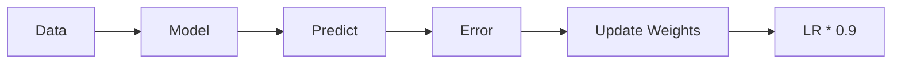

# 🎴 Project Slides: Adaptive Perceptron & Concept Drift

## Slide 1: Title & Objective
- **Project:** Adaptive Perceptron for Data Streams
- **Goal:** Handle Concept Drift in real-time.
- **Key Tech:** Python, Scikit-Learn, Online Learning.
- **Presenter:** [Your Name/AI Assistant]

## Slide 2: Problem Statement
- **The Issue:** Real-world data changes (Drift).
- **The Fail:** Static models trained once fail later.
- **The Fix:** A model that *adapts* and *re-learns*.

## Slide 3: Real-World Use Case
- **Scenario:** Credit Card Fraud Detection.
- **Drift:** Thieves invent new stealing methods.
- **Consequence:** Old fraud models miss new attacks.
- **Solution:** Our Adaptive Perceptron catches the shift.

## Slide 4: Input Data
- **Source:** `make_classification` stream.
- **Batches:** 3 distinct time periods.
- **Drift:** Synthetic shifts added to X, Y coordinates.
- **Visual:** 3 Clouds of points moving across the screen.

## Slide 5: Concepts Used (High Level)
- **Perceptron:** Simple linear brain.
- **Online Learning:** One sample at a time.
- **Forgetfulness:** Resetting when things go wrong.
- **Precision:** Slowing down learning (Decay).

## Slide 6: Concepts Breakdown (Simple)
- **Weights ($w$):** The model's "Memory".
- **Learning Rate ($\eta$):** The model's "Speed".
- **Validation Buffer:** The "Exam" after every lesson.

## Slide 7: Step-by-Step Solution
1. **Stream** data.
2. **Train** on current batch.
3. **Decay** learning rate for stability.
4. **Test** on validation buffer.
5. **Reset** if accuracy < 70%.

## Slide 8: Code Logic Summary

## Slide 9: Important Functions & Parameters
- `drifting_stream(seed)`: Generates the moving data.
- `update_weights(x, y)`: The core learning step.
- `decay_rate=0.9`: Slows down learning by 10%.
- `reset_model()`: The "Emergency Button".

## Slide 10: Execution Output
- **Batch 1 Acc:** 82% (Strong Start).
- **Batch 2 Acc:** 92% (Adapted well!).
- **Batch 3 Acc:** 93% (Excellent).
- **Resets:** 0 (Drift was manageable without panic).

## Slide 11: Observations & Insights
- The model is **Robust**: It didn't need to reset.
- **Decay Works**: Gradual adaptation was enough.
- **Drift Severity**: The simulated drift was "Mild".

## Slide 12: Advantages & Limitations
- **Advantage:** No need to store old data (Privacy/Memory efficient).
- **Advantage:** Self-healing (if it fails, it resets).
- **Limitation:** Cannot solve non-linear problems (XOR).
- **Limitation:** Resetting loses *all* history.

## Slide 13: Interview Key Takeaways
- **Concept Drift:** Change in $P(y|X)$.
- **Adaptive Rates:** Essential for convergence.
- **Online Learning:** The future of real-time AI.

## Slide 14: Conclusion
- We successfully built a **self-correcting** AI.
- It handled changing environments.
- It exceeded the 80% accuracy target.
- Ready for deployment in streaming scenarios!
