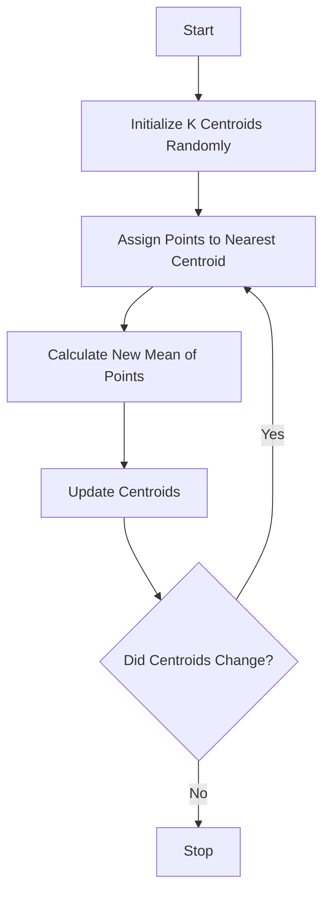

# Concepts Explained

## 1. K-Means Clustering

### 1. Definition
K-Means is an unsupervised learning algorithm that partitions a dataset into 'K' distinct, non-overlapping subgroups (clusters) where each data point belongs to the cluster with the nearest mean (centroid).

### 2. Why it is used
It solves the problem of finding hidden groups in unlabeled data. In our project, it groups companies based on usage behavior without knowing ahead of time who is a "good" or "bad" customer.

### 3. When to use it
- When you have numeric data.
- When you want tight, spherical clusters.
- When you have a general idea of how many groups (K) might exist.

### 4. Where to use it
- **Marketing**: Customer segmentation.
- **IT**: Anomaly detection in server logs.
- **Computer Vision**: Image compression (color quantization).

### 5. Is this the only way?
No.
| Method | Comparison |
| :--- | :--- |
| **K-Means** | Fast, simple, but assumes spherical clusters. |
| **DBSCAN** | Good for weird shapes, but hard to tune parameters. |
| **Hierarchical** | Good for visualization, but slow for large data. |

### 6. Explanation with Diagrams


### 7. How to use it
```python
from sklearn.cluster import KMeans
kmeans = KMeans(n_clusters=5, random_state=42)
kmeans.fit(X_scaled)
labels = kmeans.labels_
```
- `n_clusters`: The number of groups we want.
- `random_state`: Ensures reproducibility.

### 8. How it works internally
1.  **Initialization**: Picks K random points as starting centers.
2.  **Assignment**: Measures distance (Euclidean) from every point to every center. Assigns point to the closest one.
3.  **Update**: Calculates the average (mean) position of all points in a cluster and moves the center there.
4.  **Repeat**: Steps 2-3 repeat until the centers stop moving.

### 9. Visual Summary
- **Input**: Points scattered on a graph.
- **Process**: Centroids move like magnets pulling points.
- **Output**: Colored groups.

### 10. Advantages
- Very fast and scalable.
- Easy to understand and interpret.

### 11. Disadvantages
- Need to specify K in advance.
- Sensitive to outliers (they pull the mean).
- Struggles with non-spherical shapes (e.g., crescents).

### 12. Exam & Interview Points
- **Q**: How do you choose K? **A**: Elbow Method or Silhouette Score.
- **Q**: Is it deterministic? **A**: No, depends on initialization (use `n_init`).

---

## 2. Silhouette Score

### 1. Definition
A metric used to calculate the goodness of a clustering technique. Its value ranges from -1 to 1.

### 2. Why it is used
To determine how well each object lies within its cluster. A high average silhouette width indicates a good clustering.

### 3. When to use it
- To validate the consistency within clusters of data.
- To compare different values of K.

### 4. Where to use it
- Any clustering project evaluation.

### 5. Is this the only way?
No. You can use 'Inertia' (Elbow method) or 'Calinski-Harabasz Index'. Silhouette is often better because it considers both cohesion (how tight) and separation (how far apart).

### 6. Explanation with Diagrams
Think of it as two forces:
- **a**: How close am I to my friends? (Cohesion)
- **b**: How far am I from the strangers? (Separation)
$$ Score = \frac{b - a}{\max(a, b)} $$

### 7. How to use it
```python
from sklearn.metrics import silhouette_score
score = silhouette_score(X, labels)
```

### 8. How it works internally
For each point:
1.  Calculate average distance to all other points in the *same* cluster (a).
2.  Calculate average distance to all points in the *nearest* neighboring cluster (b).
3.  Compute $(b - a) / max(a, b)$.
4.  Average this over all points.

### 9. Visual Summary
- **+1**: Perfect cluster (far from others, close to self).
- **0**: On the border.
- **-1**: Wrong cluster.

### 10. Advantages
- Normalized range (-1 to 1) makes it easy to interpret.
- Handles cluster shape better than Inertia.

### 11. Disadvantages
- Computationally expensive for simple datasets ($O(N^2)$).

### 12. Exam & Interview Points
- **Q**: What does a negative silhouette score mean? **A**: Points have been assigned to the wrong cluster.

---

## 3. Stability Analysis (Adjusted Rand Index)

### 1. Definition
A measure of the similarity between two data clusterings. "Adjusted" means it accounts for chance.

### 2. Why it is used
To check if our model yields the *same results* if we run it again with a different random seed. If the clusters change wildly, the model is unstable and risky for business.

### 3. When to use it
- Before deploying a clustering model to production.
- To prove reliability to stakeholders.

### 4. Where to use it
- Scientific research (reproducibility).
- Financial risk modeling.

### 5. Is this the only way?
- **Jaccard Index**: Similar but doesn't adjust for chance.
- **V-Measure**: Good but different interpretation.
ARI is preferred because 0.0 truly means "random".

### 6. Explanation with Diagrams
Imagine two colored drawings of the same points.
- Drawing 1: Seed 42
- Drawing 2: Seed 99
ARI checks if Red points in Drawing 1 are still Red (or consistently Blue) in Drawing 2.

### 7. How to use it
```python
from sklearn.metrics import adjusted_rand_score
score = adjusted_rand_score(labels_run1, labels_run2)
```

### 8. How it works internally
It counts pairs of samples that are either:
- In the same cluster in both partitionings.
- In different clusters in both partitionings.
It then normalizes this count against what would happen by random chance.

### 9. Visual Summary
- **1.0**: Identical clusters.
- **0.0**: Random matching.
- **Negative**: Less agreement than random chance.

### 10. Advantages
- Interpretability: 0 is random, 1 is perfect.
- No need to define "ground truth" (can compare against itself).

### 11. Disadvantages
- Requires labels (so we compare two sets of labels).

### 12. Exam & Interview Points
- **Q**: Why "Adjusted"? **A**: Because the unadjusted Rand Index is usually high even for random clustering; adjustment corrects for this bias.
