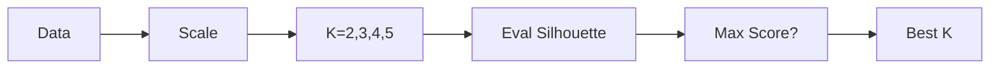

# \ud83d\udcbc Interview Preparation Cheat Sheet

## \u23f1\ufe0f 30-Second Summary
This project segments mall customers using **K-Means Clustering**. We used **Silhouette Score** to mathematically prove the best number of clusters ($K$) instead of guessing. We found that $K=4$ (or $K=2$) provides the best separation, allowing us to target "High Spenders" vs "Savers."

## \ud83d\udd11 Key Terms
- **K-Means**: Grouping data by centers.
- **Silhouette**: Quality check (-1 to 1).
- **Inertia**: Tightness check (Lower is better).
- **Feature Engineering**: Creating ratios like Spending/Income.

## \ud83c\udd9a Comparison: Inertia vs Silhouette

| Feature | Inertia | Silhouette |
|---------|---------|------------|
| **Goal** | Minimize distance to center | Maximize separation & cohesion |
| **Trend** | Always goes DOWN as K goes UP | Peaks at optimal K |
| **Calculation** | Fast (Sum of Squares) | Slow (Pairwise distances) |
| **Best Value** | 0 (but implies overfitting) | +1 (Perfect separation) |

## \u26a0\ufe0f Common Traps
- **"Why not K=50?"**: Inertia would be low, but Silhouette would likely be near 0 because clusters would overlap and be meaningless.
- **"Did you scale?"**: YES. If you don't scale Income (20,000) and Age (20), Income decides everything.

## \ud83d\udcca Visual Summary

