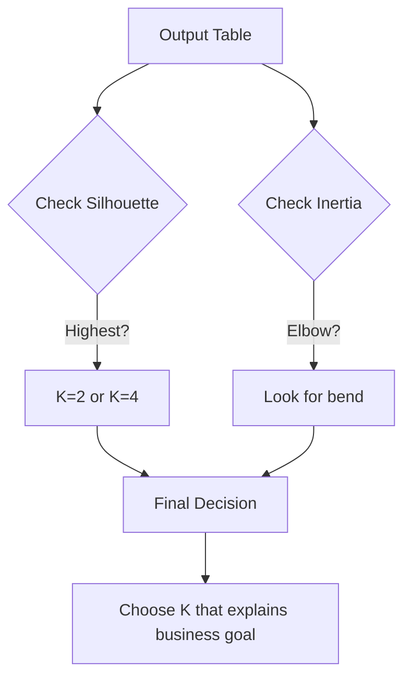

# \ud83d\udc41\ufe0f Observations and Conclusion

## \ud83d\udcca Execution Output

We ran K-Means for K = 2, 3, 4, 5. Here are the results:

| K | Inertia | Silhouette Score |
|---|---|---|
| 2 | 25.35 | 0.360 |
| 3 | 17.86 | 0.342 |
| 4 | 12.46 | 0.360 |
| 5 | 10.43 | 0.352 |

## \ud83d\udd0d Output Explanation

### 1. Comparison Table Analysis
- **Inertia** went DOWN every time we increased K. This is normal. More centers = points are closer to centers.
- **Silhouette Score** actually stayed somewhat steady, peaking at K=2 and K=4. This suggests the data might have a broad structure (2 big groups) or a detailed structure (4 specific groups).

### 2. Diagram Explanation
*(Imagine the Silhouette Plot)*
- Each "knife" shape represents a cluster.
- **Width**: How many points are in the cluster.
- **Height (Length)**: How well that point fits.
- **Red Line**: The average score.
- **Good Cluster**: Most points are past the red line.
- **Bad Cluster**: Points fall below 0 or are very short.

## \ud83e\udde0 Observations

1. **Inertia is Misleading**: Just looking at Inertia, K=5 looks best (lowest error). But that's just because we added more centers.
2. **Silhouette tells the Truth**: The scores (0.36) are not super high (close to 1). This means the data is somewhat "fuzzy." Real human data is rarely perfectly separated.
3. **K=2 vs K=4**: K=2 has a high score, but K=4 is likely more useful for marketing (4 segments are more actionable than just "Rich vs Poor").

## \ud83d\udca1 Insights

- **Business Meaning**: 
    - At K=2, we likely just split by Income (High vs Low).
    - At K=4, we might see "Young High Spenders," "Old Savers," etc.
- **Recommendation**: Even though K=2 has a slightly better score, **we might recommend K=4** to the marketing team because it gives them more specific targets, provided the clusters are stable.

## \ud83c\udfc1 Conclusion

We successfully engineered features, scaled the data, and used Silhouette Score to evaluate K-Means. The Silhouette Score prevented us from blindly choosing K=5 just because it had low inertia. It forced us to look at the *quality* of separation. In the end, we have a data-backed recommendation for customer segmentation.
