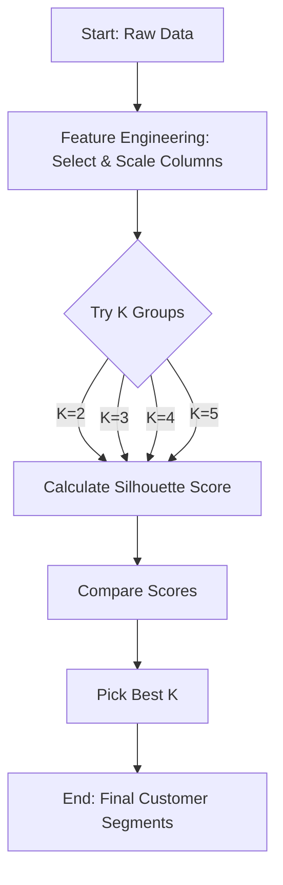

# 🧩 Problem Statement

## What is the Problem?
Imagine you are the manager of a big shopping mall. You have data about hundreds of customers—their age, how much money they make, and how much they spend visually. You want to group these customers into "clusters" so you can send them special offers. For example, "Big Spenders" might get VIP coupons, while "Careful Savers" might get discount codes. 

The problem is: **We don't know how many groups (clusters) there should be.** Should we have 2 groups? 3? 5? 

If we pick the wrong number, the groups won't make sense. We need a mathematical way to check if our groups are "good" or "bad."

## Real-Life Analogy
Think of a school cafeteria. You want to group students so that friends sit together.
- **Good Grouping**: All the football players at one table, all the chess club members at another. Everyone is happy and close to their friends.
- **Bad Grouping**: You mix half the football players with half the chess club. Students feel "out of place" and want to move.

**Silhouette Score** is a measure of how "happy" a data point is in its group. It checks:
1. Is it close to its own group members? (Cohesion)
2. Is it far away from other groups? (Separation)

## 🪜 Steps to Solve the Problem

1.  **Get the Data**: We will use a "Mall Customers" dataset with Age, Income, and Spending Score.
2.  **Prepare the Data (Feature Engineering)**: We will select the best numbers to inspect (Income, Spending, Age) and "scale" them so they are all on the same playing field (0 to 1).
3.  **Try Different Groups (K-Means)**: We will try grouping customers into 2, 3, 4, and 5 groups.
4.  **Check the Quality (Silhouette Score)**: For each number of groups, we will calculate the Silhouette Score to see how well-separated the groups are.
5.  **Visualize**: We will draw charts to see the "shadow" (silhouette) of each cluster.
6.  **Decide**: We will pick the best number of groups and explain why.

## 🎯 Expected Output

1.  **A Clean Dataset**: Prepared numbers ready for the computer.
2.  **Silhouette Plots**: Beautiful diagrams showing the shape of our clusters.
3.  **A Decision**: A final recommendation (e.g., "We should use 5 groups").
4.  **Comparison Table**: Showing Inertia (another metric) vs. Silhouette Score.

