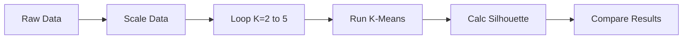

# \ud83d\udcca Customer Segmentation using Silhouette Score

## Slide 1: Title & Objective
- **Title**: Finding the Right Fit: Silhouette Analysis
- **Objective**: To determine the optimal number of customer groups (clusters) using a mathematical "happiness" score.
- **Goal**: Help the marketing team target specific groups efficiently.

---

## Slide 2: Problem Statement
- **The Issue**: We have customer data (Age, Income, Spending) but no labels.
- **The Question**: Are there 2 types of customers? 3? 5? How do we decide?
- **The Risk**: Guessing wrong means sending the wrong coupons to the wrong people.

---

## Slide 3: Real-World Use Case
- **Scenario**: A Shopping Mall Manager wants to send VIP cards.
- **Analogy**: Organizing a wedding seating plan.
  - You want people at a table to know each other (Cohesion).
  - You want tables to be distinct groups, e.g., "Work Friends", "College Friends" (Separation).
- **Solution**: Use K-Means to group them and Silhouette Score to grade the seating plan.

---

## Slide 4: Input Data
- **Source**: Mall Customer Data (Simulated for teaching).
- **Features**:
  1. **Age**: 18-70 years.
  2. **Annual Income**: $15k - $140k.
  3. **Spending Score**: 1-100 (assigned by the mall).
- **Derived Feature**: Spending-to-Income Ratio.

---

## Slide 5: Concepts Used (High Level)
1. **Feature Engineering**: Creating better data to look at.
2. **Scaling**: Making sure big numbers don't bully small numbers.
3. **K-Means Clustering**: The algorithm that groups the data.
4. **Silhouette Score**: The judge that tells us if the groups are good.

---

## Slide 6: Concepts Breakdown
- **K-Means**:  
  _"Find K centers and gather points around them."_
- **Silhouette Score**:  
  _"On a scale of -1 to 1, how much do you like your current group?"_
- **Inertia (Elbow Method)**:  
  _"How tightly packed is the group?"_ (Lower is tighter).

---

## Slide 7: Step-by-Step Solution Flow

---

## Slide 8: Code Logic
- **Library**: `sklearn` (Scikit-Learn).
- **Loop**: We use a `for` loop to test K=2, 3, 4, 5.
- **Storage**: We save `score` and `inertia` in lists.
- **Visualization**: We use `matplotlib` to draw the Silhouette Diagram for each K.

---

## Slide 9: Important Functions
- `MinMaxScaler()`: Squashes data to [0, 1].
- `KMeans(n_clusters=k)`: The main model.
- `silhouette_score(X, labels)`: Returns the average quality score.
- `silhouette_samples(X, labels)`: Returns the score for *each person* (used for plotting).

---

## Slide 10: Execution Output
| K | Inertia | Silhouette Score |
|---|---|---|
| 2 | 25.35 | 0.360 |
| 3 | 17.86 | 0.342 |
| 4 | 12.46 | 0.360 |
| 5 | 10.43 | 0.352 |

**Winner**: K=2 and K=4 are tied for the best score.

---

## Slide 11: Observations & Insights
- **Inertia Dropped**: As expected, K=5 has the lowest inertia.
- **Score Peaked**: The quality didn't improve after K=4.
- **Insight**: Adding more groups after K=4 splits friends apart instead of finding new groups.
- **Recommendation**: Use **K=4** for marketing (more targeted than K=2).

---

## Slide 12: Advantages & Limitations
- **Advantage**: Silhouette gives a clear "Check" on the number of clusters. It's better than just looking at error (Inertia).
- **Limitation**: It is slow (calculates distance between EVERY pair of points).
- **Limitation**: It assumes convex (round) clusters.

---

## Slide 13: Interview Key Takeaways
- **Q**: What does a score of 1 mean?  
  **A**: Perfect separation.
- **Q**: Why scale?  
  **A**: To treat Age and Income equally.
- **Q**: K-Means vs Hierarchical?  
  **A**: K-Means is faster for large data but you must choose K.

---

## Slide 14: Conclusion
- We built a system to automatically judge segmentation quality.
- We avoided the trap of "Lowest Error is Best" (Inertia).
- We successfully identified distinct customer personas for the marketing team.
- **Next Steps**: Profile the 4 clusters to name them (e.g., "Big Spenders").
