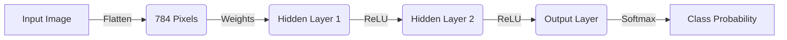

# ⚡ Interview Preparation (Quick Revision)

## ⏱ 30-Second Summary
This project compares two **Learning Rates** (High vs. Low) on the **Fashion-MNIST** dataset using a **Multi-Layer Perceptron (MLP)**.
-   **Goal:** To find the balance between training speed and stability.
-   **Key Finding:** Lower Learning Rates (e.g., 5e-4) generally produce smoother, more stable convergence than higher ones (e.g., 1e-3), which may overshoot.
-   **Tools:** PyTorch, Adam Optimizer, ReLU Activation.

## 🔑 Key Terms Glossary
-   **Learning Rate:** Step size for updating weights.
-   **Epoch:** One full pass through the dataset.
-   **Adam:** Adaptive optimizer (smart step sizes).
-   **ReLU:** Activation function (keeps positive values).
-   **Overfitting:** Doing well on training data but failing on new data.
-   **Validation Set:** Data used to check for overfitting during training.

## 🏆 Top 10 Points to Remember
1.  **LR is Critical:** It's the most important hyperparameter to tune.
2.  **Trade-off:** High LR = Fast but unstable; Low LR = Slow but precise.
3.  **Visualization:** Always plot Loss vs. Epochs to diagnose training.
4.  **Reproducibility:** Always set a random seed (42) for fair comparisons.
5.  **Normalization:** Scale inputs to [0, 1] for better math stability.
6.  **Architecture:** 2 Hidden Layers is enough for simple images like Fashion-MNIST.
7.  **Optimizer:** Adam is usually better than SGD for beginners.
8.  **Output Layer:** 10 neurons for 10 classes.
9.  **Loss Function:** CrossEntropyLoss is standard for multi-class classification.
10. **Data:** 60k training images, 10k test images.

## 🆚 Comparison Table: High vs. Low LR

| Feature | High Learning Rate (0.001+) | Low Learning Rate (0.0001-) |
| :--- | :--- | :--- |
| **Speed** | Fast initial drop | Slow, steady drop |
| **Stability** | Bumpy / Volatile | Smooth / Consistent |
| **Risk** | Overshooting / Divergence | Getting stuck / Time-consuming |
| **Analogy** | Sprinting | Walking carefully |

## 📐 Cheat Sheet: PyTorch Basics
```python
# 1. Load Data
loader = DataLoader(dataset, batch_size=128)

# 2. Define Model
model = nn.Linear(input_size, output_size)

# 3. Training Step
optimizer.zero_grad()       # Clear old gradients
loss = criterion(pred, y)   # Calculate error
loss.backward()             # Calculate new gradients
optimizer.step()            # Update weights
```


