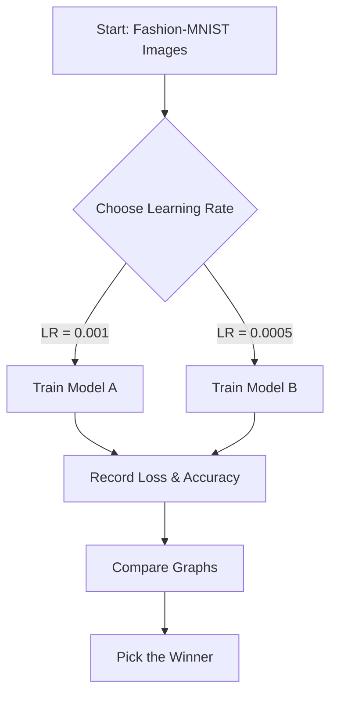

# 🧩 Problem Statement

## The Problem: "Too Fast vs. Just Right"
Imagine you are training a computer to recognize clothes (like teaching a child to sort laundry). You want it to learn as fast as possible, but:
1.  **If it learns too fast (High Learning Rate):** It might jump effectively but miss the "perfect" understanding, making mistakes or getting confused (overshooting).
2.  **If it learns too slow (Low Learning Rate):** It will be very careful but might take forever to finish.

**Our Goal:** We need to find the "sweet spot." We will race two models:
-   **Model A (Sprinter):** Uses a higher learning rate (0.001).
-   **Model B (Jogger):** Uses a lower learning rate (0.0005).

We want to see which one gets the best results without crashing!

## 🌍 Real-World Analogy
Think of **parking a car**:
-   **High Learning Rate:** You press the gas pedal hard. You get to the spot fast, but you might hit the curb or park crookedly.
-   **Low Learning Rate:** You tap the gas gently. It takes longer, but you park perfectly in the lines.

## 🪜 Steps to Solve the Problem
1.  **Get the Clothes (Data):** Download the Fashion-MNIST dataset directly (t-shirts, dresses, sneakers).
2.  **Build the Brain (Model):** Create a simple Neural Network (MLP) with 2 hidden layers to think about the images.
3.  **Run Experiment A (Fast):** Train the model with Learning Rate = 0.001. Watch how it learns.
4.  **Run Experiment B (Slow):** Train the *exact same* model with Learning Rate = 0.0005.
5.  **Compare Results:** Draw a graph (Learning Curve) to see who won the race (Speed vs. Accuracy).

## 🎯 Expected Output (Overall)
We will generate two main things:
1.  **A Plot:** A chart showing two lines.
    -   Red line (Fast LR): Might be jagged or bumpy.
    -   Blue line (Slow LR): Should be smoother.
2.  **A Decision:** A conclusion saying, "I choose Model [A or B] because..."

