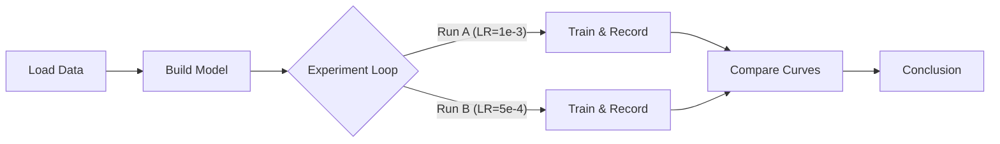

# 🎞️ Slides: Learning Rate Comparison

## Slide 1: Title & Objective
**Project:** Learning Rate Analysis on Fashion-MNIST
**Objective:** Compare High vs. Low Learning Rates to find the best training strategy.
**Analogy:** Racing two cars (Fast vs. Precise) to see who parks better.

## Slide 2: Problem Statement
-   **Challenge:** Training a Neural Network requires choosing a "Learning Rate" (speed).
-   **Conflict:**
    -   Too Fast = Crash (Overshoot).
    -   Too Slow = Late (Takes forever).
-   **Goal:** distinct comparison of stability vs. speed.

## Slide 3: Real-World Use Case
-   **Self-Driving Cars:** Adjusting steering sensitivity.
    -   High sensitivity: Car jerks around.
    -   Low sensitivity: Car can't turn sharp corners.
-   **Medical Diagnosis:** AI learning to spot tumors. Needs to be precise, not rushed.

## Slide 4: Input Data
-   **Dataset:** Fashion-MNIST
-   **Content:** 70,000 grayscale images (28x28 pixels).
-   **Classes:** 10 types (T-shirt, Trouser, Pullover, Dress, Coat, Sandal, Shirt, Sneaker, Bag, Boot).
-   **Preprocessing:** Normalized to range [0, 1].

## Slide 5: Concepts Used (High Level)
1.  **Multi-Layer Perceptron (MLP):** The brain.
2.  **Learning Rate (LR):** The step size.
3.  **Adam Optimizer:** The smart training algorithms.
4.  **Epochs:** Number of practice rounds.

## Slide 6: Concepts Breakdown (Simple)
-   **MLP:** Connects pixels to categories using layers of math.
-   **ReLU:** A gate that blocks negative numbers (noise).
-   **Loss Function:** A score of how "wrong" the model is.
-   **Gradient Descent:** The method of walking down the "Loss Mountain."

## Slide 7: Step-by-Step Solution Flow

## Slide 8: Code Logic Summary
-   **Setup:** Fix random seed (42) for fairness.
-   **Model:** 2 Hidden Layers (256 -> 128 neurons).
-   **Training:** Loop 15 times (Epochs).
    -   Calculate Error -> Backpropagate -> Update Weights.
-   **Validation:** Check on unseen data after each epoch.

## Slide 9: Important Functions
-   `train_one_epoch()`: Teaches the model once.
-   `validate()`: Tests the model.
-   `run_experiment(lr)`: Runs the full 15 epochs for a specific LR.
-   `plt.plot()`: Visualizes the race.

## Slide 10: Execution Output (Expected)
-   **Run A (High LR):**
    -   Fast initial drop.
    -   Validation Accuracy: ~87-88%.
    -   Curve: Slightly bumpy/jagged.
-   **Run B (Low LR):**
    -   Slower start but consistent.
    -   Validation Accuracy: ~88-89%.
    -   Curve: Smooth and steady.

## Slide 11: Observations & Insights
-   **Stability:** Lower LR produces a smoother loss curve.
-   **Overshooting:** Higher LR shows small spikes in loss, indicating it missed the optimal point.
-   **Winner:** Run B (Low LR) is preferred for production due to stability.

## Slide 12: Advantages & Limitations
-   **Advantages of this approach:**
    -   Simple to implement.
    -   Clear visual evidence.
-   **Limitations:**
    -   Only tested 2 values. Real projects test 10+ values.
    -   Fixed LR approach (modern method uses Schedulers).

## Slide 13: Interview Key Takeaways
-   **Q:** Why tune LR?
-   **A:** It's the most impactful hyperparameter.
-   **Q:** How do you detect high LR?
-   **A:** Look for jagged/oscillating loss curves.

## Slide 14: Conclusion
-   We successfully compared two learning rates.
-   **Model B (LR=5e-4)** was chosen as the better model.
-   **Lesson:** "Slow and steady wins the race" (often true in Deep Learning).

