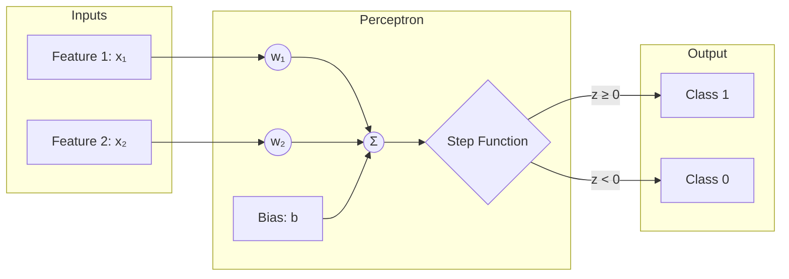
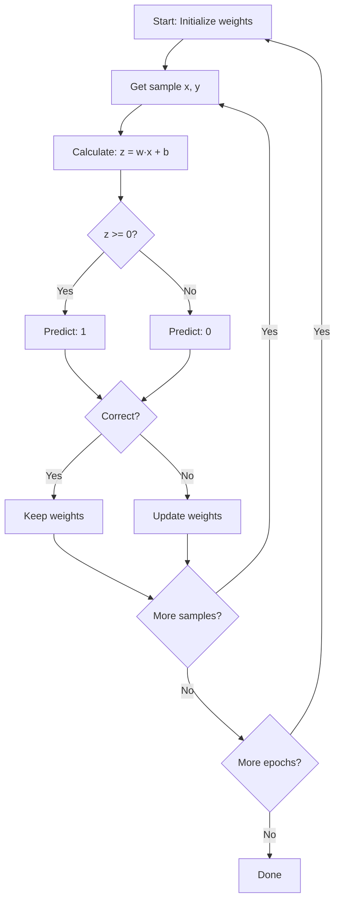
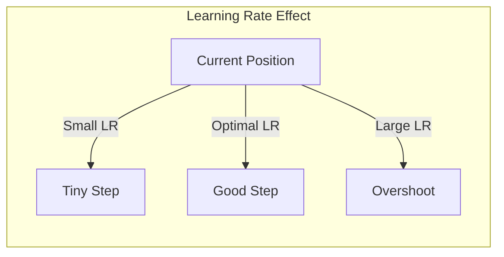
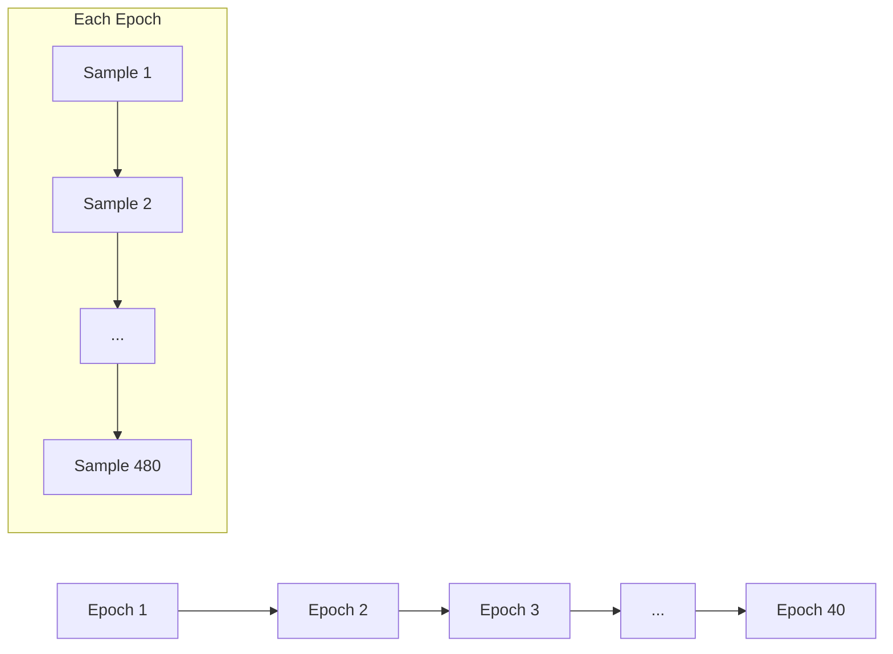
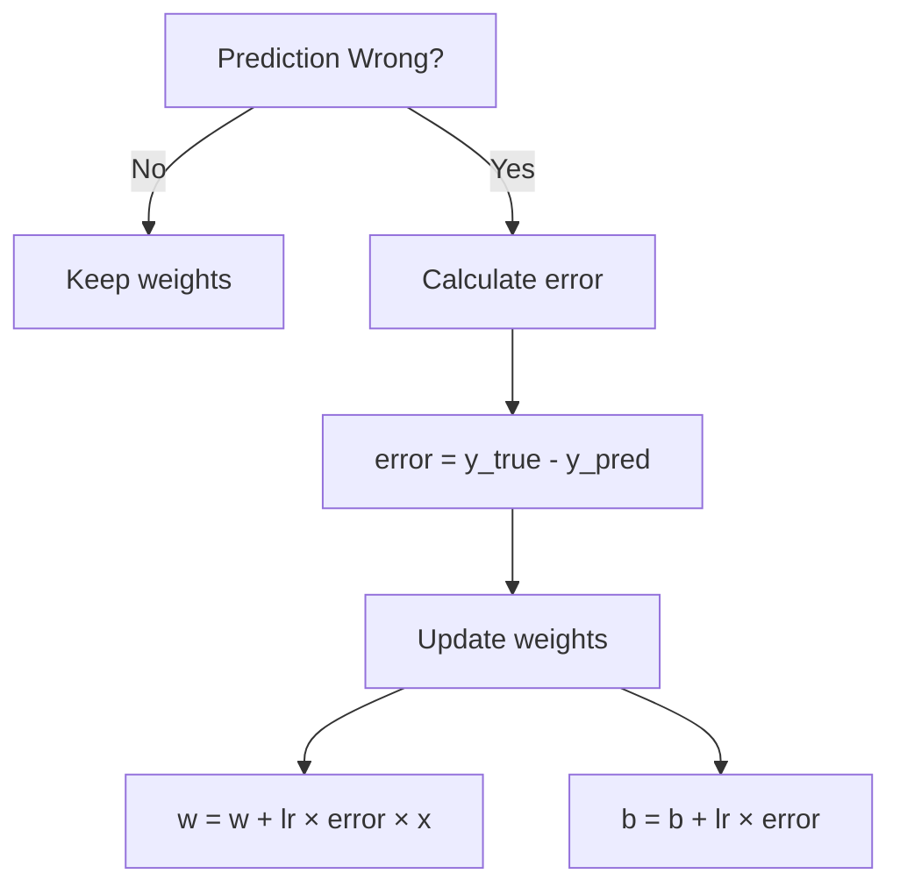
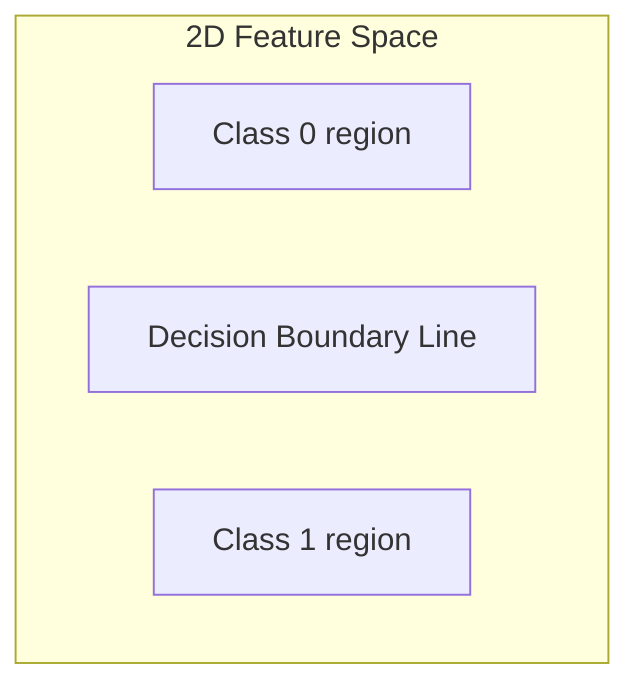
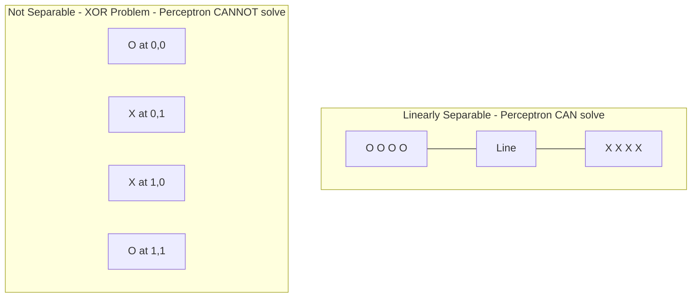

# Concepts Explained: Perceptron From Scratch

## Table of Contents
1. [Perceptron](#perceptron)
2. [Learning Rate](#learning-rate)
3. [Epoch](#epoch)
4. [Weight Update Rule](#weight-update-rule)
5. [Decision Boundary](#decision-boundary)
6. [Linear Separability](#linear-separability)

---

## Perceptron

### 1. Definition
A Perceptron is the simplest neural network - a single artificial neuron that makes binary classification decisions using a linear decision boundary.

**Exam-friendly wording:** "A Perceptron is a linear binary classifier that learns weights for input features to separate data into two classes."

### 2. Why it is used
- Solves binary classification problems
- Foundation for understanding neural networks
- Simple to implement and understand
- Computationally efficient

### 3. When to use it
- Binary classification tasks
- Linearly separable data
- Educational purposes
- Simple baseline models

### 4. Where to use it
| Industry | Application |
|----------|-------------|
| Email | Spam detection |
| Healthcare | Disease prediction |
| Finance | Loan approval |
| Manufacturing | Quality control |

### 5. Is this the only way?

| Alternative | Comparison |
|-------------|------------|
| Logistic Regression | Uses sigmoid, handles non-separable data better |
| SVM | Can use kernels for non-linear boundaries |
| Neural Networks | Multi-layer, learns complex patterns |
| Decision Trees | Non-linear, interpretable |

**Why Perceptron?** Simplest to understand, foundation for all neural networks, guaranteed convergence on linearly separable data.

### 6. Explanation with Diagram



**How it works:**
1. Each input is multiplied by its weight
2. All weighted inputs are summed with bias
3. Step function converts to 0 or 1 output

### 7. How to use it

```python
# Create Perceptron
perceptron = Perceptron(learning_rate=0.01, n_epochs=40)

# Train
perceptron.fit(X_train, y_train)

# Predict
predictions = perceptron.predict(X_test)

# Evaluate
accuracy = perceptron.score(X_test, y_test)
```

### 8. How it works internally

**Step-by-step internal process:**

1. **Initialization:** Weights = [0, 0], Bias = 0
2. **Forward Pass:**
   - Calculate: z = w₁×x₁ + w₂×x₂ + b
   - Apply step function: y_pred = 1 if z ≥ 0 else 0
3. **Update (if wrong):**
   - error = y_true - y_pred
   - w = w + lr × error × x
   - b = b + lr × error
4. **Repeat** for all samples, all epochs



### 9. Visual Summary

- **Input:** Features (x₁, x₂)
- **Weights:** Importance of each feature
- **Bias:** Shifts decision boundary
- **Output:** Binary classification (0 or 1)
- **Learning:** Error-driven weight updates

### 10. Advantages

| Advantage | Explanation | Proof |
|-----------|-------------|-------|
| Simple | Easy to implement | Only ~50 lines of code |
| Fast | No complex math | O(n) per epoch |
| Interpretable | Weights show feature importance | w₁ > w₂ means feature 1 matters more |
| Convergent | Guaranteed on separable data | Perceptron Convergence Theorem |

### 11. Disadvantages / Limitations

| Disadvantage | Explanation | When it matters |
|--------------|-------------|-----------------|
| Only linear | Cannot learn XOR | Non-linear patterns |
| Binary only | Can't do multi-class directly | 3+ classes |
| Sensitive | To learning rate | Small LR = slow, Large LR = unstable |
| No probabilities | Just 0 or 1 | When you need confidence |

### 12. Exam & Interview Points

**Key points to memorize:**
1. Perceptron = single neuron with step function
2. Only updates on misclassification
3. Convergent on linearly separable data
4. Cannot solve XOR problem

**Common exam questions:**
- Q: What is a Perceptron?
- A: A linear binary classifier using weighted inputs and step function.

- Q: When does Perceptron fail?
- A: When data is not linearly separable.

- Q: How does it learn?
- A: By adjusting weights when predictions are wrong.

---

## Learning Rate

### 1. Definition
Learning rate (η or α) is a hyperparameter that controls how much the weights change during each update.

### 2. Why it is used
Controls the trade-off between learning speed and stability.

### 3. When to use it
Every gradient-based or iterative learning algorithm.

### 4. Where to use it
All machine learning models that learn through optimization.

### 5. Is this the only way?

| Alternative | Description |
|-------------|-------------|
| Adaptive LR | Algorithms like Adam adjust LR automatically |
| LR Scheduling | Decrease LR over time |
| Line Search | Find optimal step size each iteration |

### 6. Explanation with Diagram



### 7. How to use it

```python
# Set learning rate
perceptron = Perceptron(learning_rate=0.01)

# Common values
# 0.001 - Very slow, stable
# 0.01  - Good default
# 0.1   - Fast, may oscillate
# 1.0   - Very fast, unstable
```

### 8. How it works internally

The learning rate multiplies the update:
```
weight_update = learning_rate × error × input
```

**Example:**
- LR = 0.01, error = 1, input = [2, 3]
- Update = 0.01 × 1 × [2, 3] = [0.02, 0.03]

### 9. Visual Summary

| LR Value | Speed | Stability | Convergence |
|----------|-------|-----------|-------------|
| 0.001 | Slow | High | Guaranteed |
| 0.01 | Medium | High | Good |
| 0.1 | Fast | Medium | May oscillate |
| 1.0 | Very Fast | Low | May diverge |

### 10. Advantages
- Simple to understand
- Single hyperparameter to tune
- Direct control over learning speed

### 11. Disadvantages
- Requires tuning
- Fixed value may not be optimal throughout training
- Too high = unstable, too low = slow

### 12. Exam & Interview Points

**Key points:**
1. Controls step size in weight updates
2. Trade-off: speed vs. stability
3. Typical range: 0.001 to 1.0
4. Default starting point: 0.01

---

## Epoch

### 1. Definition
One epoch is a complete pass through the entire training dataset.

**Real-life analogy:** Reading a textbook cover-to-cover once = one epoch.

### 2. Why it is used
Multiple passes help the model learn from different perspectives and orderings.

### 3. When to use it
Every iterative training process.

### 4. Where to use it
All machine learning training loops.

### 5. Is this the only way?

| Alternative | Description |
|-------------|-------------|
| Early Stopping | Stop when validation accuracy plateaus |
| Convergence | Stop when error < threshold |
| Iterations | Count individual updates instead |

### 6. Explanation with Diagram



### 7. How to use it

```python
perceptron = Perceptron(n_epochs=40)  # 40 passes through data
```

### 8. How it works internally

```python
for epoch in range(n_epochs):      # Outer loop
    shuffle(data)                   # Shuffle each epoch
    for sample in data:             # Inner loop
        train_on_sample(sample)
```

### 9. Visual Summary

- Epoch 1: Model is guessing randomly
- Epoch 10: Model starts getting some patterns right
- Epoch 20: Model accuracy stabilizes
- Epoch 40: Model has converged

### 10. Advantages
- Simple to understand
- Easy to track progress
- Gives model multiple chances to learn

### 11. Disadvantages
- Too few = underfitting
- Too many = overfitting, wasted time
- Fixed number ignores actual convergence

### 12. Exam & Interview Points

**Key points:**
1. One epoch = one complete pass through training data
2. More epochs = more learning opportunities
3. Should shuffle data each epoch
4. 40-100 epochs is typical starting point

---

## Weight Update Rule

### 1. Definition
The rule that determines how weights change when a prediction is wrong:
```
w = w + learning_rate × (y_true - y_pred) × x
```

### 2. Why it is used
This is how the Perceptron learns from its mistakes.

### 3. When to use it
Every time the Perceptron makes a wrong prediction.

### 4. Where to use it
Core of all Perceptron implementations.

### 5. Is this the only way?

| Alternative | Description |
|-------------|-------------|
| Gradient Descent | Uses gradients for smoother updates |
| Delta Rule | Uses activation error for smoother learning |
| Backpropagation | For multi-layer networks |

### 6. Explanation with Diagram



### 7. How to use it

```python
if y_true != y_pred:
    error = y_true - y_pred  # +1 or -1
    self.weights += self.learning_rate * error * x
    self.bias += self.learning_rate * error
```

### 8. How it works internally

**Case 1: Predicted 0, True is 1**
- error = 1 - 0 = +1
- weights increase in direction of x
- Next time, weighted sum will be larger (more positive)

**Case 2: Predicted 1, True is 0**
- error = 0 - 1 = -1
- weights decrease in direction of x
- Next time, weighted sum will be smaller (more negative)

### 9. Visual Summary

| True | Pred | Error | Action |
|------|------|-------|--------|
| 1 | 0 | +1 | Increase weights |
| 0 | 1 | -1 | Decrease weights |
| 1 | 1 | 0 | No change |
| 0 | 0 | 0 | No change |

### 10. Advantages
- Simple and intuitive
- Only updates on errors (efficient)
- Guaranteed to converge on separable data

### 11. Disadvantages
- Can oscillate on boundary points
- No notion of "how wrong" (just wrong or right)
- Doesn't provide probabilities

### 12. Exam & Interview Points

**Key formula:**
```
w_new = w_old + η × (y - ŷ) × x
b_new = b_old + η × (y - ŷ)
```

**Key insight:** Only update when wrong!

---

## Decision Boundary

### 1. Definition
The line (in 2D) or hyperplane (in higher dimensions) that separates the two classes.

**Equation:** w₁x₁ + w₂x₂ + b = 0

### 2. Why it is used
This is what the Perceptron learns - the separator between classes.

### 3. When to use it
For understanding and visualizing classification.

### 4. Where to use it
All linear classifiers.

### 5. Is this the only way?

| Boundary Type | Model |
|---------------|-------|
| Linear | Perceptron, Logistic Regression |
| Non-linear | SVM with kernels, Neural Networks |
| Piecewise | Decision Trees |

### 6. Explanation with Diagram



### 7. How to use it

```python
# Decision boundary equation: w1*x1 + w2*x2 + b = 0
# Solving for x2: x2 = -(w1*x1 + b) / w2

x1_line = np.linspace(x_min, x_max, 100)
x2_line = -(w1 * x1_line + b) / w2
plt.plot(x1_line, x2_line)
```

### 8. How it works internally

- Points where w·x + b > 0 → Class 1
- Points where w·x + b < 0 → Class 0
- Points where w·x + b = 0 → On the boundary

### 9. Visual Summary

The decision boundary:
- Is perpendicular to weight vector w
- Shifts based on bias b
- Divides feature space into two half-planes

### 10. Advantages
- Interpretable (you can visualize it)
- Simple equation
- Fast to compute predictions

### 11. Disadvantages
- Only works for linearly separable data
- Cannot capture complex patterns

### 12. Exam & Interview Points

**Key equation:** w₁x₁ + w₂x₂ + b = 0

**Key insight:** Weights define orientation, bias defines position.

---

## Linear Separability

### 1. Definition
Data is linearly separable if a single straight line (2D), plane (3D), or hyperplane (nD) can perfectly separate all points of different classes.

### 2. Why it is used
Perceptron ONLY works on linearly separable data.

### 3. When to use it
Checking if Perceptron is appropriate for your problem.

### 4. Where to use it
Preliminary data analysis, algorithm selection.

### 5. Is this the only way?

**If data is NOT linearly separable:**
- Use SVM with kernels (kernel trick)
- Use neural networks (multi-layer Perceptron)
- Use non-linear models (decision trees, random forests)

### 6. Explanation with Diagram



### 7. XOR Problem - Famous Perceptron Limitation

```
X1  X2  Output
0   0   0
0   1   1
1   0   1  
1   1   0
```

No single line can separate 0s from 1s!

### 8. How it works internally

- Perceptron Convergence Theorem: If data is linearly separable, Perceptron WILL converge
- If not separable, Perceptron will oscillate forever

### 9. Visual Summary

| Separable? | Perceptron Works? | Solution |
|------------|-------------------|----------|
| Yes | Yes | Use Perceptron |
| No | No | Use MLP, SVM, etc. |

### 10. Advantages of Linearly Separable Data
- Simple models work
- Fast training and inference
- Easy to interpret

### 11. Disadvantages Limited real-world applicability - most real data is not perfectly separable

### 12. Exam & Interview Points

**Key points:**
1. Perceptron convergence requires linear separability
2. XOR is the classic counter-example
3. Solution: Multi-layer networks (MLP)

---

## Jargon Glossary

| Term | Simple Explanation |
|------|-------------------|
| Perceptron | Single neuron classifier |
| Weight | Importance of a feature |
| Bias | Base value before features |
| Epoch | One pass through all data |
| Learning Rate | Step size for updates |
| Convergence | When learning stops improving |
| Decision Boundary | Line separating classes |
| Linear Separability | Can a line separate classes? |
| Step Function | Outputs 0 or 1 based on threshold |
| Hyperparameter | Settings you choose (not learned) |
