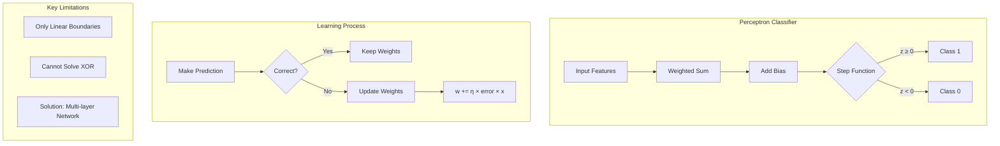

# Interview Preparation: Perceptron From Scratch

## 30-Second Summary

The **Perceptron** is the simplest neural network — a single neuron that classifies data into two categories by learning a linear boundary. It:
- Computes weighted sum: `z = w·x + b`
- Applies step function: output 1 if z≥0, else 0
- Updates only on errors: `w += lr × (y-ŷ) × x`
- Converges on linearly separable data
- Cannot solve XOR (need multi-layer)

---

## Key Terms Glossary

| Term | Definition |
|------|------------|
| Perceptron | Single neuron binary classifier |
| Weight (w) | Importance multiplier for each feature |
| Bias (b) | Shift term for decision boundary |
| Learning Rate (η) | Step size for weight updates |
| Epoch | One complete pass through training data |
| Decision Boundary | Line/plane separating classes: w·x+b=0 |
| Linear Separability | Data that can be divided by a straight line |
| Step Function | Outputs 1 if input≥0, else 0 |
| Convergence | When model stops improving |
| Update Count | Number of weight corrections made |

---

## Top 10 Points to Remember

1. **Perceptron = single neuron + step function**
2. **Only updates when prediction is WRONG**
3. **Decision rule: predict 1 if w·x+b ≥ 0**
4. **Update rule: w = w + η(y-ŷ)x**
5. **Guaranteed to converge on linearly separable data**
6. **Cannot solve XOR — need multi-layer network**
7. **Learning rate controls update magnitude**
8. **Higher class_sep = easier classification**
9. **Shuffle data each epoch to prevent order bias**
10. **Test on holdout data to verify generalization**

---

## Comparison Tables

### Perceptron vs Other Models

| Aspect | Perceptron | Logistic Regression | SVM | MLP |
|--------|------------|---------------------|-----|-----|
| Output | 0 or 1 | Probability | 0 or 1 | Any |
| Boundary | Linear | Linear | Linear/Non-linear | Non-linear |
| Activation | Step | Sigmoid | None | ReLU/Sigmoid |
| Non-linear | No | No | With kernels | Yes |
| XOR | ❌ | ❌ | ❌ | ✅ |

### Learning Rate Effects

| LR Value | Speed | Stability | Use When |
|----------|-------|-----------|----------|
| 0.001 | Slow | High | Need precision |
| 0.01 | Medium | High | Default choice |
| 0.1 | Fast | Medium | Quick experiments |
| 1.0 | Very Fast | Low | Usually avoid |

### Linear vs Non-linear Data

| Data Type | Perceptron | Solution |
|-----------|------------|----------|
| AND gate | ✅ Works | Use Perceptron |
| OR gate | ✅ Works | Use Perceptron |
| XOR gate | ❌ Fails | Use MLP |
| Circles | ❌ Fails | Use SVM+kernel |

---

## Cheat Sheet

### Formulas
```
Prediction:     z = w₁x₁ + w₂x₂ + b
                y = 1 if z ≥ 0 else 0

Update:         error = y_true - y_pred
                w = w + η × error × x
                b = b + η × error

Accuracy:       = correct_predictions / total_predictions

Boundary:       w₁x₁ + w₂x₂ + b = 0
                Solving: x₂ = -(w₁x₁ + b) / w₂
```

### Key Code Patterns
```python
# Prediction
linear_output = np.dot(x, w) + b
prediction = 1 if linear_output >= 0 else 0

# Update (only if wrong)
if y_true != y_pred:
    error = y_true - y_pred
    weights += learning_rate * error * x
    bias += learning_rate * error

# Accuracy
accuracy = np.mean(y_pred == y_true)
```

### Quick Algorithm Steps
1. Initialize weights to 0
2. For each epoch:
   - Shuffle training data
   - For each sample:
     - Predict
     - If wrong, update weights
3. Evaluate on test data

---

## Mermaid Summary Diagram



---

## Interview Quick Answers

**Q: Explain Perceptron in one line.**
A: "A single-neuron classifier that learns a linear decision boundary by updating weights only when it makes mistakes."

**Q: When would you use Perceptron?**
A: "For linearly separable binary classification problems, or as a teaching tool to understand neural networks."

**Q: Why can't Perceptron solve XOR?**
A: "XOR requires a non-linear boundary, but Perceptron can only learn linear boundaries."

**Q: How do you know if data is linearly separable?**
A: "Visualize in 2D/3D. If you can draw a straight line (or plane) to separate classes, it's linearly separable."

**Q: What's the key difference between Perceptron and Logistic Regression?**
A: "Perceptron outputs hard 0/1 using step function; Logistic Regression outputs probability using sigmoid."

---

## Common Traps to Avoid

| Trap | Correct Answer |
|------|----------------|
| "Perceptron always updates" | Only updates on WRONG predictions |
| "Perceptron gives probabilities" | It gives hard 0 or 1 |
| "Perceptron can solve any problem" | Only linearly separable problems |
| "Higher LR is always better" | Too high causes oscillation |
| "More epochs is always better" | Can lead to overfitting |

---

## Project Results Summary

| Metric | Value |
|--------|-------|
| Dataset | 600 samples, 2 features |
| Train/Test Split | 80%/20% (480/120) |
| Epochs | 40 |
| Learning Rate | 0.01 |
| Total Updates | 699 |
| Test Accuracy | **98.33%** |
| Success Criteria | ✅ Met (≥95%) |
