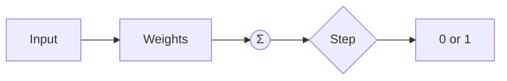

# Interview Questions: Perceptron From Scratch

## Table of Contents
1. [Basic Perceptron Questions](#basic-perceptron-questions)
2. [Algorithm & Implementation Questions](#algorithm--implementation-questions)
3. [Hyperparameter Questions](#hyperparameter-questions)
4. [Comparison Questions](#comparison-questions)
5. [Practical Application Questions](#practical-application-questions)

---

## Basic Perceptron Questions

### Q1: What is a Perceptron?

**Simple Answer (for 10-year-old):**
Imagine a robot that looks at two things about a student (like math score and science score) and decides "Pass" or "Fail". The robot learns by being told when it's wrong!

**Technical Answer:**
A Perceptron is a linear binary classifier that computes a weighted sum of inputs, adds a bias, and applies a step function to produce a binary output: `y = step(w·x + b)`.



**Key Points:**
- Simplest neural network (single neuron)
- Only works on linearly separable data
- Foundation for all deep learning

---

### Q2: How does a Perceptron learn?

**Simple Answer:**
It's like learning to shoot basketball. If you miss (wrong prediction), you adjust your throw (weights). If you score (correct), keep doing the same!

**Technical Answer:**
The Perceptron uses error-driven learning:
1. Make a prediction
2. If wrong: `w = w + lr × (y_true - y_pred) × x`
3. If correct: do nothing

**Common Mistake:**
Saying "it always updates weights" - No! Only updates on errors.

---

### Q3: What is the decision boundary?

**Simple Answer:**
A line on a graph that separates two groups. Points on one side are "Class 0", points on the other side are "Class 1".

**Technical Answer:**
The decision boundary is defined by `w·x + b = 0`. In 2D: `w₁x₁ + w₂x₂ + b = 0`.


---

### Q4: What is linear separability?

**Simple Answer:**
Can you draw ONE straight line to perfectly separate two groups? If yes = linearly separable.

**Technical Answer:**
Data is linearly separable if there exists a hyperplane that can perfectly classify all samples.

**Key Point:**
Perceptron convergence is GUARANTEED only on linearly separable data.

---

### Q5: Why does the Perceptron fail on XOR?

**Simple Answer:**
XOR has 4 points: (0,0)=0, (0,1)=1, (1,0)=1, (1,1)=0. Try drawing one straight line to separate 0s from 1s - impossible!

**Technical Answer:**
XOR is not linearly separable. No single hyperplane can divide the feature space correctly.

**Solution:** Multi-layer Perceptron (MLP).

---

## Algorithm & Implementation Questions

### Q6: What is the Perceptron update rule?

**Simple Answer:**
If you guess wrong, move your answer closer to the right one.

**Technical Answer:**
```
w_new = w_old + η × (y_true - y_pred) × x
b_new = b_old + η × (y_true - y_pred)
```

Where η (eta) is the learning rate.

---

### Q7: Why do we shuffle data each epoch?

**Simple Answer:**
Like shuffling a deck of cards before a game - it keeps things fair and prevents the model from memorizing the order.

**Technical Answer:**
Shuffling prevents the model from learning patterns in the data ordering, reduces variance in gradient estimates, and helps escape local optima.

---

### Q8: What is an epoch?

**Simple Answer:**
Reading through your entire textbook once = one epoch. Multiple epochs = reading it multiple times to learn better.

**Technical Answer:**
One epoch is a complete pass through all training samples. Multiple epochs allow the model to refine its decision boundary.

---

### Q9: How do you calculate accuracy?

**Simple Answer:**
Count how many you got right, divide by total. If you got 95 out of 100 correct, accuracy = 95%.

**Technical Answer:**
```
accuracy = (number of correct predictions) / (total predictions)
         = np.mean(y_pred == y_true)
```

---

### Q10: Why initialize weights to zero?

**Simple Answer:**
Starting from zero is like a blank slate - no bias toward any direction initially.

**Technical Answer:**
For Perceptron, zero initialization works because:
1. No initial bias toward any class
2. First update will set the direction based on first error
3. Guaranteed convergence on separable data still holds

**Note:** For deep networks, zero init causes symmetry problems - use random init instead.

---

## Hyperparameter Questions

### Q11: What is learning rate and how to choose it?

**Simple Answer:**
How big of a step to take when learning. Too small = slow learner. Too big = keeps overshooting.

**Technical Answer:**
Learning rate controls the magnitude of weight updates.

| Value | Effect |
|-------|--------|
| 0.001 | Very stable, slow convergence |
| 0.01 | Good balance (common default) |
| 0.1 | Fast, may oscillate |
| 1.0 | Unstable, may diverge |

---

### Q12: How many epochs should we train for?

**Simple Answer:**
Keep training until your score stops improving. For our project: 40 epochs was enough.

**Technical Answer:**
Options:
1. Fixed number (40 epochs here)
2. Early stopping (stop when validation accuracy plateaus)
3. Convergence (stop when no more updates needed)

---

### Q13: What happens if learning rate is too high?

**Simple Answer:**
Like overcorrecting while driving - you keep zigzagging and never go straight!

**Technical Answer:**
High LR causes:
- Oscillation around the optimal boundary
- May never converge
- Accuracy fluctuates wildly

---

### Q14: What happens if learning rate is too low?

**Simple Answer:**
Like a turtle trying to finish a race - technically it will get there, but it takes forever!

**Technical Answer:**
Low LR causes:
- Very slow convergence
- May need many more epochs
- But guaranteed stable convergence

---

## Comparison Questions

### Q15: Perceptron vs Logistic Regression

| Aspect | Perceptron | Logistic Regression |
|--------|------------|---------------------|
| Output | 0 or 1 | Probability [0,1] |
| Activation | Step function | Sigmoid function |
| Loss | Perceptron loss | Log loss |
| Updates | Only on errors | On all samples |
| Non-separable data | Oscillates forever | Still converges |

---

### Q16: Perceptron vs SVM

| Aspect | Perceptron | SVM |
|--------|------------|-----|
| Margin | No margin concept | Maximizes margin |
| Boundary | Any separating line | Optimal separating line |
| Non-linear | No | Yes (with kernels) |
| Solution | Many possible | Unique optimal |

---

### Q17: Perceptron vs Multi-layer Perceptron (MLP)

| Aspect | Perceptron | MLP |
|--------|------------|-----|
| Layers | 1 (single) | Multiple |
| Non-linear | No | Yes |
| XOR problem | Cannot solve | Can solve |
| Complexity | Simple | More complex |

---

### Q18: fit() vs predict() vs score()

| Method | Purpose | Returns |
|--------|---------|---------|
| fit(X, y) | Train the model | self (for chaining) |
| predict(X) | Make predictions | Array of 0s and 1s |
| score(X, y) | Calculate accuracy | Float [0, 1] |

---

## Practical Application Questions

### Q19: How would you improve this Perceptron?

**Answer:**
1. **Adaptive learning rate:** Decrease LR over time
2. **Early stopping:** Stop when no improvement
3. **Pocket algorithm:** Keep best weights seen
4. **Regularization:** Add L1/L2 penalty (though not standard for Perceptron)

---

### Q20: When would you NOT use a Perceptron?

**Answer:**
1. Non-linearly separable data (use MLP, SVM with kernels)
2. Need probability outputs (use Logistic Regression)
3. Complex patterns (use deep learning)
4. High-dimensional data with complex relationships

---

## Common Mistakes & Traps

### Mistake 1: Updating on correct predictions
**Wrong:** `self.weights += lr * x` for every sample
**Right:** Only update when `y_true != y_pred`

### Mistake 2: Confusing epochs and iterations
**Wrong:** "One iteration through all data"
**Right:** "One epoch = one complete pass; one iteration = one sample update"

### Mistake 3: Perceptron gives probabilities
**Wrong:** "Perceptron outputs confidence scores"
**Right:** "Perceptron outputs hard 0 or 1"

### Mistake 4: Works on any data
**Wrong:** "Perceptron can classify all datasets"
**Right:** "Only guaranteed to converge on linearly separable data"

---

## Key Points to Remember

1. Perceptron = single neuron with step function
2. Only updates on misclassification
3. Convergent on linearly separable data
4. Cannot solve XOR (need multi-layer)
5. Learning rate controls step size
6. Epoch = one pass through all data
7. Decision boundary: w·x + b = 0
