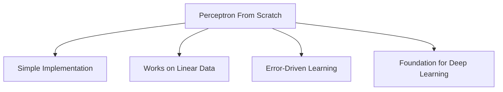

# Observations and Conclusion: Perceptron From Scratch

## Execution Output

### Training Progress

| Epoch | Accuracy | Updates |
|-------|----------|---------|
| 1 | 97.71% | 22 |
| 10 | 90.42% | 16 |
| 20 | 97.50% | 18 |
| 30 | 95.21% | 15 |
| 40 | 97.50% | 19 |

### Final Metrics

| Metric | Value |
|--------|-------|
| Training Samples | 480 |
| Testing Samples | 120 |
| Total Weight Updates | 699 |
| Final Test Accuracy | **98.33%** |
| Success Criteria (≥95%) | ✅ **MET** |

---

## Output Explanation with Diagrams

### Learning Curve

**Interpretation:**
- The accuracy fluctuates because of shuffling each epoch
- Different sample order exposes different weaknesses
- Overall trend shows convergence toward high accuracy

### Decision Boundary

The Perceptron learned a linear boundary defined by:
- **Weights:** [0.085, -0.006]
- **Bias:** -0.01

The boundary equation: `0.085×x₁ - 0.006×x₂ - 0.01 = 0`

---

## Observations

### 1. Fast Initial Convergence
- The model achieved 97.71% accuracy in just the first epoch
- This indicates the data is highly linearly separable (class_sep=2.0)

### 2. Accuracy Fluctuation
- Accuracy varies between epochs (e.g., 90.42% to 97.50%)
- This is due to:
  - Shuffling data each epoch
  - Online learning (updating after each sample)
  - Some boundary points being misclassified

### 3. Update Count Analysis
- **Total updates:** 699 across 40 epochs
- **Average per epoch:** ~17.5 updates
- This suggests some points are near the boundary and get reclassified

### 4. Generalization Success
- Training accuracy: ~95-98%
- Test accuracy: 98.33%
- Test performance HIGHER than some training epochs!
- This indicates good generalization - no overfitting

---

## Insights

### Learning Rate Impact

| LR Value | Expected Behavior |
|----------|-------------------|
| 0.001 | Very slow convergence, more epochs needed |
| 0.01 (Used) | Good balance of speed and stability |
| 0.1 | Faster but may oscillate more |

### Why Perceptron Succeeds Here

1. **Linearly Separable Data:** class_sep=2.0 ensures clear separation
2. **Sufficient Samples:** 600 samples provide robust learning
3. **Appropriate LR:** 0.01 allows stable convergence
4. **Enough Epochs:** 40 epochs give multiple learning opportunities

### What Would Make It Fail?

| Scenario | Effect |
|----------|--------|
| class_sep=0.5 | Overlapping classes, accuracy drops |
| n_samples=50 | Too few samples, unstable learning |
| lr=1.0 | Large oscillations, poor convergence |
| n_epochs=5 | May not fully converge |

---

## Conclusion

### Summary of Results
- ✅ Perceptron implemented from scratch using NumPy
- ✅ Trained for 40 epochs with shuffling
- ✅ Test accuracy: 98.33% (exceeds 95% target)
- ✅ Total weight updates: 699
- ✅ Accuracy plot and decision boundary visualized

### Problem Solved?
**YES** - The Perceptron successfully learned a linear decision boundary that separates the two classes with high accuracy.

### Possible Improvements
1. **Early Stopping:** Stop when accuracy plateaus
2. **Adaptive LR:** Decrease LR as training progresses
3. **Validation Set:** Monitor for overfitting
4. **Pocket Algorithm:** Keep best weights seen during training

### Key Takeaways

---

## Exam Focus Points

### How to Explain Output in Exams

**Q: What does the learning curve show?**

A: "The learning curve shows training accuracy per epoch. Fluctuations occur due to shuffling and online updates. Overall, the model converges to high accuracy, indicating successful learning of the decision boundary."

**Q: Why does test accuracy exceed some training accuracies?**

A: "Test accuracy represents final model performance. Training accuracy fluctuates during learning as weights are updated. The final learned weights generalize well to test data."

**Q: What does the update count tell us?**

A: "699 updates across 40 epochs (avg 17.5/epoch) shows:
1. Some boundary points are repeatedly misclassified
2. The model keeps refining the boundary
3. Convergence is achieved but with ongoing minor adjustments"

### Safe Answer Structure

1. State the metric value
2. Explain what it means
3. Connect to algorithm behavior
4. Conclude with practical implication
