# Problem Statement: Perceptron From Scratch

## 🧩 What Problem Are We Solving?

### The Problem (Explained Simply)

Imagine you are a **teacher** with a pile of student exam papers. Each paper has two scores (say, Math and Science). You want to quickly decide: "**Pass** or **Fail**?" without reading each paper in detail.

The **Perceptron** is like a simple **decision-making machine**. It learns a **straight line** (called a decision boundary) that separates "Pass" students from "Fail" students based on their two scores.

```mermaid
graph LR
    A[Student Scores] --> B{Perceptron}
    B --> C[Pass ✅]
    B --> D[Fail ❌]
```



### Why Does This Problem Matter?

| Real-World Use | Example |
|----------------|---------|
| Email Filtering | Spam or Not Spam? |
| Medical Diagnosis | Healthy or Sick? |
| Quality Control | Defective or Good? |
| Finance | Approve Loan or Reject? |

The Perceptron is the **foundation of neural networks**. Understanding it helps you grasp how deep learning works!

---

## 🪜 Steps to Solve the Problem

### Step-by-Step Approach


### Breaking It Down

| Step | What We Do | Simple Analogy |
|------|------------|----------------|
| 1. Generate Data | Create 600 student papers with 2 scores each | Teacher preparing exam papers |
| 2. Split Data | Keep 20% papers aside for final testing | Practice tests vs. final exam |
| 3. Initialize Weights | Start with random guesses | New teacher guessing initially |
| 4. Train (40 epochs) | Learn from mistakes, shuffle each round | Improve with practice |
| 5. Count Updates | Track how many corrections were made | Count mistake corrections |
| 6. Plot Results | Draw the decision line and accuracy graph | Report card visualization |

---

## 🎯 Expected Output

### What We Will Produce

1. **Accuracy Plot**: A graph showing how accuracy improves over 40 epochs
2. **Decision Boundary**: A plot showing the separating line between classes
3. **Update Count**: Total number of weight corrections made
4. **Commentary**: 150-200 word analysis of learning dynamics

### Success Criteria

| Metric | Target |
|--------|--------|
| Test Accuracy | >= 95% |
| Holdout Split | 20% |
| Training Epochs | 40 |
| Shuffling | Yes, each epoch |

### Sample Output Visualization

```
Epoch 1:  Accuracy = 50.0%  (many updates)
Epoch 10: Accuracy = 85.0%  (fewer updates)
Epoch 20: Accuracy = 92.0%  (even fewer)
Epoch 40: Accuracy = 98.0%  (minimal updates)

Total Weight Updates: ~150
Final Test Accuracy: 96.67%
```

---

## 📝 Exam Focus Points

### Key Lines to Remember

1. `y_pred = 1 if (X @ w + b) >= 0 else 0` → Perceptron prediction rule
2. `w += lr * (y - y_pred) * x` → Weight update rule
3. `np.random.shuffle(indices)` → Shuffling for better learning

### Typical Exam Questions

| Question | One-Line Answer |
|----------|-----------------|
| What is a Perceptron? | A single neuron that learns a linear decision boundary |
| Why shuffle each epoch? | To prevent learning order-dependent patterns |
| When does Perceptron fail? | When data is not linearly separable |
| What does learning rate control? | Step size of weight updates |
