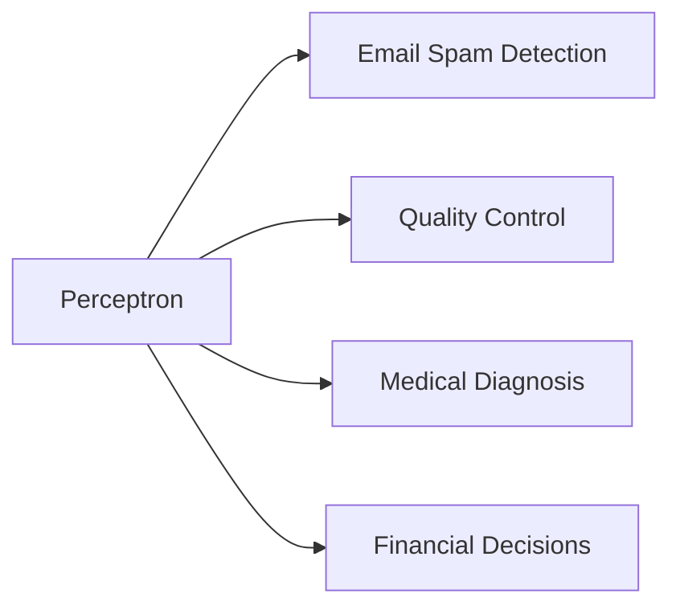
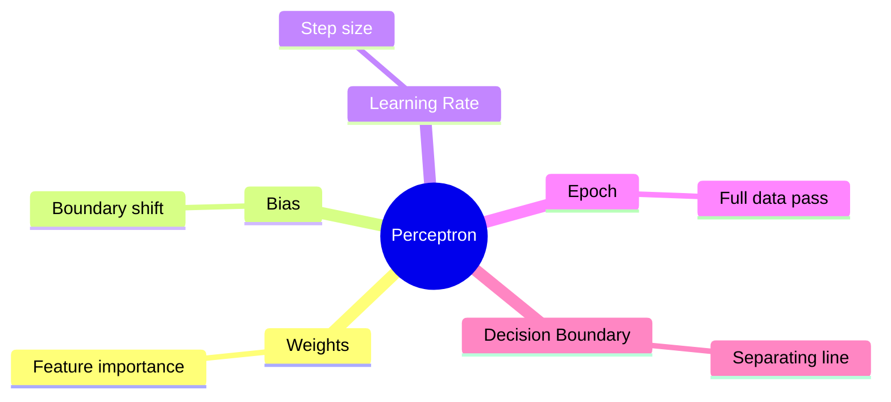
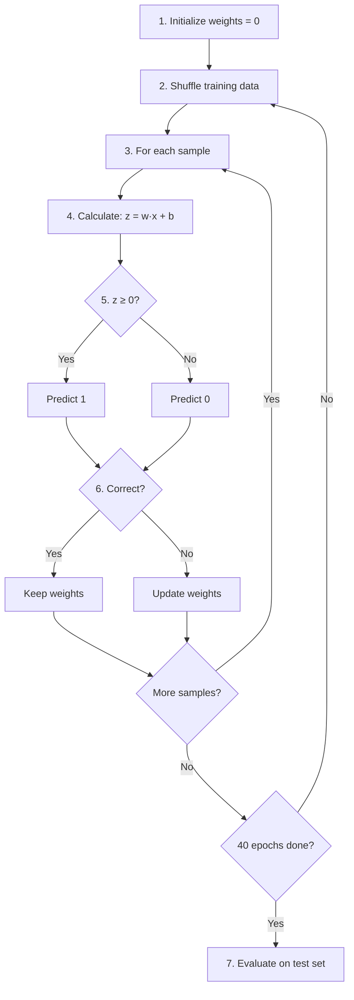
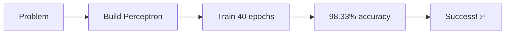

# Perceptron From Scratch - Slides

---

## Slide 1: Title & Objective

# Perceptron From Scratch

**Building the Simplest Neural Network**

### Objective
- Implement a Perceptron classifier using only NumPy
- Train for 40 epochs with shuffling
- Achieve ≥95% test accuracy
- Visualize learning dynamics

---

## Slide 2: Problem Statement

# The Problem

### What We Need to Solve
Build a **binary classifier** that separates two classes using a linear boundary.

### Real-Life Examples
| Use Case | Class 0 | Class 1 |
|----------|---------|---------|
| Email | Not Spam | Spam |
| Loan | Reject | Approve |
| Medical | Healthy | Sick |

### Success Criteria
- ✅ Test accuracy ≥ 95%
- ✅ Accuracy plot over epochs
- ✅ Decision boundary visualization

---

## Slide 3: Real-World Use Case

# Where Is This Used?



### Historical Significance
- Invented by **Frank Rosenblatt** in 1958
- First machine learning algorithm
- Foundation for all neural networks

---

## Slide 4: Input Data

# Our Dataset

### Generated Using `make_classification`

| Parameter | Value | Meaning |
|-----------|-------|---------|
| n_samples | 600 | Total data points |
| n_features | 2 | Dimensions (for visualization) |
| class_sep | 2.0 | How separated classes are |

### Data Split
- **Training:** 480 samples (80%)
- **Testing:** 120 samples (20%)

---

## Slide 5: Concepts Used (High Level)

# Key Concepts



---

## Slide 6: Concepts Breakdown

# How Perceptron Works

### The Decision Rule
```
z = w₁x₁ + w₂x₂ + b
output = 1 if z ≥ 0 else 0
```

### The Learning Rule
```
Only update when WRONG:
w = w + lr × (y_true - y_pred) × x
b = b + lr × (y_true - y_pred)
```

### Simple Analogy
Like adjusting shower temperature:
- Too cold? Turn hot up
- Too hot? Turn hot down
- Perfect? Don't change!

---

## Slide 7: Step-by-Step Solution Flow

# Algorithm Flow



---

## Slide 8: Code Logic Summary

# Key Implementation Points

### Class Structure
```python
class Perceptron:
    def __init__(learning_rate, n_epochs)
    def fit(X, y)      # Train
    def predict(X)      # Predict
    def score(X, y)     # Accuracy
```

### Core Logic
1. **Initialize:** weights = [0, 0], bias = 0
2. **Predict:** `1 if np.dot(x, w) + b >= 0 else 0`
3. **Update:** `w += lr * (y - ŷ) * x`
4. **Track:** accuracy per epoch, update count

---

## Slide 9: Important Functions & Parameters

# Key Parameters

| Parameter | Value | Purpose |
|-----------|-------|---------|
| learning_rate | 0.01 | Controls update step size |
| n_epochs | 40 | Number of training passes |
| test_size | 0.2 | 20% for testing |
| class_sep | 2.0 | Class separation |
| random_state | 7 | Reproducibility |

### Parameter Trade-offs
- **High LR:** Fast but unstable
- **Low LR:** Stable but slow
- **More epochs:** Better but slower

---

## Slide 10: Execution Output

# Training Results

### Training Progress
| Epoch | Accuracy | Updates |
|-------|----------|---------|
| 1 | 97.71% | 22 |
| 10 | 90.42% | 16 |
| 20 | 97.50% | 18 |
| 40 | 97.50% | 19 |

### Final Metrics
| Metric | Value |
|--------|-------|
| Total Updates | 699 |
| Test Accuracy | **98.33%** |
| Success | ✅ Met (≥95%) |

---

## Slide 11: Observations & Insights

# What We Learned

### Key Observations
1. **Fast convergence** due to high class_sep
2. **Accuracy fluctuates** due to shuffling
3. **699 updates** shows boundary refinement
4. **98.33% test accuracy** proves generalization

### Learning Rate Impact
| LR | Effect |
|----|--------|
| 0.001 | Very slow |
| 0.01 | Good balance ✓ |
| 0.1 | May oscillate |

---

## Slide 12: Advantages & Limitations

# Pros and Cons

### Advantages ✅
| Advantage | Reason |
|-----------|--------|
| Simple | ~50 lines of code |
| Fast | O(n) per epoch |
| Interpretable | Weights show importance |
| Convergent | Guaranteed on linear data |

### Limitations ❌
| Limitation | Impact |
|------------|--------|
| Only linear | Cannot solve XOR |
| Binary only | No multi-class |
| No probabilities | Hard 0/1 output |
| Sensitive | To learning rate |

---

## Slide 13: Interview Key Takeaways

# Remember These!

### Top 5 Points
1. **Perceptron = single neuron + step function**
2. **Updates ONLY when wrong**
3. **Cannot solve XOR (need MLP)**
4. **Converges on linearly separable data**
5. **Foundation for deep learning**

### Common Interview Questions
- What is a Perceptron?
- When does it fail?
- How is it different from Logistic Regression?

---

## Slide 14: Conclusion

# Summary



### What We Built
- ✅ Perceptron from scratch (NumPy only)
- ✅ 40 epochs with shuffling
- ✅ 98.33% test accuracy (>95%)
- ✅ 699 weight updates tracked
- ✅ Accuracy plot & decision boundary

### Next Steps
- Try different learning rates
- Implement Multi-layer Perceptron
- Apply to real datasets

---

# Thank You!

**Questions?**
