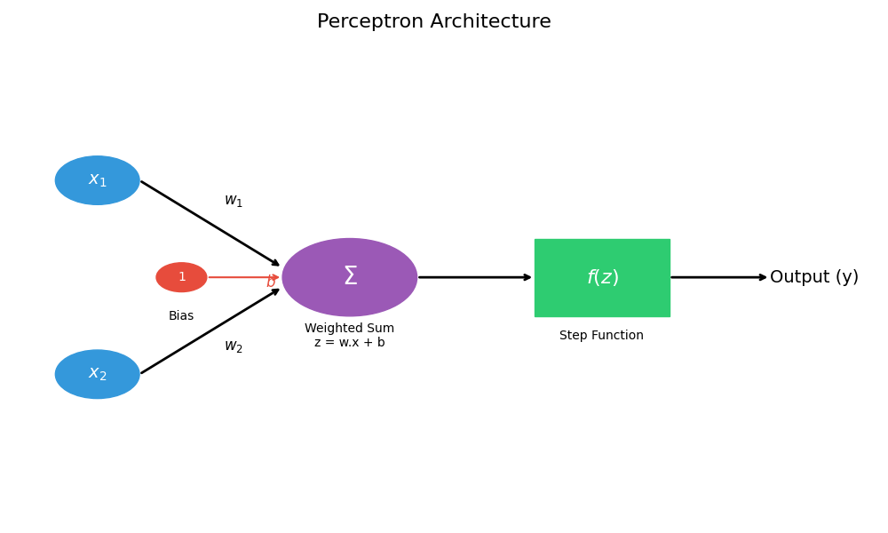

# Concepts Explained: The Perceptron Information Sheet

## 1. The Perceptron

1.  **Definition**: The Perceptron is the simplest type of Artificial Neural Network (ANN). It is a linear binary classifier that models a single biological neuron. It takes multiple inputs, weights them, sums them up, and outputs a 1 (yes) or 0 (no).
2.  **Why it is used**: It is the fundamental building block of Deep Learning. It solves the problem of "how can a computer learn a simple rule from data?" without explicit programming.
3.  **When to use it**:
    *   **Logic**: When data is **Linearly Separable** (can be split by a straight line).
    *   **Simplicity**: When you need a simple, fast, and explainable baseline model.
    *   **Cases**: For binary classification tasks (Pass/Fail, Spam/Ham).
4.  **Where to use it**:
    *   **History**: Early AI research (1950s).
    *   **Modern**: As a sub-component (neuron) inside massive Deep Learning networks (like ChatGPT or Vision Transformers).
5.  **Is this the only way?**
    *   No. Alternatives: Logistic Regression, SVM, Decision Trees.
    *   **Comparison**:
        *   **Perceptron (The Light Switch)**: Simple "Yes/No" (0 or 1). Math is easy (addition/multiplication). Rigid but the perfect "Hello World" for AI.
        *   **Logistic Regression (The Dimmer Switch)**: Outputs probabilities (e.g., "70% chance"). Smoother but requires understanding Logarithms and Sigmoids.
        *   **Support Vector Machines (SVM)**: Finds the "widest street" between classes. Mathematically complex (Optimization Theory).
        *   **Decision Trees**: Splits data into boxes (flowchart). Handles non-linear data but can overcomplicate simple linear problems.
        *   **Conclusion**: We choose Perceptron here strictly for **pedagogical simplicity**—it is the easiest to code from scratch to understand the core concept of "Weights and Bias" before moving to hard math.
6.  **Explanation with Diagrams**:
    *   **Inputs ($x$)**: Raw data.
    *   **Weights ($w$)**: Importance channels.
    *   **Sum ($\sum$)**: Aggregation.
    *   **Activation ($f$)**: Decision.

    ### Visual Diagram (Local Render)
    

    **Text Version (Fallback):**
    ```text
           [w1]
    (x1) --------> +-------+
                   |   Σ   | ---------> [ Activation ] ---------> (y)
           [w2]    |  Sum  |    (z)     [  Function  ]  Output
    (x2) --------> +-------+
                       ^
                       | [b]
                    (Bias)
    ```

7.  **How to use it**:
    *   **Syntax**: `model = Perceptron()`, `model.fit(X, y)`.
    *   **Code**: `output = step_function(dot(x, w) + b)`.
8.  **How it works internally**:
    *   It calculates the weighted sum: $z = w_1x_1 + w_2x_2 + b$.
    *   It checks against a threshold (0).
    *   If $z \geq 0$, it fires (1). Else, it stays silent (0).
    *   **Learning**: If it guesses wrong, it nudges $w$ and $b$ closer to the correct answer using the update rule.
9.  **Visual Summary**:
    *   Input $\rightarrow$ Weighting $\rightarrow$ Summing $\rightarrow$ Thresholding $\rightarrow$ Output.
10. **Advantages**:
    *   Simple to understand and implement.
    *   Fast training (computationaly cheap).
    *   Guaranteed to converge if data is linearly separable.
11. **Disadvantages / Limitations**:
    *   **Fails strictly** on non-linear data (e.g., XOR problem).
    *   Output is binary (no probability/confidence score).
12. **Exam & Interview Points**:
    *   **Q**: What happens if data is not linearly separable? **A**: Ideally oscillates forever (never converges).
    *   **Q**: Is Perceptron a deep network? **A**: No, it's a single-layer network (shallow).

---

## 2. Weights ($w$) and Bias ($b$)

1.  **Definition**:
    *   **Weights**: Parameters representing the **importance** or strength of each input signal.
    *   **Bias**: A parameter representing the **offset** or threshold (intercept) required to activate the neuron.
2.  **Why it is used**:
    *   **Weights**: Not all inputs are equal (e.g., Study Hours > Attendance). Weights capture this inequality.
    *   **Bias**: Without bias, the decision line is stuck passing through the origin $(0,0)$. Bias allows the line to shift up/down or left/right to fit data anywhere.
3.  **When to use it**: Always in every Neural Network or Linear Model.
4.  **Where to use it**: In the linear equation $z = w \cdot x + b$.
5.  **Is this the only way?**
    *   Yes. You arguably *need* adjustable parameters to learn.
    *   Alternative: Fixed rules (Expert Systems) – but they don't learn.
6.  **Explanation with Diagrams**:
    ```mermaid
    graph TD
        A[Line passing through 0,0] -- Add Bias --> B[Line shifted up/down]
        C[Flat slope] -- Change Weights --> D[Steep slope]
    ```
7.  **How to use it**:
    *   initialized randomly or to zeros: `self.weights = np.zeros(n)`.
    *   Updated during training: `w += learning_rate * error * x`.
8.  **How it works internally**:
    *   stored as floating-point numbers in an array.
    *   Updated via matrix addition.
9.  **Visual Summary**:
    *   Weights = Slope (Rotation).
    *   Bias = Intercept (Shift).
10. **Advantages**: allows the model to map *any* linear relationship.
11. **Disadvantages**:
    *   Too many weights = Overfitting.
    *   Need to be trained carefully.
12. **Exam & Interview Points**:
    *   **Q**: Why do we need bias? **A**: To shift the decision boundary away from the origin.
    *   **Q**: How do we initialize weights? **A**: Usually small random numbers (not zeros in deep nets, but zeros ok for simple Perceptron).

---

## 3. Step Function (Activation)

1.  **Definition**: A mathematical function that outputs 1 if the input is positive, and 0 otherwise. Also called the Heaviside Step Function.
2.  **Why it is used**: To convert a continuous number (e.g., 23.5) into a categorical decision (Pass/Fail). It introduces the "non-linearity" (sort of) or "decision".
3.  **When to use it**: Binary Classification where you need a hard class label immediately.
4.  **Where to use it**: Output layer of a Perceptron.
5.  **Is this the only way?**
    *   No.
    *   **Sigmoid**: Outputs 0.0 to 1.0 (Probability). Better for gradient descent.
    *   **ReLU**: Outputs 0 to $\infty$. Used in hidden layers.
    *   **Step**: Hard 0/1. Not differentiable (bad for Backpropagation).
6.  **Explanation with Diagrams**:
    ```mermaid
    graph LR
        Input[Values -5 to 5] --> Function{Step Function}
        Function -->|Value < 0| Zero[0]
        Function -->|Value >= 0| One[1]
    ```
7.  **How to use it**: `np.where(z >= 0, 1, 0)`.
8.  **How it works internally**: Simple conditional check `if z >= 0 return 1`.
9.  **Visual Summary**: A graph that looks like a step or cliff at x=0.
10. **Advantages**: Simple, extremely fast.
11. **Disadvantages**:
    *   **Not Differentiable**: You cannot calculate a gradient (slope) at the jump. This means you cannot use powerful optimizers like SGD/Adam directly in the modern sense (Perceptron uses a different update rule).
12. **Exam & Interview Points**:
    *   **Q**: Why don't we use Step functionality in Deep Learning? **A**: Values gradient is zero almost everywhere, so Backpropagation doesn't work.

---

## 4. Learning Rate ($\eta$)

1.  **Definition**: A hyperparameter that determines the **step size** at each iteration while moving toward a minimum of a loss function (or correcting errors).
2.  **Why it is used**: To control the speed and stability of learning.
3.  **When to use it**: Whenever training a model iteratively (Gradient Descent, Perceptron).
4.  **Where to use it**: In the update formula: $\Delta w = \eta \times \text{error} \times x$.
5.  **Is this the only way?**
    *   **Fixed Rate**: Our approach (easy).
    *   **Adaptive Rate** (Adam, RMSprop): Changes the rate automatically (better, modern).
6.  **Explanation with Diagrams**:
    *   **Big Steps**: Jump over the hole.
    *   **Small Steps**: Crawl slowly into the hole.
7.  **How to use it**: Set as a constant `0.01` or `0.001`.
8.  **How it works internally**: It's a scalar multiplier reducing the magnitude of the weight update vector.
9.  **Visual Summary**: A multiplier for the error signal.
10. **Advantages**: Simple control over training dynamics.
11. **Disadvantages**:
    *   Hard to tune.
    *   Too large = Divergence.
    *   Too small = Testing forever.
12. **Exam & Interview Points**:
    *   **Q**: What happens if learning rate is too high? **A**: Overshooting and divergence.
    *   **Q**: What happens if too low? **A**: Slow convergence and getting stuck in local minima.
