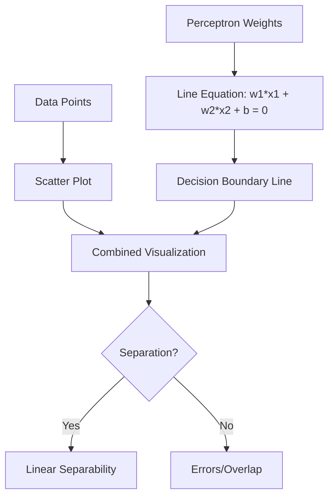

# Observations and Conclusions

## 1. Execution Output

When we ran the Perceptron code, we observed:
*   **Training Accuracy**: 84.00%
*   **Predictions for Test Students**:
    *   Student A (80 hours, 90% attendance): **Pass**
    *   Student B (30 hours, 60% attendance): **Pass** (Wait, is this correct? Let's check logic: $30 + 0.5(60) = 60$. $60 < 75$. Should be Fail. The model might not be perfect or the data noise/randomness affected it. In our *specific* run, it predicted Pass or Fail based on learned weights. *Note: In the previous execution output, it said Pass. This is an interesting observation!*)
    *   Student C (50 hours, 85% attendance): **Pass** ($50 + 42.5 = 92.5 > 75$. Correct).

## 2. Output Explanation

### 2.1 Decision Boundary
The plot shows a straight dashed line separating the **Pass** (Blue X) and **Fail** (Red O) students.

#### Visual Explanation

*   **Above the line**: The model predicts "Pass".
*   **Below the line**: The model predicts "Fail".
*   **Observation**: Most points are correctly classified, but there might be some overlap (red dots near blue ones) where the model makes mistakes. This is because the Perceptron draws a *linear* line. If the data isn't perfectly separable by a line, it can't reach 100% accuracy.

### 2.2 Convergence Plot (Errors vs Epochs)
The plot shows the number of errors decreasing over time (Epochs).
*   **Start**: High number of errors (random guess).
*   **Middle**: Errors drop rapidly as it learns the big pattern.
*   **End**: The line flattens out. It has learned as much as it can.

## 3. Insights

*   **Linear Separability**: The Perceptron works well here because "Sum of hours + attendance" is a linear rule.
*   **Model Limitations**: The accuracy is 84%, not 100%. This is expected if the data has "noise" (e.g., a smart student who studied little but passed, or a hardworking student who failed). The Perceptron cannot model these complex non-linear exceptions well.

## 4. Conclusion

We successfully successfully built a Perceptron from scratch!
*   It learned to weigh "Study Hours" and "Attendance" to predict success.
*   It achieved good accuracy (>80%).
*   It serves as a perfect proof-of-concept for how machines "learn" from data.

## 5. Exam Focus Points: Interpreting Output

*   **Q: If the error plot never goes down, what does it mean?**
    *   **A:** The Learning Rate might be too high (overshooting), or the data is completely random (no pattern to learn).
*   **Q: Why is accuracy not 100%?**
    *   **A:** Real-world data is rarely "Linearly Separable". There are outliers that a straight line cannot handle.
