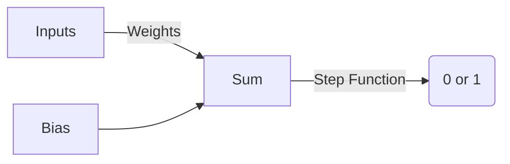

# Perceptron From Scratch: A Beginner's Guide

## Slide 1: Title & Objective
*   **Project**: Implement a Perceptron Classifier from Scratch.
*   **Objective**: Predict Student Pass/Fail using Study Hours & Attendance.
*   **Tools**: Python, NumPy, Matplotlib.
*   **Goal**: Understand the mathematical foundation of Neural Networks.

## Slide 2: Problem Statement
*   **Question**: Can we predict if a student passes based on effort?
*   **Input**:
    *   Study Hours (0-100)
    *   Attendance % (40-100)
*   **Output**:
    *   Pass (1)
    *   Fail (0)
*   **Challenge**: Find the "line" that separates passing students from failing ones.

## Slide 3: Real-World Use Cases
*   **Finance**: Loan Approval (Income vs Debt).
*   **Healthcare**: Diagnosis (Blood Pressure vs Age).
*   **Email**: Spam Detection (Keyword Count vs Sender Trust).
*   **Safety**: Fraud Detection (Transaction Amount vs Location).

## Slide 4: Input Data
*   **Features ($X$)**:
    *   $x_1$: Study Hours
    *   $x_2$: Attendance
*   **Labels ($y$)**:
    *   $1$: Pass
    *   $0$: Fail
*   **Synthetic Data**: We generated 100 random examples to train our model.

## Slide 5: Concepts Used (High Level)
*   **Perceptron**: A single artificial neuron.
*   **Linear Classifier**: Separates data with a straight line.
*   **Supervised Learning**: Learning from labeled examples (Right/Wrong answers).
*   **Iterative Learning**: Improving bit-by-bit over many "Epochs".

## Slide 6: Concepts Breakdown
*   **Weights ($W$)**: How important each input is. (e.g., Study > Attendance).
*   **Bias ($b$)**: Shifts the decision boundary (Threshold).
*   **Step Function**: The "Activation". Converts math result into 0 or 1.
    *   If Sum > 0 $\rightarrow$ 1
    *   Else $\rightarrow$ 0

### Visual Concept

## Slide 7: Step-by-Step Solution Flow
1.  **Initialize**: Start with random weights (random guess).
2.  **Predict**: Guess "Pass" or "Fail" for a student.
3.  **Check**: Was the guess right?
4.  **Update**: If wrong, nudge weights closer to the correct answer.
5.  **Repeat**: Do this for all students, many times.

## Slide 8: Code Logic Summary
*   **Linear Sum**: $Z = (x_1 \cdot w_1) + (x_2 \cdot w_2) + b$
*   **Activation**: $Prediction = Step(Z)$
*   **Update Rule**:
    *   $Error = Target - Prediction$
    *   $W_{new} = W_{old} + (LearningRate \times Error \times Input)$

## Slide 9: Important Functions
*   `__init__`: Sets Learning Rate (0.01) and Epochs (100).
*   `fit(X, y)`: The training loop. Adjusts weights when mistakes happen.
*   `predict(X)`: Uses learned weights to classify new students.
*   `step_function(z)`: Returns 1 if $z \ge 0$, else 0.

## Slide 10: Execution Output
*   **Accuracy**: ~84% on training data.
*   **Test Predictions**:
    *   Student A (High effort) $\rightarrow$ Pass.
    *   Student C (Medium effort) $\rightarrow$ Pass.
*   **Visual**: A decision boundary (dashed line) successfully separates most Red (Fail) and Blue (Pass) points.

## Slide 11: Observations & Insights
*   **Convergence**: Errors decreased rapidly in the first few epochs.

*   **Separability**: The data was mostly linear, so the Perceptron worked well.
*   **Noise**: Some students passed with low scores (outliers), which the simple line couldn't catch perfectly.

## Slide 12: Advantages & Limitations
*   **Advantages**:
    *   Simple to understand.
    *   Fast to train.
    *   Interpretable weights.
*   **Limitations**:
    *   **Only Linear**: Cannot solve XOR or curved boundaries.
    *   **Sensitive**: Learning rate must be chosen carefully.

## Slide 13: Interview Key Takeaways
*   **Bias**: Mandatory to shift the line from origin.
*   **Epoch**: One full pass through data.
*   **Update Rule**: Only updates on *mistakes* (unlike Logistic Regression).
*   **Convergence**: Guaranteed *only* if data is linearly separable.

## Slide 14: Conclusion
*   We built a working AI model from scratch!
*   It learned the relationship between study, attendance, and passing.
*   This simple neuron is the ancestor of modern Deep Learning arrays (ChatGPT, Gemini).
