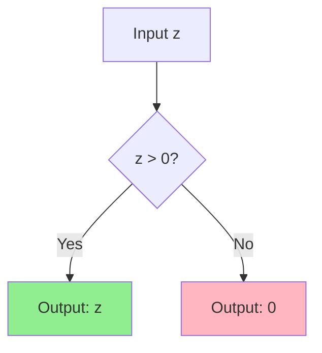
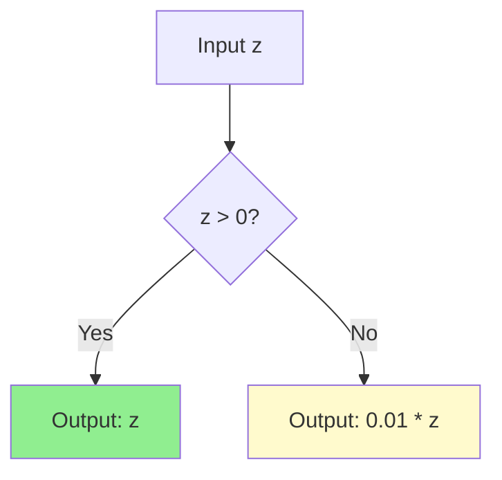
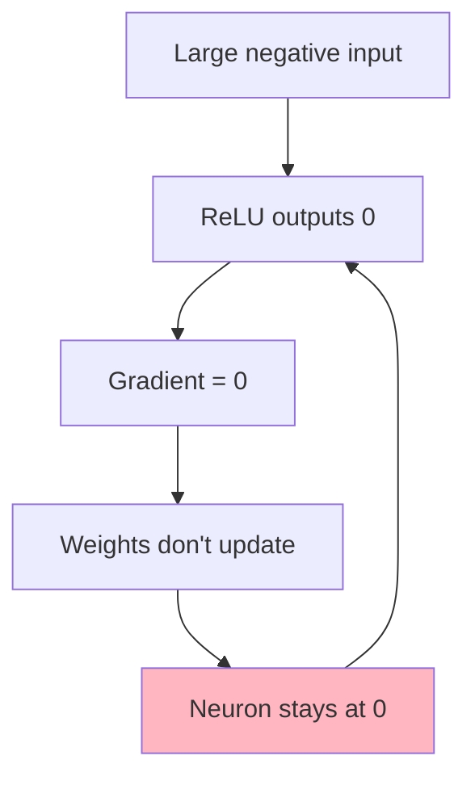
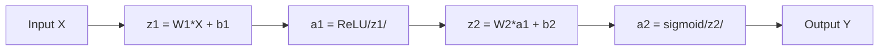
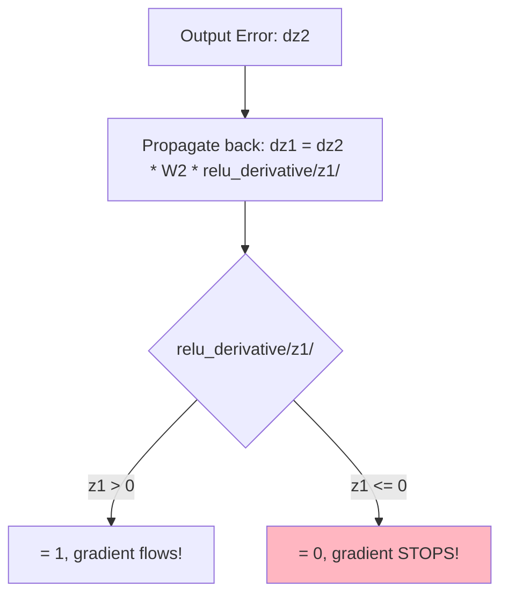
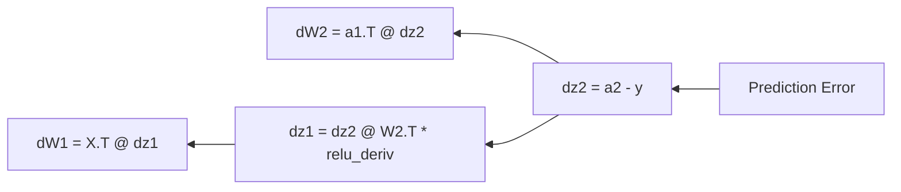

# Concepts Explained: ReLU vs Leaky ReLU

## Jargon Glossary

| Term | Simple Meaning | Technical Meaning |
|------|---------------|-------------------|
| **Neuron** | A worker in the network | Mathematical unit that processes inputs |
| **Activation** | The worker's output | Result after applying activation function |
| **ReLU** | "Pass if positive, else zero" | max(0, z) |
| **Leaky ReLU** | "Pass if positive, else 1% leak" | max(alpha*z, z) where alpha=0.01 |
| **Dead Neuron** | A lazy worker who never works | Neuron with zero output for all inputs |
| **Gradient** | How much to adjust | Derivative used for weight updates |
| **Forward Propagation** | Data flowing through network | Computing outputs from inputs |
| **Backward Propagation** | Learning from mistakes | Computing gradients to update weights |
| **Epoch** | One full round of training | One pass through all training data |
| **Loss** | How wrong we are | Measure of prediction error |

---

## Concept 1: ReLU (Rectified Linear Unit)

### 1. Definition
**Simple**: A function that outputs the input if positive, otherwise outputs zero.
**Exam-friendly**: ReLU(z) = max(0, z)

### 2. Why It Is Used
- Solves vanishing gradient problem of sigmoid/tanh
- Computationally efficient (simple max operation)
- Creates sparse activations (many zeros)

### 3. When to Use It
- Default choice for hidden layers
- Image classification (CNNs)
- Most deep learning architectures

### 4. Where to Use It
- Hidden layers of neural networks
- Convolutional neural networks
- NOT for output layers (use sigmoid/softmax instead)

### 5. Is This the Only Way?

| Alternative | Pros | Cons |
|-------------|------|------|
| Sigmoid | Smooth, bounded (0,1) | Vanishing gradient |
| Tanh | Zero-centered | Vanishing gradient |
| Leaky ReLU | No dying neurons | Slightly more complex |
| ELU | Smooth, no dying neurons | Computationally expensive |

**Why ReLU is chosen**: Fast, simple, works well in most cases.

### 6. Explanation with Diagram



### 7. How to Use It
```python
def relu(z):
    return np.maximum(0, z)

# Example
relu(5)   # Returns 5
relu(-3)  # Returns 0
```

### 8. How It Works Internally
1. Input z is received (can be array or scalar)
2. NumPy's maximum function compares each element with 0
3. If z > 0: return z (unchanged)
4. If z <= 0: return 0

### 9. Visual Summary
- **Formula**: max(0, z)
- **Positive inputs**: Pass through unchanged
- **Negative inputs**: Become zero
- **Derivative**: 1 for z>0, 0 for z<=0

### 10. Advantages
- Computationally efficient
- Helps prevent vanishing gradient
- Creates sparse representations
- Faster convergence than sigmoid/tanh

### 11. Disadvantages / Limitations
- **Dying ReLU problem**: Neurons can "die" and never recover
- Not zero-centered (can affect optimization)
- Unbounded output (can cause exploding activations)

### 12. Exam & Interview Points
1. ReLU = max(0, z)
2. Derivative: 1 if z>0, else 0
3. Dying ReLU: neurons stuck at zero forever
4. Used in hidden layers, not output
5. Faster than sigmoid/tanh

---

## Concept 2: Leaky ReLU

### 1. Definition
**Simple**: Like ReLU but lets a tiny bit (1%) through for negative values.
**Exam-friendly**: LeakyReLU(z) = z if z > 0, else alpha * z

### 2. Why It Is Used
- Prevents dying ReLU problem
- Keeps gradient flowing for all inputs
- All neurons can continue learning

### 3. When to Use It
- When you observe dead neurons with ReLU
- Deep networks
- Data with many negative pre-activations

### 4. Where to Use It
- Hidden layers of neural networks
- Generative Adversarial Networks (GANs)
- Deep architectures where dying ReLU is a concern

### 5. Is This the Only Way?

| Alternative | Pros | Cons |
|-------------|------|------|
| ReLU | Simpler | Dying neurons |
| Parametric ReLU | Learnable alpha | More parameters |
| ELU | Smooth | Computationally expensive |
| SELU | Self-normalizing | Strict conditions |

### 6. Explanation with Diagram



### 7. How to Use It
```python
def leaky_relu(z, alpha=0.01):
    return np.where(z > 0, z, alpha * z)

# Example
leaky_relu(5)    # Returns 5
leaky_relu(-100) # Returns -1 (1% of -100)
```

### 8. How It Works Internally
1. Check if input z > 0
2. If yes: return z unchanged
3. If no: return alpha * z (small fraction)
4. Gradient is never zero!

### 9. Visual Summary
- **Formula**: z if z > 0, else alpha * z
- **Alpha**: Typically 0.01 (1%)
- **Positive inputs**: Pass through unchanged
- **Negative inputs**: Scaled by alpha (not zero!)
- **Key benefit**: No dead neurons

### 10. Advantages
- Prevents dying ReLU problem
- Gradient always flows (1 or alpha)
- All neurons keep learning
- Minimal computational overhead

### 11. Disadvantages / Limitations
- One more hyperparameter (alpha)
- Not always better than ReLU
- Slightly more complex

### 12. Exam & Interview Points
1. LeakyReLU = max(alpha*z, z) where alpha typically 0.01
2. Derivative: 1 if z>0, alpha if z<=0
3. Prevents dead neurons
4. Alpha = 0.01 means 1% leak
5. No zero gradients!

---

## Concept 3: Dying ReLU Problem

### 1. Definition
**Simple**: When a neuron always outputs zero and stops learning forever.
**Exam-friendly**: Neurons with zero gradient for all inputs, unable to recover.

### 2. Why It Happens
1. ReLU outputs 0 for negative inputs
2. When output is 0, gradient is also 0
3. Zero gradient means weights don't update
4. Neuron is permanently "dead"

### 3. When It Occurs
- Large learning rates push weights negative
- Poor weight initialization
- Data with many negative values
- Deep networks with many layers

### 4. Where It Is Observed
- Hidden layers with ReLU activation
- Deep neural networks
- Models with poor initialization

### 5. Solutions Comparison

| Solution | How It Helps | Trade-off |
|----------|-------------|-----------|
| Leaky ReLU | Allows small gradient | Extra hyperparameter |
| Proper initialization | Keeps activations balanced | Doesn't prevent all cases |
| Lower learning rate | Gentler updates | Slower training |
| Batch Normalization | Normalizes activations | Computational cost |

### 6. Explanation with Diagram



### 7. How to Detect It
```python
def count_dead_neurons(network, X):
    activations = network.forward(X)
    # Dead = zero for ALL samples
    dead = np.sum(np.all(activations == 0, axis=0))
    return dead
```

### 8. How It Works Internally
1. Neuron receives negative weighted sum (z < 0)
2. ReLU outputs 0
3. Backward pass: gradient * ReLU_derivative = gradient * 0 = 0
4. Weight update: W -= learning_rate * 0 = W (no change!)
5. Next forward pass: same negative sum, same zero output
6. **Infinite loop of death!**

### 9. Visual Summary
- **Cause**: z <= 0 means ReLU derivative = 0
- **Effect**: No learning for that neuron
- **Solution**: Use Leaky ReLU (derivative = alpha, not 0)
- **Detection**: Count neurons with all-zero activations

### 10. Advantages of Understanding This
- Choose better activation functions
- Diagnose training problems
- Improve model performance

### 11. Common Mistakes
- Using high learning rates with ReLU
- Poor weight initialization
- Not monitoring for dead neurons
- Ignoring the problem in deep networks

### 12. Exam & Interview Points
1. Dead neuron = always outputs 0
2. Caused by zero gradient in ReLU
3. Fix with Leaky ReLU, proper init, lower lr
4. More common in deep networks
5. Reduces effective network capacity

---

## Concept 4: Forward Propagation

### 1. Definition
**Simple**: Data flowing through the network from input to output.
**Exam-friendly**: Computing layer outputs sequentially using weights, biases, and activations.

### 2. Why It Is Used
- Generate predictions from inputs
- Required before backward propagation
- Transforms raw data into useful outputs

### 3. When to Use It
- During training (before backward pass)
- During inference/prediction
- Every time you want network output

### 4. Where to Use It
- All neural networks
- Every layer from input to output

### 5. Formula
For each layer:
```
z = W * x + b       (weighted sum)
a = activation(z)   (apply activation like ReLU)
```

### 6. Explanation with Diagram



### 7. How to Use It
```python
def forward(self, X):
    self.z1 = np.dot(X, self.W1) + self.b1
    self.a1 = relu(self.z1)
    self.z2 = np.dot(self.a1, self.W2) + self.b2
    self.a2 = sigmoid(self.z2)
    return self.a2
```

### 8. How It Works Internally
1. Input X (shape: samples x features)
2. Multiply by W1, add b1 to get z1
3. Apply activation to get a1
4. Repeat for each layer
5. Final output is prediction

### 9. Visual Summary
- **Input**: Raw features
- **Per layer**: z = Wx + b, then a = activation(z)
- **Output**: Final predictions

### 10. Advantages
- Simple chain of operations
- Easily parallelizable (matrix operations)
- Same computation for training and inference

### 11. Key Points
- Store z and a values (needed for backward pass)
- Different activations for different layers
- Matrix shapes must match

### 12. Exam & Interview Points
1. Forward pass: input → hidden → output
2. Formula: z = Wx + b, a = activation(z)
3. Store intermediate values for backprop
4. Same process for training and prediction
5. Time complexity: O(n * m) for n samples, m neurons

---

## Concept 5: Backward Propagation

### 1. Definition
**Simple**: Learning from mistakes by adjusting weights based on errors.
**Exam-friendly**: Computing gradients using chain rule and updating weights.

### 2. Why It Is Used
- Neural networks need to learn from errors
- Adjusts weights to make better predictions
- Core of supervised learning

### 3. When to Use It
- Only during training
- After forward propagation
- Before weight updates

### 4. Where the Dying ReLU Problem Happens!



### 5. Key Formula
```
dW = (1/m) * X.T @ (dz)
weight_update: W = W - learning_rate * dW
```

### 6. Explanation with Diagram



### 7. How to Use It
```python
def backward(self, X, y, learning_rate):
    m = X.shape[0]
    
    # Output layer gradient
    dz2 = self.a2 - y.reshape(-1, 1)
    dW2 = np.dot(self.a1.T, dz2) / m
    
    # Hidden layer gradient (DYING RELU HERE!)
    dz1 = np.dot(dz2, self.W2.T) * relu_derivative(self.z1)
    dW1 = np.dot(X.T, dz1) / m
    
    # Update weights
    self.W1 -= learning_rate * dW1
    self.W2 -= learning_rate * dW2
```

### 8. How It Works Internally
1. Compute output error: dz2 = prediction - truth
2. Compute output weight gradient: dW2
3. Propagate error back: dz1 = dz2 * W2 * activation_derivative
4. Compute hidden weight gradient: dW1
5. Update all weights

### 9. Visual Summary
- **Purpose**: Learn from errors
- **Method**: Chain rule to compute gradients
- **Critical point**: activation_derivative can be 0 (ReLU) or alpha (Leaky ReLU)

### 10. Advantages
- Efficient gradient computation
- Scales to deep networks
- Foundation of deep learning

### 11. Key Points
- Uses chain rule from calculus
- Requires stored forward pass values
- Learning rate controls step size

### 12. Exam & Interview Points
1. Backprop uses chain rule
2. Gradient = local gradient * upstream gradient
3. ReLU gradient = 0 for z <= 0 (causes dying neurons!)
4. Leaky ReLU gradient = alpha for z <= 0 (prevents dying!)
5. Weight update: W -= lr * gradient
