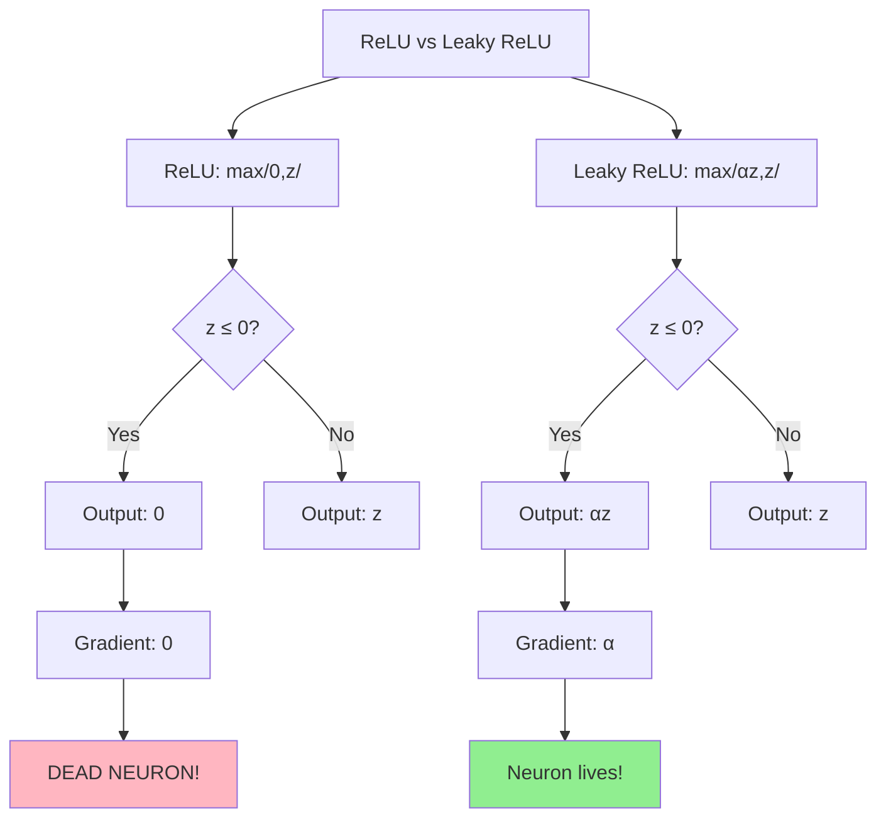

# Interview Preparation: ReLU vs Leaky ReLU - Quick Revision

## 30-Second Summary

**Problem**: Dying ReLU - neurons that stop learning forever because ReLU outputs 0 and has 0 gradient for negative inputs.

**Solution**: Leaky ReLU - adds a small "leak" (1%) for negative inputs, keeping gradient non-zero and neurons alive.

**Key Result**: Both activations work well with proper initialization. Leaky ReLU is safer, especially for deep networks.

---

## Key Terms Glossary

| Term | One-Line Definition |
|------|-------------------|
| ReLU | max(0, z) - outputs z if positive, else 0 |
| Leaky ReLU | max(αz, z) - like ReLU but 1% leak for negatives |
| Dead Neuron | Neuron outputting 0 for all inputs, never learns |
| Gradient | Rate of change used to update weights |
| Forward Prop | Data flowing input → hidden → output |
| Backward Prop | Computing gradients to update weights |
| Alpha (α) | Leak factor in Leaky ReLU (typically 0.01) |
| He Init | Weight initialization designed for ReLU |

---

## Top 10 Points to Remember

1. **ReLU = max(0, z)** - simple, fast, but can have dead neurons
2. **Leaky ReLU = max(αz, z)** where α = 0.01 - prevents dead neurons
3. **Dead neurons** output 0 for ALL inputs and never recover
4. **Dying ReLU** happens when gradient = 0 for z ≤ 0
5. **Leaky ReLU gradient** = α for z ≤ 0, so neurons stay alive
6. **He initialization** is best for ReLU networks
7. **Forward prop**: z = Wx + b, a = activation(z)
8. **Backward prop**: multiply upstream gradient by activation derivative
9. **Use Leaky ReLU** for deep networks or when dead neurons appear
10. **Both work well** with proper initialization

---

## Comparison Tables

### ReLU vs Leaky ReLU

| Aspect | ReLU | Leaky ReLU |
|--------|------|------------|
| Formula | max(0, z) | max(αz, z) |
| Derivative (z > 0) | 1 | 1 |
| Derivative (z ≤ 0) | **0** | **α (0.01)** |
| Dead neurons | Possible | Not possible |
| Complexity | Simpler | Slightly more |
| When to use | Most cases | Deep nets, safety |

### Activation Functions Overview

| Function | Pros | Cons |
|----------|------|------|
| ReLU | Fast, simple | Dead neurons |
| Leaky ReLU | No dead neurons | Extra param |
| ELU | Smooth | Expensive |
| Sigmoid | Bounded (0,1) | Vanishing gradient |
| Tanh | Zero-centered | Vanishing gradient |

### Common Problems & Solutions

| Problem | Cause | Solution |
|---------|-------|----------|
| Dead neurons | ReLU gradient = 0 | Leaky ReLU |
| Vanishing gradient | Sigmoid/Tanh | ReLU family |
| Exploding gradient | High weights | Gradient clipping |
| Slow training | Poor init | He/Xavier init |

---

## Cheat Sheet

### Quick Formulas
```
ReLU(z) = max(0, z)
ReLU'(z) = 1 if z>0, else 0

LeakyReLU(z, α=0.01) = max(αz, z)  
LeakyReLU'(z) = 1 if z>0, else α

Forward: z = Wx + b → a = activation(z)
Backward: dW = X.T @ dz / m
Update: W = W - lr × dW
```

### Code Snippets
```python
# ReLU
def relu(z):
    return np.maximum(0, z)

# Leaky ReLU  
def leaky_relu(z, alpha=0.01):
    return np.where(z > 0, z, alpha * z)

# Dead neuron check
dead = np.sum(np.all(activations == 0, axis=0))
```

### Quick Decision Tree
```
Need hidden layer activation?
├── Standard case → ReLU
├── Deep network → Leaky ReLU
├── See dead neurons → Leaky ReLU
├── Need smooth → ELU/Swish
└── Output layer → Sigmoid/Softmax
```

---

## Mermaid Summary Diagram



---

## Common Interview Questions - Quick Answers

**Q: What is dying ReLU?**
A: Neurons stuck outputting 0 due to zero gradient for negative inputs.

**Q: How does Leaky ReLU fix it?**
A: Provides small gradient (α=0.01) for negative inputs, so neurons keep learning.

**Q: When to use ReLU vs Leaky ReLU?**
A: ReLU for simple/shallow networks, Leaky ReLU for deep networks or as insurance.

**Q: What's a dead neuron?**
A: A neuron with zero output for ALL training samples that can never recover.

**Q: What initialization for ReLU?**
A: He initialization: W ~ N(0, sqrt(2/n_in))

---

## Final Tips

1. **Start with ReLU** - it works most of the time
2. **Monitor for dead neurons** - if >10%, switch to Leaky ReLU
3. **Use He initialization** - essential for ReLU networks
4. **Leaky ReLU is safe** - minimal overhead, prevents issues
5. **Know the difference** - vanishing gradient ≠ dying ReLU
