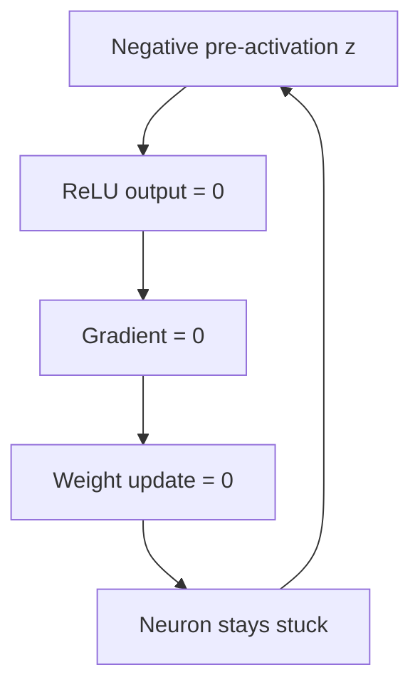
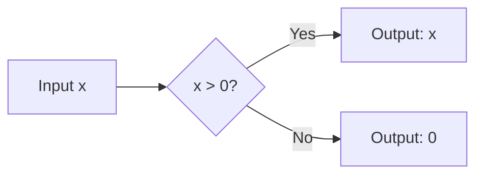
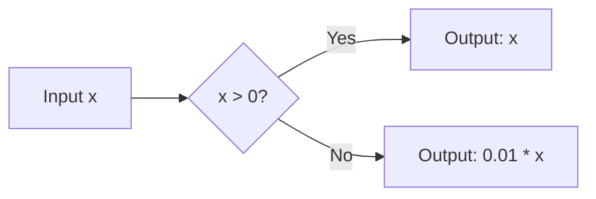
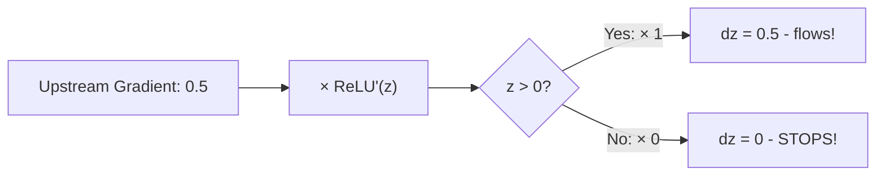
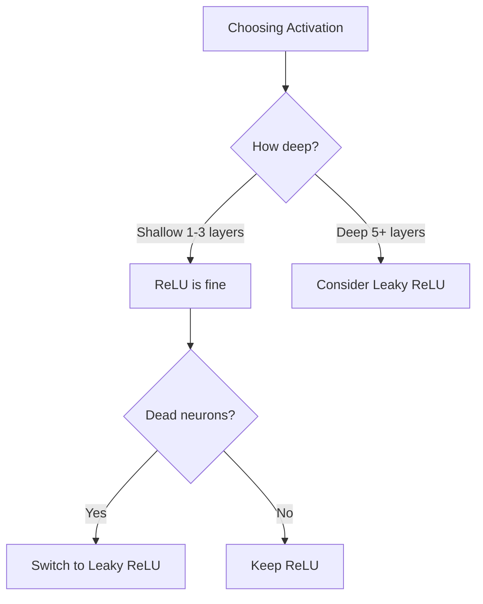
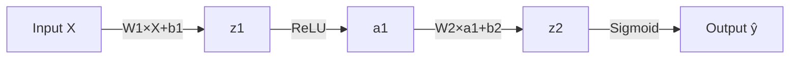
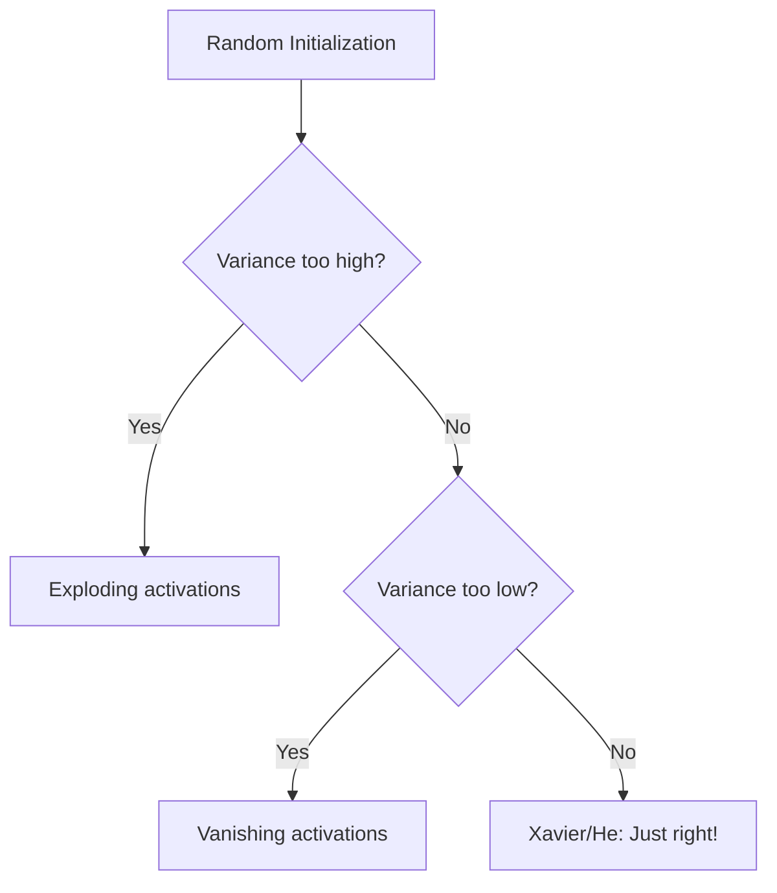
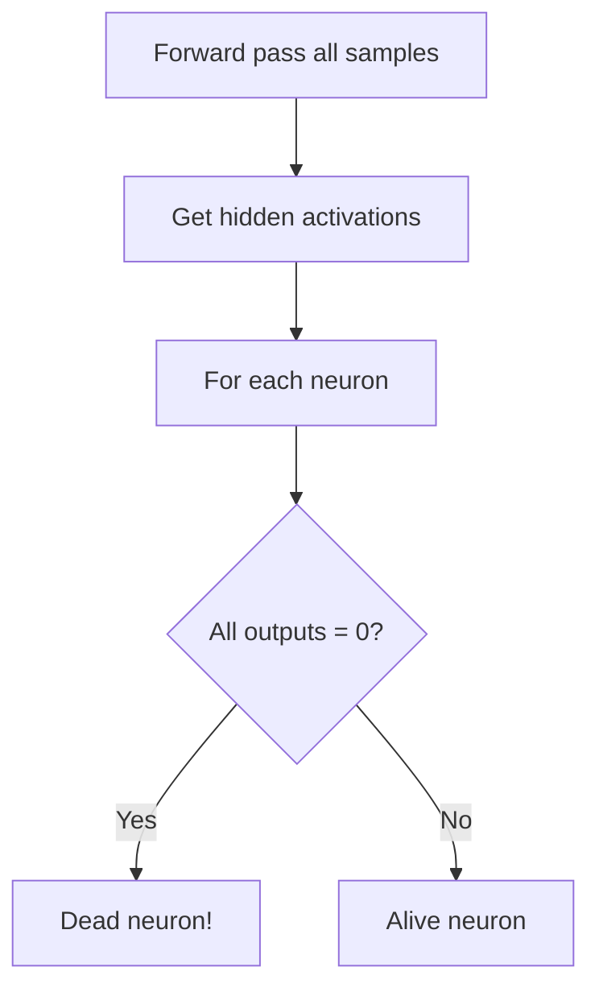
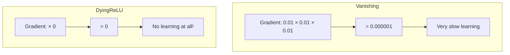
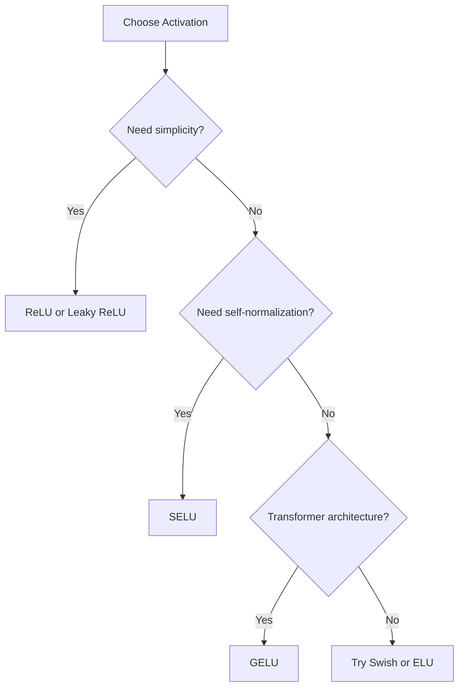

# Interview Questions: ReLU vs Leaky ReLU

## Question 1: What is the Dying ReLU Problem?

### Simple Answer (for 10-year-old)
Imagine a worker who gets lazy. If they receive a negative number, they output zero. But once they start always outputting zero, they get stuck and never do any work again! They're "dead."

### Technical Answer (for interviewer)
The dying ReLU problem occurs when neurons get stuck outputting zero for all inputs because:
1. ReLU outputs 0 for negative inputs (z ≤ 0)
2. The gradient of ReLU is 0 for negative inputs
3. With zero gradient, weights never update during backpropagation
4. The neuron becomes permanently inactive ("dead")

### Mermaid Diagram


### Real-Life Analogy
Like a light switch stuck in the OFF position - no electricity flows, so it can never turn back on.

### Common Mistakes
- Thinking dead neurons can recover (they can't with ReLU!)
- Confusing with vanishing gradient (different problem)
- Not monitoring for dead neurons during training

### Key Points to Remember
- Dead = zero output for ALL inputs
- Caused by zero gradient in ReLU
- Fix with Leaky ReLU, proper initialization, or lower learning rate

---

## Question 2: What is ReLU and how does it work?

### Simple Answer
ReLU is like a one-way door: positive numbers pass through, negative numbers get blocked (become zero).

### Technical Answer
ReLU (Rectified Linear Unit) is an activation function defined as:
- f(x) = max(0, x)
- Derivative: 1 if x > 0, 0 if x ≤ 0

It solves the vanishing gradient problem of sigmoid/tanh and is computationally efficient.

### Mermaid Diagram


### Real-Life Analogy
A water gate that only opens for positive water pressure.

### Common Mistakes
- Using ReLU for output layer (should use sigmoid/softmax)
- Ignoring the dying neuron risk
- Not using proper weight initialization

### Key Points
- Formula: max(0, x)
- Most popular hidden layer activation
- Fast and simple

---

## Question 3: What is Leaky ReLU and why use it?

### Simple Answer
Like ReLU, but instead of completely blocking negative numbers, it lets 1% through. This tiny "leak" keeps the neuron alive!

### Technical Answer
Leaky ReLU modifies ReLU to prevent dying neurons:
- f(x) = x if x > 0, else α * x (typically α = 0.01)
- Derivative: 1 if x > 0, α if x ≤ 0

The non-zero gradient for negative inputs ensures all neurons can continue learning.

### Mermaid Diagram


### Real-Life Analogy
A door with a tiny crack - even when "closed," a little air gets through.

### Common Mistakes
- Using alpha = 0 (that's just ReLU!)
- Using too high alpha (loses ReLU benefits)
- Thinking it's always better (not necessarily)

### Key Points
- Formula: max(αx, x) where α = 0.01
- Prevents dead neurons
- Minimal computational overhead

---

## Question 4: How does backpropagation cause dying neurons?

### Simple Answer
During learning, we multiply the error by how much the activation changes. For ReLU with negative input, this change is zero, so the error becomes zero, and the neuron never learns.

### Technical Answer
In backpropagation, the gradient is computed as:
```
dz = upstream_gradient * activation_derivative(z)
```
For ReLU when z ≤ 0:
- activation_derivative = 0
- dz = anything * 0 = 0
- Weight update: W -= lr * 0 = W (no change!)

### Mermaid Diagram


### Real-Life Analogy
Like multiplying any number by zero - the result is always zero, no matter how big the original number was.

### Common Mistakes
- Thinking only output layer is affected
- Not understanding chain rule
- Ignoring gradient flow visualization

### Key Points
- Chain rule: gradient flows backward
- ReLU derivative = 0 stops gradient
- Leaky ReLU derivative = α keeps gradient flowing

---

## Question 5: When should you use ReLU vs Leaky ReLU?

### Simple Answer
Use ReLU normally (it's simpler). Use Leaky ReLU when you're worried about neurons dying, especially in deep networks.

### Technical Answer

| Use ReLU when... | Use Leaky ReLU when... |
|------------------|------------------------|
| Standard hidden layers | Deep networks (>5 layers) |
| Well-initialized networks | Observing dead neurons |
| Prototyping | Production systems |
| Computational efficiency matters | Safety/robustness matters |

### Mermaid Diagram


### Real-Life Analogy
ReLU is like a regular door - simple, works most of the time. Leaky ReLU is like a door with an emergency exit - slightly more complex but safer.

### Common Mistakes
- Always using one without considering alternatives
- Not monitoring for dead neurons
- Overlooking initialization importance

### Key Points
- ReLU: simpler, faster, works for most cases
- Leaky ReLU: safer, prevents dead neurons
- Try both and compare!

---

## Question 6: What is forward propagation?

### Simple Answer
Data flowing through the network like water through pipes - from input, through hidden layers, to output.

### Technical Answer
Forward propagation computes layer outputs sequentially:
1. For each layer: z = W × x + b (weighted sum)
2. Apply activation: a = activation(z)
3. Pass a as input to next layer
4. Final output is the prediction

### Mermaid Diagram


### Real-Life Analogy
An assembly line: raw materials (input) → processing stations (layers) → finished product (output).

### Common Mistakes
- Forgetting to store intermediate values
- Wrong matrix dimensions
- Using wrong activation for each layer

### Key Points
- Formula: z = Wx + b, a = activation(z)
- Store z and a for backpropagation
- Different activations for hidden vs output layers

---

## Question 7: What is Xavier/He initialization?

### Simple Answer
A smart way to set initial weights so they're not too big or too small, keeping neurons balanced and preventing dying.

### Technical Answer
Xavier initialization sets weights based on layer sizes:
- Xavier: W ~ Normal(0, sqrt(2 / (n_in + n_out)))
- He (for ReLU): W ~ Normal(0, sqrt(2 / n_in))

This keeps activations in a reasonable range throughout the network.

### Mermaid Diagram


### Real-Life Analogy
Like tuning a guitar - strings shouldn't be too tight or too loose.

### Common Mistakes
- Using random init without scaling
- Using Xavier for ReLU (use He instead)
- Ignoring initialization importance

### Key Points
- Xavier: for sigmoid/tanh
- He: for ReLU/Leaky ReLU
- Proper init prevents many training issues

---

## Question 8: How do you detect dead neurons?

### Simple Answer
Look at each neuron's output for all training samples. If a neuron always outputs zero, it's dead!

### Technical Answer
```python
def count_dead_neurons(network, X_train):
    activations = network.forward(X_train)
    # Neuron is dead if activation = 0 for ALL samples
    dead = np.sum(np.all(activations == 0, axis=0))
    return dead
```

### Mermaid Diagram


### Real-Life Analogy
Like checking if a light bulb works by testing it multiple times - if it never turns on, it's dead.

### Common Mistakes
- Only checking one batch (need ALL samples)
- Checking during training (activations change)
- Not logging/monitoring dead neurons

### Key Points
- Dead = zero output for ALL inputs
- Check after training or periodically
- More than 10% dead is concerning

---

## Question 9: What's the difference between vanishing gradient and dying ReLU?

### Simple Answer
Vanishing gradient: gradients become very small but not zero. Dying ReLU: gradients become exactly zero.

### Technical Answer

| Aspect | Vanishing Gradient | Dying ReLU |
|--------|-------------------|------------|
| Cause | Sigmoid/tanh in deep nets | ReLU with z ≤ 0 |
| Gradient | Very small (~0.01) | Exactly 0 |
| Affected | All neurons (slow learning) | Specific neurons (no learning) |
| Solution | ReLU, BatchNorm | Leaky ReLU, better init |
| Recovery | Possible | Impossible without reset |

### Mermaid Diagram


### Real-Life Analogy
- Vanishing: A whisper getting quieter but still audible
- Dying ReLU: Complete silence (the speaker stopped working)

### Common Mistakes
- Confusing the two problems
- Thinking ReLU solves all gradient issues
- Not understanding when each occurs

### Key Points
- Vanishing: gradients shrink, neurons learn slowly
- Dying: gradients = 0, neurons stop completely
- Different problems, different solutions

---

## Question 10: What are the alternatives to ReLU and Leaky ReLU?

### Simple Answer
There are many "cousin" activation functions like ELU, SELU, and Swish - each with different trade-offs.

### Technical Answer

| Activation | Formula | Pros | Cons |
|-----------|---------|------|------|
| ReLU | max(0, x) | Simple, fast | Dead neurons |
| Leaky ReLU | max(αx, x) | No dead neurons | Extra hyperparameter |
| ELU | x if x>0, α(e^x-1) else | Smooth, mean closer to 0 | Expensive |
| SELU | λ × (x if x>0, α(e^x-1) else) | Self-normalizing | Specific conditions |
| Swish | x × sigmoid(x) | Smooth, often better | Computationally expensive |
| GELU | x × Φ(x) | Used in transformers | Complex |

### Mermaid Diagram


### Real-Life Analogy
Like different types of doors: sliding, revolving, automatic - each has specific use cases.

### Common Mistakes
- Using complex activations when simple works
- Not benchmarking on your specific task
- Following trends blindly

### Key Points
- ReLU/Leaky ReLU: default choices
- ELU/SELU: for specific architectures
- Swish/GELU: modern alternatives
- Always benchmark on your task!
