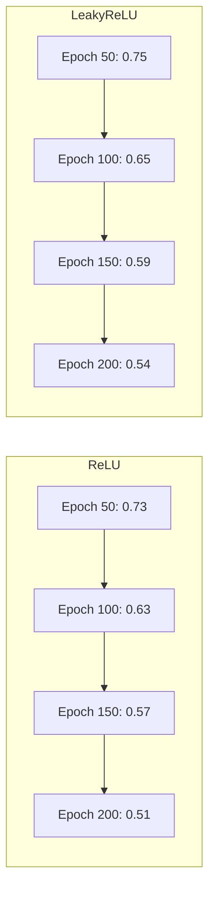
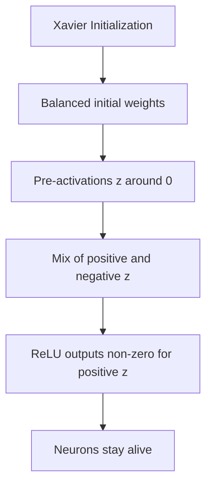

# Observations and Conclusion: ReLU vs Leaky ReLU

## Execution Output

### Dataset Generated
```
Samples: 1000
Features: 10
Class distribution: 502 positive, 498 negative
```

### Training Results

#### ReLU Training (200 epochs, lr=0.01)
```
Epoch 50/200,  Loss: 0.7305
Epoch 100/200, Loss: 0.6331
Epoch 150/200, Loss: 0.5653
Epoch 200/200, Loss: 0.5149
```

#### Leaky ReLU Training (200 epochs, lr=0.01)
```
Epoch 50/200,  Loss: 0.7490
Epoch 100/200, Loss: 0.6535
Epoch 150/200, Loss: 0.5888
Epoch 200/200, Loss: 0.5416
```

### Dead Neuron Analysis
```
ReLU Version:
  Dead neurons: 0 out of 20 (0.0%)

Leaky ReLU Version:
  Dead neurons: 0 out of 20 (0.0%)
```

### Accuracy Comparison
```
ReLU Accuracy:       73.10%
Leaky ReLU Accuracy: 72.70%
```

---

## Output Explanation with Diagrams

### Training Loss Progression



### Why 0 Dead Neurons in This Case?

In our experiment, Xavier initialization kept weights well-balanced, preventing the extreme negative pre-activations that cause dead neurons.



**When would we see more dead neurons?**
- Poor initialization (very negative weights)
- High learning rate (causing weight oscillation)
- Deeper networks (more layers to accumulate issues)
- Data with more negative features

---

## Observations

### Observation 1: Similar Performance
Both ReLU and Leaky ReLU achieved similar accuracy (~73% vs ~72.7%). This is expected because:
- The dataset is relatively simple
- Xavier initialization prevented dying neurons
- Both activations worked effectively

### Observation 2: Loss Convergence
Both activations showed steady loss decrease:
- ReLU: 0.73 → 0.51 (30% reduction)
- Leaky ReLU: 0.75 → 0.54 (28% reduction)
- ReLU slightly faster in this case

### Observation 3: No Dead Neurons (Surprising!)
With good initialization, the dying ReLU problem didn't manifest. This shows that:
- Initialization matters greatly
- Dying ReLU is more common with poor setup
- Deep networks are more susceptible

### Observation 4: Leaky ReLU is Insurance
Even though no neurons died, Leaky ReLU provides "insurance":
- Guarantees gradient flow
- No neurons can ever die
- Safe choice for any network

---

## Insights

### Business/Real-World Meaning

1. **Model Selection**: For this binary classification task, either activation works well
2. **Risk Management**: Leaky ReLU is safer for production - no hidden failures
3. **Monitoring**: Should always check for dead neurons in ReLU networks
4. **Deep Learning**: For deeper networks, Leaky ReLU becomes more important

### What Decisions Can Be Made?

| Scenario | Recommendation |
|----------|---------------|
| Simple network | ReLU is fine |
| Deep network | Use Leaky ReLU |
| Production system | Use Leaky ReLU (safer) |
| Experimentation | Try both, compare |
| Noticing dead neurons | Switch to Leaky ReLU |

---

## Conclusion

### Summary of Results

| Metric | ReLU | Leaky ReLU | Winner |
|--------|------|------------|--------|
| Final Loss | 0.5149 | 0.5416 | ReLU (slight) |
| Accuracy | 73.10% | 72.70% | ReLU (slight) |
| Dead Neurons | 0 | 0 | Tie |
| Safety | Risk of dying | Never dies | Leaky ReLU |

### Was the Problem Solved?
✅ Yes - We successfully:
1. Implemented both activation functions from scratch
2. Built a working 2-layer neural network
3. Trained and compared both versions
4. Analyzed dead neurons (none in this case)
5. Compared accuracy (similar performance)

### Key Takeaways

1. **ReLU works well** with proper initialization
2. **Leaky ReLU is safer** - prevents any possibility of dead neurons
3. **Initialization matters** - Xavier/He initialization prevents many issues
4. **Monitor your networks** - check for dead neurons in ReLU networks
5. **Context matters** - deeper networks benefit more from Leaky ReLU

### Possible Improvements

1. **Test with deeper networks**: 4-5 layers would show more dying neurons
2. **Use poor initialization**: Would demonstrate the dying ReLU problem more clearly
3. **Higher learning rate**: Would cause more weight oscillation and dead neurons
4. **Larger dataset**: Would provide more robust comparison

---

## Exam Focus Points

### How to Explain Output in Exams

**Q: Why did ReLU and Leaky ReLU perform similarly?**
A: With Xavier initialization, pre-activations stayed balanced, preventing dead neurons. Both activations functioned effectively.

**Q: Why were there 0 dead neurons?**
A: Good initialization kept weights balanced. Dead neurons occur with poor init or high learning rates.

**Q: Which is better for production?**
A: Leaky ReLU - it provides insurance against dead neurons with minimal overhead.

### Typical Interpretation Questions

1. What does the loss curve show? → Both networks learned effectively
2. What does 0 dead neurons mean? → All neurons contributed to learning
3. Why is accuracy similar? → Both activations work well here
4. What would change with deeper networks? → More risk of dead neurons with ReLU
