# Problem Statement: Investigating the Dying ReLU Problem

## 🧩 What Problem Are We Solving?

### Simple Explanation (Like Explaining to a 10-Year-Old)

Imagine you have a team of workers (neurons) in a factory. Each worker has a simple rule:
- **ReLU Worker**: "If the number I receive is positive, I pass it along. If it's negative or zero, I do nothing (output 0)."

The problem? Sometimes these workers get **lazy and stop working forever**! Once a ReLU worker starts outputting zero for everything, they never wake up again. This is called **"Dying ReLU"** - the workers become "dead neurons."

**Leaky ReLU Workers** are smarter:
- "If the number is positive, I pass it along. If it's negative, I pass along a tiny bit (1% of it)."

This tiny leak keeps the workers alive and learning!

### Technical Definition

The **dying ReLU problem** occurs when neurons get stuck in a state where they always output zero because:
1. ReLU outputs 0 for all negative inputs
2. When output is 0, the gradient is also 0
3. Zero gradient means the weights never update
4. The neuron is permanently "dead"

---

## 🎯 Real-Life Analogy

Think of neurons like **light switches**:

| Type | Behavior | Problem? |
|------|----------|----------|
| **ReLU Switch** | ON if signal > 0, completely OFF otherwise | Can get stuck OFF forever! |
| **Leaky ReLU Switch** | ON if signal > 0, DIM (1% brightness) otherwise | Never completely off, can recover |

When a ReLU switch gets stuck OFF, no electricity flows, so it can never turn back on. A Leaky ReLU always has a tiny trickle of electricity, so it can always recover.

---

## 🪜 Steps to Solve the Problem

```mermaid
flowchart TD
    A[🎯 Start: Generate Dataset] --> B[📐 Step 1: Implement Activation Functions]
    B --> C[🏗️ Step 2: Build Neural Network Class]
    C --> D[⚙️ Step 3: Implement Forward Propagation]
    D --> E[📊 Step 4: Implement Backward Propagation]
    E --> F[🏋️ Step 5: Train with ReLU - 200 epochs]
    F --> G[🏋️ Step 6: Train with Leaky ReLU - 200 epochs]
    G --> H[📈 Step 7: Plot Loss Curves]
    H --> I[🔍 Step 8: Count Dead Neurons]
    I --> J[📝 Step 9: Compare Accuracy]
    J --> K[✍️ Step 10: Write Analysis]
    K --> L[🎉 Done: Understand Dying ReLU]
```



### Detailed Step Breakdown

| Step | What We Do | Why We Do It |
|------|-----------|--------------|
| 1 | Implement `relu()` and `leaky_relu()` | Build the "brain" of our neurons |
| 2 | Implement derivatives | Needed for learning (backward propagation) |
| 3 | Build neural network | Create the structure: Input → Hidden → Output |
| 4 | Forward propagation | How data flows forward through the network |
| 5 | Backward propagation | How the network learns from mistakes |
| 6 | Train two versions | Compare ReLU vs Leaky ReLU fairly |
| 7 | Plot loss curves | Visualize how well each version learns |
| 8 | Count dead neurons | Measure the "dying ReLU" problem directly |
| 9 | Compare accuracy | Which activation gives better results? |
| 10 | Write analysis | Understand when to use which activation |

---

## 🎯 Expected Output

### 1. Training Loss Comparison Plot
A graph showing two lines:
- **Blue line** (ReLU): May be bumpy or get stuck
- **Orange line** (Leaky ReLU): Usually smoother and lower

### 2. Dead Neuron Report
```
=== DEAD NEURON ANALYSIS ===
ReLU Version:
  - Dead neurons: 8 out of 20 (40.0%)

Leaky ReLU Version:
  - Dead neurons: 0 out of 20 (0.0%)
```

### 3. Accuracy Comparison
```
=== ACCURACY COMPARISON ===
ReLU Accuracy:     78.5%
Leaky ReLU Accuracy: 85.2%
```

### 4. Written Analysis (200-300 words)
A comparison explaining:
- Which performed better and why
- How many neurons "died" in each version
- When to use ReLU vs Leaky ReLU in real projects

---

## 📐 Network Architecture

```mermaid
flowchart LR
    subgraph Input["📥 Input Layer (10 features)"]
        I1[x₁]
        I2[x₂]
        I3[...]
        I10[x₁₀]
    end
    
    subgraph Hidden["🧠 Hidden Layer (20 neurons)"]
        H1[h₁]
        H2[h₂]
        H3[...]
        H20[h₂₀]
    end
    
    subgraph Output["📤 Output Layer (1 neuron)"]
        O1[ŷ]
    end
    
    I1 --> H1
    I1 --> H2
    I1 --> H20
    I2 --> H1
    I2 --> H2
    I10 --> H20
    
    H1 --> O1
    H2 --> O1
    H20 --> O1
```



**Activation Functions:**
- Hidden Layer: ReLU or Leaky ReLU (we compare both)
- Output Layer: Sigmoid (for binary classification: 0 or 1)

---

## 🔑 Key Terms Glossary

| Term | Simple Meaning | Technical Meaning |
|------|---------------|-------------------|
| **Neuron** | A worker in the network | A mathematical unit that processes inputs |
| **Activation** | The worker's output | Result after applying activation function |
| **ReLU** | "Pass if positive, else zero" | max(0, z) |
| **Leaky ReLU** | "Pass if positive, else leak 1%" | max(0.01z, z) |
| **Dead Neuron** | A lazy worker who never works | Neuron with zero output for all inputs |
| **Gradient** | How much to adjust | Derivative used for weight updates |
| **Epoch** | One full round of training | One pass through all training data |

---

## ✅ Success Criteria

1. ✅ All activation functions implemented correctly
2. ✅ Neural network trains without errors
3. ✅ Loss curves show learning progress
4. ✅ Dead neuron count shows ReLU has more dead neurons
5. ✅ Leaky ReLU achieves equal or better accuracy
6. ✅ Written analysis explains the findings clearly
