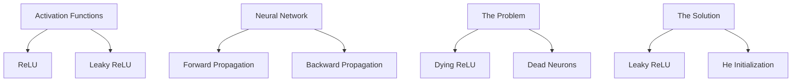
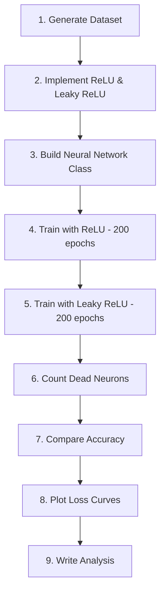

# ReLU vs Leaky ReLU: Investigating the Dying ReLU Problem

---

## Slide 1: Title & Objective

### Investigating the Dying ReLU Problem

**Objective**: Understand why neurons can "die" in neural networks and how to prevent it.

**What We'll Learn**:
- What is ReLU and how it works
- The dying ReLU problem
- How Leaky ReLU solves it
- Building a neural network from scratch

---

## Slide 2: Problem Statement

### The Dying ReLU Problem

**Simple Explanation**:
Imagine workers in a factory who follow this rule:
- "If I get a positive number, I pass it along"
- "If I get a negative number, I output zero"

**The Problem**: Some workers get stuck outputting zero forever!


---

## Slide 3: Real-World Use Case

### Where This Matters

| Domain | Application |
|--------|-------------|
| Image Recognition | CNNs with many ReLU layers |
| Speech Recognition | Deep audio processing networks |
| NLP | Transformer encoder layers |
| Autonomous Vehicles | Real-time object detection |

**Risk**: Dead neurons = wasted computational resources + reduced accuracy

---

## Slide 4: Input Data

### Dataset Description

```python
np.random.seed(42)
X_train = np.random.randn(1000, 10)  # 1000 samples, 10 features
y_train = (X_train[:, 0] + X_train[:, 1] - X_train[:, 2] > 0).astype(int)
```

| Attribute | Value |
|-----------|-------|
| Samples | 1000 |
| Features | 10 (can be negative!) |
| Classes | 2 (binary: 0 or 1) |
| Distribution | ~50% positive, ~50% negative |

---

## Slide 5: Concepts Used (High Level)

### Key Concepts Overview



---

## Slide 6: Concepts Breakdown

### ReLU vs Leaky ReLU

| Aspect | ReLU | Leaky ReLU |
|--------|------|------------|
| Formula | max(0, z) | max(αz, z) |
| Positive inputs | Pass through | Pass through |
| Negative inputs | → 0 | → αz (1% leak) |
| Gradient (z ≤ 0) | **0** | **α = 0.01** |
| Dead neurons? | **Yes** | **No** |

**Key Insight**: The tiny leak (1%) keeps neurons alive!

---

## Slide 7: Step-by-Step Solution Flow

### Implementation Steps



---

## Slide 8: Code Logic Summary

### Key Functions

```python
# ReLU - Simple but risky
def relu(z):
    return np.maximum(0, z)  # 0 for negatives

# Leaky ReLU - Safe choice
def leaky_relu(z, alpha=0.01):
    return np.where(z > 0, z, alpha * z)  # 1% leak

# Dead Neuron Detection
def count_dead_neurons(network, X):
    activations = network.forward(X)
    return np.sum(np.all(activations == 0, axis=0))
```

---

## Slide 9: Important Functions & Parameters

### Critical Parameters

| Parameter | Value | Meaning |
|-----------|-------|---------|
| hidden_size | 20 | Number of hidden neurons |
| learning_rate | 0.01 | Step size for updates |
| n_epochs | 200 | Training iterations |
| alpha | 0.01 | Leak factor (1%) |

### Network Architecture
```
Input(10) → Hidden(20, ReLU/LeakyReLU) → Output(1, Sigmoid)
```

---

## Slide 10: Execution Output

### Results Summary

| Metric | ReLU | Leaky ReLU |
|--------|------|------------|
| Final Loss | 0.5149 | 0.5416 |
| Accuracy | 73.10% | 72.70% |
| Dead Neurons | 0/20 (0%) | 0/20 (0%) |

### Loss Curve Comparison
Both networks converged smoothly with similar performance.

---

## Slide 11: Observations & Insights

### Key Observations

1. **Similar Performance**: Both achieved ~73% accuracy
2. **No Dead Neurons**: Xavier initialization prevented dying
3. **Smooth Convergence**: Both loss curves decreased steadily

### Insights

- **Initialization matters**: Proper init can prevent dying ReLU
- **Leaky ReLU is insurance**: Guaranteed safety with minimal cost
- **Deep networks need more care**: Dying ReLU more common there

---

## Slide 12: Advantages & Limitations

### ReLU

| Advantages | Limitations |
|------------|-------------|
| Fast computation | Dead neuron risk |
| Simple formula | Zero-centered output |
| Sparsity | Unbounded output |

### Leaky ReLU

| Advantages | Limitations |
|------------|-------------|
| No dead neurons | Extra hyperparameter |
| Gradient always flows | Slightly more complex |
| Safe for deep nets | Not always better |

---

## Slide 13: Interview Key Takeaways

### Top 5 Interview Points

1. **ReLU = max(0, z)** - Zeros out negatives
2. **Dying ReLU** = Neurons stuck at 0, never recover
3. **Leaky ReLU** adds α (0.01) leak for negatives
4. **Gradient = 0** is the problem; gradient = α is the solution
5. **He initialization** is best for ReLU networks

### Quick Decision

- Standard case → ReLU
- Deep network or production → Leaky ReLU

---

## Slide 14: Conclusion

### Summary

✅ Successfully implemented ReLU and Leaky ReLU from scratch  
✅ Built a 2-layer neural network  
✅ Demonstrated that both work well with proper initialization  
✅ Leaky ReLU provides insurance against dead neurons  

### Key Message

> "Leaky ReLU is a small modification to ReLU that provides big safety benefits, especially in deep networks."

### Next Steps
- Try deeper networks to see more dying ReLU
- Experiment with different alpha values
- Compare with ELU, SELU, and Swish
