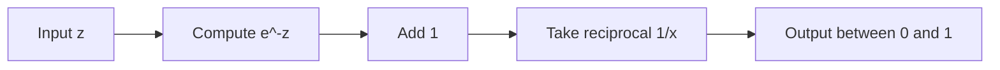
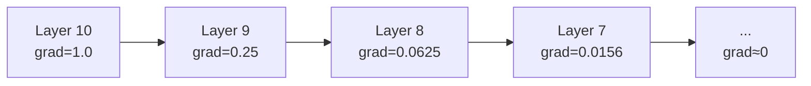

# Concepts Explained: Sigmoid Activation Function

## 1. Activation Function

### Definition
An **activation function** is a mathematical function applied to each neuron's output in a neural network. It determines whether a neuron should "fire" (activate) based on its inputs.

**Exam-friendly wording**: "A non-linear function that introduces non-linearity into neural networks, enabling them to learn complex patterns."

### Why It Is Used
- **Problem it solves**: Without activation functions, neural networks would be simple linear models
- **Why needed in this project**: To transform weighted sums into bounded, interpretable outputs

### When to Use It
- During forward propagation in neural networks
- When building any type of neural network model
- When you need non-linear decision boundaries

### Where to Use It
- Image classification (CNNs)
- Natural Language Processing
- Recommendation systems
- Any deep learning application

### Is This the Only Way?

| Alternative | Description | Comparison |
|-------------|-------------|------------|
| Linear activation | f(z) = z | No non-linearity, network becomes single layer |
| Step function | f(z) = 1 if z > 0, else 0 | Not differentiable, can't use gradient descent |
| Sigmoid | σ(z) = 1/(1+e^(-z)) | Differentiable, but vanishing gradient problem |
| Tanh | (e^z - e^(-z))/(e^z + e^(-z)) | Zero-centered, but still vanishing gradient |
| ReLU | max(0, z) | No vanishing gradient for positive, but "dead neurons" |

**Why Sigmoid is chosen here**: Needed for understanding the evolution of activation functions and still used in binary classification output layers.

### How to Use It

```python
import numpy as np

def sigmoid(z):
    return 1 / (1 + np.exp(-z))

# Example usage
result = sigmoid(0)  # Returns 0.5
result = sigmoid(5)  # Returns ~0.993
```

### How It Works Internally



1. Take input value z
2. Compute negative of z
3. Raise e to that power
4. Add 1 to the result
5. Take reciprocal (1 divided by result)

### Visual Summary
- Input: Any real number (-∞ to +∞)
- Output: Always between 0 and 1
- S-shaped curve (hence "sigmoid" from Greek letter sigma)
- Smooth and differentiable everywhere

### Advantages
- Output interpretable as probability
- Smooth gradient (no sudden jumps)
- Bounded output (prevents explosion)

### Disadvantages / Limitations
- Vanishing gradient for large |z|
- Output not zero-centered (slows learning)
- Computationally expensive (exponential)

### Exam & Interview Points

**Key Points to Memorize:**
1. Formula: σ(z) = 1 / (1 + e^(-z))
2. Output range: (0, 1) - exclusive
3. Derivative: σ'(z) = σ(z) × (1 - σ(z))
4. Maximum derivative: 0.25 at z = 0

**Common Questions:**
- Q: What is the range of sigmoid?
- A: Strictly between 0 and 1 (never exactly 0 or 1)

- Q: Why is sigmoid used in binary classification?
- A: Because its output can be interpreted as probability

- Q: What is the vanishing gradient problem?
- A: When gradients become very small during backpropagation, making learning extremely slow

---

## 2. Sigmoid Function

### Definition
The **Sigmoid function** (also called logistic function) is defined as:

σ(z) = 1 / (1 + e^(-z))

### Why It Is Used
- Squashes any real number to range (0, 1)
- Provides probability-like interpretation
- Smooth and differentiable (good for gradient descent)

### When to Use It
- Binary classification output layer
- Logistic regression
- Gate mechanisms in LSTM/GRU

### Where to Use It
- Spam detection (output: probability of spam)
- Medical diagnosis (probability of disease)
- Credit scoring (probability of default)

### Is This the Only Way?

| Approach | Pros | Cons |
|----------|------|------|
| Sigmoid | Probability interpretation | Vanishing gradient |
| Tanh | Zero-centered | Still vanishing gradient |
| ReLU | Fast, no vanishing gradient for positive | Dead neurons, no probability interpretation |
| Softmax | Multi-class probabilities | More complex |

### How to Use It

```python
def sigmoid(z):
    """
    Input: z (scalar or numpy array)
    Output: Values between 0 and 1
    """
    return 1 / (1 + np.exp(-z))

# Examples
sigmoid(-5)   # 0.0067 (close to 0)
sigmoid(0)    # 0.5 (exactly middle)
sigmoid(5)    # 0.9933 (close to 1)
```

### How It Works Internally

For z = 2:
1. Compute -z = -2
2. Compute e^(-2) = 0.1353
3. Add 1: 1 + 0.1353 = 1.1353
4. Take reciprocal: 1/1.1353 = 0.8808

Result: sigmoid(2) ≈ 0.88

### Visual Summary

```
Output
  1 |            ___________
    |          /
0.5 |--------x---------------
    |       /
  0 |______/
    |________________________
        -6    0    +6   Input
```

### Advantages
- Bounded output (no explosion)
- Differentiable (works with gradient descent)
- Probability interpretation

### Disadvantages
- Vanishing gradient (for |z| > 4)
- Not zero-centered
- Exponential computation is slow

### Exam & Interview Points

**Questions:**
- Q: What happens to sigmoid output when z is very large?
- A: Approaches 1 (but never reaches exactly 1)

- Q: What happens when z = 0?
- A: sigmoid(0) = 0.5 exactly

---

## 3. Sigmoid Derivative

### Definition
The derivative of the sigmoid function is:

σ'(z) = σ(z) × (1 - σ(z))

### Why It Is Used
- Required for backpropagation
- Tells us how sensitive the output is to changes in input
- Used to update weights during training

### When to Use It
- During backward pass in neural networks
- When computing gradients for optimization
- Training any model using gradient descent

### How to Use It

```python
def sigmoid_derivative(z):
    s = sigmoid(z)
    return s * (1 - s)

# Examples
sigmoid_derivative(0)   # 0.25 (maximum)
sigmoid_derivative(2)   # 0.1049
sigmoid_derivative(5)   # 0.0066 (nearly zero!)
```

### How It Works Internally

For z = 0:
1. Compute σ(0) = 0.5
2. Compute 1 - σ(0) = 0.5
3. Multiply: 0.5 × 0.5 = 0.25

### Visual Summary
- Maximum gradient: 0.25 at z = 0
- Gradient approaches 0 as |z| increases
- Bell-shaped curve

### Exam & Interview Points

**Key Points:**
- Maximum value is 0.25 (not 1!)
- Occurs at z = 0
- For |z| > 4, gradient ≈ 0 (vanishing gradient)

---

## 4. Vanishing Gradient Problem

### Definition
The **vanishing gradient problem** occurs when gradients become extremely small during backpropagation, causing weights in early layers to update very slowly or not at all.

### Why It Is a Problem
- Deep networks can't learn effectively
- Early layers receive almost no gradient signal
- Training can take forever or fail completely

### Why Sigmoid Causes This

Looking at the derivative formula:
- Maximum gradient is only 0.25
- When multiplied across many layers: 0.25^n becomes tiny
- For 10 layers: 0.25^10 ≈ 0.00000095

### Visual Explanation



### Exam & Interview Points

**Question**: Why does ReLU not have vanishing gradient for positive inputs?
**Answer**: ReLU derivative is 1 for positive inputs, so gradients don't shrink.

---

## 5. Saturation Regions

### Definition
**Saturation regions** are input ranges where the sigmoid output is very close to 0 or 1, and the gradient is nearly zero.

### Where They Occur
- **Left saturation**: z < -4 (output ≈ 0)
- **Right saturation**: z > +4 (output ≈ 1)

### Why It Matters
- Learning stops in saturated neurons
- Model "gets stuck" in these regions
- Careful weight initialization is needed

### Exam & Interview Points

**Question**: How can you prevent saturation?
**Answer**: 
1. Proper weight initialization
2. Batch normalization
3. Use ReLU instead of sigmoid in hidden layers
