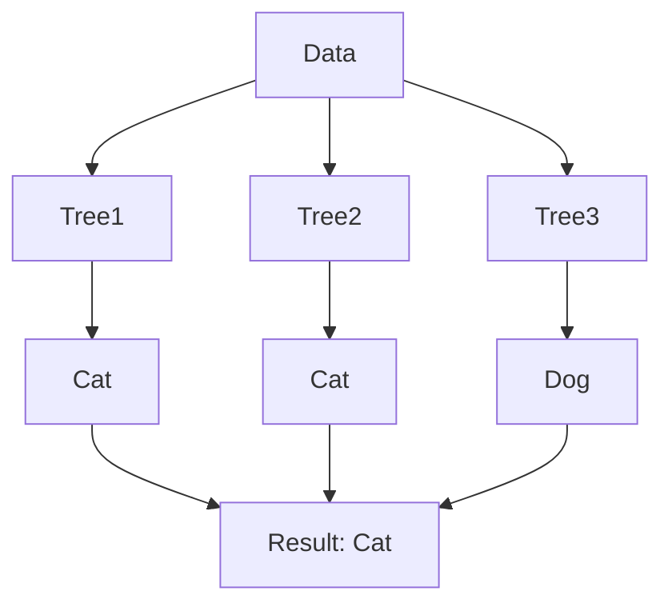

# Concepts Explained: Thermal Powerline Hotspot Detection

## 📚 Core Concepts Guide

This document explains the key technical concepts used in the project. Each concept is broken down into 12 detailed points to ensure complete understanding.

---

### Concept 1: Thermal Anomaly Detection

#### 1. Definition
The use of thermal imaging (infrared) to identify abnormal temperature patterns that indicate potential equipment failure or safety hazards.

#### 2. Why it is used
- Electrical faults generate heat (Joule heating) before catastrophic failure.
- Allows non-contact, safe inspection of high-voltage lines.

#### 3. When to use it
- During routine preventative maintenance patrols.
- After storms or high-load events to check for damage.
- When predictive maintenance is enabled.

#### 4. Where to use it
- Power transmission lines (joints, splices).
- Substations (transformers, breakers).
- Solar panels (hotspot detection).

#### 5. Is this the only way?
| Method | Pros | Cons |
|--------|------|------|
| **Thermal (AI)** | Remote, fast, detects internal issues | Expensive cameras, weather dependent |
| **Visual Inspection** | Cheap, easy to understand | Misses internal heat, dangerous if manual |
| **Contact Sensors** | Accurate, continuous | Hard to install on high voltage, expensive |

**Winner:** Thermal AI for large-scale infrastructure because it's scalable and safe.

#### 6. Explanation with Diagram
```mermaid
flowchart LR
    A[Normal Current] -->|Low Resistance| B[Normal Heat (40°C)]
    C[Corroded Joint] -->|High Resistance| D[Excess Heat (80°C+)]
    D --> E[Thermal Camera Sees Hotspot]
    E --> F[AI Detects Anomaly]
```

#### 7. How to use it
- Capture data using radiometric thermal cameras (FLIR).
- Analyze temperature deltas (difference from ambient/neighbors).
- Code: `delta = temp_max - temp_mean`

#### 8. How it works internally
- Electrical resistance ($R$) creates heat ($P = I^2R$).
- A bad connection means higher $R$, so more heat ($P$) for the same current ($I$).
- The camera detects Infrared radiation, converts it to temperature values.

#### 9. Visual Summary
- **Input:** Invisible Infrared Light 🌊
- **Process:** Sensor → Temperature Matrix 🔢
- **Output:** Colorful Heatmap Image 🌈

#### 10. Advantages
- **Early Warning:** Finds problems weeks before failure.
- **Safety:** No need to touch live wires.
- **Speed:** Drones can survey miles of line per hour.

#### 11. Disadvantages / Limitations
- **Solar Loading:** Sun can heat up normal wires (false positives).
- **Wind Cooling:** Wind can cool down hotspots (false negatives).
- **Cost:** High-resolution thermal cameras are expensive.

#### 12. Exam & Interview Points
- **Q:** What law governs resistive heating? **A:** Joule's Law ($P = I^2R$).
- **Q:** Why use delta-T instead of absolute temp? **A:** To account for weather/load changes.

---

### Concept 2: Random Forest Classifier

#### 1. Definition
An ensemble machine learning algorithm that builds many decision trees and merges them together to get a more accurate and stable prediction.

#### 2. Why it is used
- "Wisdom of crowds" logic: Many weak learners (trees) make a strong learner.
- Handles non-linear relationships and interactions well.

#### 3. When to use it
- Tabular data (like our CSV).
- Classification tasks with complex boundaries.
- When interpretability (feature importance) is needed.

#### 4. Where to use it
- Fault detection, medical diagnosis, fraud detection.
- Industry standard for "good enough" models without deep learning.

#### 5. Is this the only way?
| Algo | Pros | Cons |
|------|------|------|
| **Random Forest** | Robust, needs little tuning | Slow prediction, large model size |
| **Logistic Reg** | Fast, simple math | Fails on complex patterns |
| **Neural Nets** | Best for images/text | Overkill for small tabular data |

#### 6. Explanation with Diagram


#### 7. How to use it
```python
model = RandomForestClassifier(n_estimators=100)
model.fit(X_train, y_train)
y_pred = model.predict(X_test)
```

#### 8. How it works internally
- **Bootstrapping:** Each tree sees a random subset of data (with replacement).
- **Feature Randomness:** Each split typically considers only a random subset of features.
- Trees grow deep (overfitting individually) but averaging them fixes variance.

#### 9. Visual Summary
- **Forest:** Collection of Trees 🌲🌲🌲
- **Voting:** Majority rule 🗳️
- **Result:** Consensus prediction 🎯

#### 10. Advantages
- **Robust:** Less likely to overfit than a single decision tree.
- **Feature Importance:** Tells you which variables matter most.
- **Versatile:** Handles missing values and mix of numerical/categorical data.

#### 11. Disadvantages / Limitations
- **Black Box:** Hard to visualize 100 trees at once.
- **Extrapolation:** Cannot predict values outside training range (unlike regression).
- **Memory:** Can be large to store.

#### 12. Exam & Interview Points
- **Q:** What is "Out-of-Bag" (OOB) error? **A:** Validation error calculated from rows not used in a tree's training.
- **Q:** Main hyperparameters? **A:** `n_estimators` (trees), `max_depth` (complexity).

---

### Concept 3: Precision, Recall & F1-Score

#### 1. Definition
Metrics to evaluate classification models, especially when classes are imbalanced (like rare thermal faults).

#### 2. Why it is used
- **Accuracy lies.** If 99% of lines are safe, a model saying "All Safe" is 99% accurate but useless.
- We need to know specific types of errors.

#### 3. When to use it
- Anomaly detection, fraud detection, medical tests.
- Whenever False Positives and False Negatives have different costs.

#### 4. Where to use it
- Evaluated on the **Test Set**.
- Reported to stakeholders to set thresholds.

#### 5. Is this the only way?
- **Accuracy:** Good only for balanced classes (50/50).
- **ROC-AUC:** Good for overall ranking, but F1 is better for specific decision points.

#### 6. Explanation with Diagram
```mermaid
grid
    title Confusion Matrix
    TP "True Positive": 5
    FP "False Positive": 2
    FN "False Negative": 1
    TN "True Negative": 92
```

#### 7. How to use it
```python
print(classification_report(y_test, y_pred))
# Returns table with all three metrics
```

#### 8. How it works internally
- **Precision:** $TP / (TP + FP)$ → "When I cry wolf, is there a wolf?"
- **Recall:** $TP / (TP + FN)$ → "Did I find all the wolves?"
- **F1-Score:** $2 * (P * R) / (P + R)$ → Harmonic mean (balance).

#### 9. Visual Summary
- **Precision:** Cleanliness of positive predictions 🧼
- **Recall:** Completeness of positive discovery 🕵️
- **F1:** The "Golden Mean" between them ⚖️

#### 10. Advantages
- **Honest:** Reveals if model is just guessing the majority class.
- **Business Aligned:** Can tune for Precision (reduce false alarms) or Recall (safety first).
  - For power lines: **Recall is King** (Better to check a safe line than miss a fire).

#### 11. Disadvantages / Limitations
- **Trade-off:** Increasing Recall usually lowers Precision.
- **Threshold dependent:** Changing probability threshold (e.g., from 0.5 to 0.3) changes all these values.

#### 12. Exam & Interview Points
- **Q:** High Recall, Low Precision? **A:** Paranoid model (flags everything).
- **Q:** High Precision, Low Recall? **A:** Conservative model (misses many, but precise when it speaks).

---

### Concept 4: Spatial Heatmaps

#### 1. Definition
A data visualization technique that represents the magnitude of a phenomenon (risk) as color in two dimensions.

#### 2. Why it is used
- The human brain processes patterns 60,000x faster than text.
- Immediately identifies **clusters** of problems (e.g., a whole sector failing).

#### 3. When to use it
- Geospatial data (maps).
- Matrix data (correlations, confusion matrices).
- Any 2D grid analysis.

#### 4. Where to use it
- Power corridor dashboards.
- Weather apps.
- Website click tracking.

#### 5. Is this the only way?
| Viz | Pros | Cons |
|-----|------|------|
| **Heatmap** | Instant density/pattern check | Can hide individual points |
| **Scatter Plot** | Shows exact points | Messy with overlap |
| **Table** | Exact numbers | Hard to see big picture |

#### 6. Explanation with Diagram
```mermaid
flowchart TD
    A[Grid Cell (10,5)] -->|Value: 0.9| B[Color Mapping]
    B -->|Colormap: RdYlGn| C[Pixel Color: Red]
    C --> D[Display on Map]
```

#### 7. How to use it
```python
plt.imshow(grid_data, cmap='RdYlGn_r')
plt.colorbar()
# cmap='RdYlGn_r' means Red=High, Green=Low (reversed)
```

#### 8. How it works internally
- Normalizes values to 0.0–1.0 range.
- Maps 0.0–1.0 to a designated color gradient (e.g., Green → Yellow → Red).
- Renders pixels on a coordinate system.

#### 9. Visual Summary
- **Low Value:** Cool Color (Blue/Green) ❄️
- **High Value:** Hot Color (Red/Orange) 🔥
- **Gradient:** Smooth transition 🌈

#### 10. Advantages
- **Intuitive:** "Red is bad" is universal.
- **Context:** Shows problem areas relative to surroundings.
- **Density:** Handles massive amounts of data in small space.

#### 11. Disadvantages / Limitations
- **Colorblindness:** Red/Green maps are hard for some users (use viridis/plasma).
- **Scale sensitivity:** Outliers can "squash" the color scale so everything else looks the same.

#### 12. Exam & Interview Points
- **Q:** What is interpolation? **A:** Smoothing colors between grid points to look nicer.
- **Q:** Why use a diverging colormap? **A:** To show deviation from a neutral center (e.g., temperature deviation).
