# ⚡ Interview Preparation Cheat Sheet

## ⏱️ 30-Second Project Summary
"I developed an AI-based system to detect **thermal hotspots** in power transmission lines using **Random Forest**. The goal was to prevent equipment failure by analyzing thermal features extracted from drone data. We achieved an **ROC-AUC of 0.89** and generated **spatial risk heatmaps** to help maintenance crews prioritize dangerous areas, focusing on high **Recall** to ensure safety."

---

## 🗝️ Key Terms Glossary

| Term | Simple Definition |
|------|-------------------|
| **Hotspot** | Area significantly hotter than surroundings (potential fault). |
| **Delta-T** | Temp difference between a component and its neighbor. |
| **Random Forest** | AI model made of many decision trees voting together. |
| **Recall** | Ability to find ALL faults (Don't miss any!). |
| **Precision** | Accuracy of "Fault" alerts (Don't cry wolf!). |
| **Class Imbalance** | Having way more "Normal" examples than "Faults". |
| **Heatmap** | Color-coded grid showing risk density. |

---

## 🏆 Top 10 Points to Remember

1. **Problem:** Detecting overheating power lines to prevent fires/outages.
2. **Data:** Tabular thermal features (Mean temp, Max temp, Load).
3. **Model:** Random Forest Classifier (Robust, interpretable).
4. **Why RF?:** Handles non-linear data and gives feature importance.
5. **Metric:** **F1-Score / Recall** (Accuracy is misleading!).
6. **Key Feature:** `hotspot_fraction` (Size of the hot area matters).
7. **Spatial Analysis:** Grid-based risk mapping for operators.
8. **Imbalance Handling:** Used `class_weight='balanced'`.
9. **Impact:** Predicts failures before they happen (Preventative).
10. **Future:** Use raw images (CNN) and time-series data (LSTM).

---

## ⚖️ Deployment Comparison

| Feature | Condition-Based (This Project) | Predictive Maintenance (Future) |
|---------|--------------------------------|---------------------------------|
| **Data** | Snapshot (Current Temp) | Time-Series (History) |
| **Q Ask** | "Is it broken *now*?" | "When *will* it break?" |
| **AI Model**| Classification | Regression / Forecasting |
| **Action** | Fix immediately | Schedule fix next month |

---

## 🗺️ Pipeline Flow (Memory Aid)

```mermaid
flowchart LR
    Data[💾 CSV Data] --> Clean[🧹 Preprocessing]
    Clean --> Train[🎓 Train RF Model]
    Train --> Eval[📈 Evaluate Metrics]
    Eval --> Map[🗺️ Generate Heatmap]
    Map --> Action[👷 Dispatch Crew]
```

## ⚠️ Common Trap Questions

**Q: "Did you use Deep Learning?"**
A: "No. With tabular feature data, Random Forest is often superior and faster. Deep Learning is for raw images."

**Q: "Why is accuracy 84% if the model is good?"**
A: "Accuracy is biased by safe tiles. My Recall is 75%, meaning I catch 3 out of 4 hidden faults, which is excellent for a first-pass screening tool."
