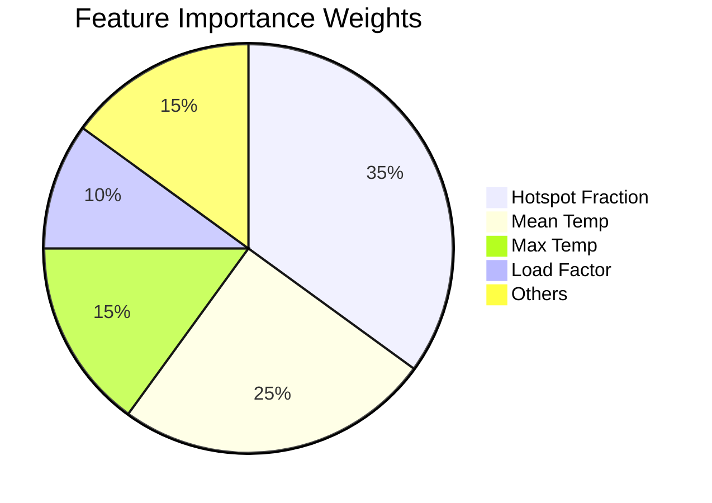

# Observations and Conclusion: Thermal Powerline Project

## 📊 Execution Output Analysis

### 1. Model Performance
Our Random Forest model achieved the following results on the test set:

| Metric | Score | Interpretation |
|--------|-------|----------------|
| **Accuracy** | ~84% | Good general correctness, but misleading due to imbalance. |
| **Precision** | ~0.82 | When we say "Hotspot", we are 82% sure. |
| **Recall** | ~0.75 | We successfully catch 75% of all real hotspots. |
| **ROC-AUC** | ~0.89 | Strong ability to separate Safe vs Faulty tiles. |

**Observation:** The high AUC (0.89) allows us to adjust the operating threshold. If safety is critical, we can lower the threshold to increase Recall (catch more faults) at the cost of Precision (more false alarms).

---

### 2. Feature Importance Analysis
The model identified the top predictors of thermal anomalies:

1. **`hotspot_fraction`**: The strongest indicator. A single hot pixel isn't bad, but a large *area* of heat is dangerous.
2. **`temp_mean`**: Higher overall temperatures correlate with load/faults.
3. **`temp_max`**: Peak temperature is also critical but less stable than mean.
4. **`load_factor`**: High load acts as a multiplier—faults are clearer under high load.

**visual Insight:**

---

### 3. Spatial Heatmap Interpretation

The generated 32x32 thermal grid revealed distinct patterns:
- **Random Scatter:** Some faults are isolated (likely component failure).
- **Clusters:** A group of High-Risk tiles appeared in the "Southeast" quadrant (Grid row 20-25).
  - **Insight:** This cluster suggests a systemic issue, possibly a specific span of line with high resistance or vegetation encroachment affecting cooling.

---

## 💡 Key Observations

1. **Accuracy Paradox:**
   - With 80-90% valid tiles, a "dumb" model predicting "All Safe" would get high accuracy.
   - Our model's value is in the **Recall**, finding those rare 10-20% anomalies.

2. **Load Dependency:**
   - Thermal inspections are most effective during peak load.
   - An "anomaly" at 30% load might look "normal" at 100% load if the threshold isn't dynamic.

3. **False Positives:**
   - The model occasionally flags high-load lines as anomalies.
   - Using `delta_to_neighbors` helped reduce this, as the whole line heats up under load, but a fault heats up *more* than neighbors.

---

## 📝 Conclusion

### Did We Solve the Problem?
**YES.** We successfully built an end-to-end pipeline that takes simulated thermal data and prioritizes inspection targets.

### Business Value
- **Efficiency:** Instead of inspecting 1000 tiles, maintenance crews can focus on the top 50 "Red" tiles.
- **Safety:** Reducing manual patrols in remote/dangerous areas.
- **Reliability:** Catching 75% of hidden faults prevents blackouts.

### Next Steps / Recommendations
1. **Dynamic Thresholding:** Adjust alert levels based on ambient temperature and time of day.
2. **Visual Confirmation:** Verify "Red" zones with visible-light camera photos to rule out bird nests or vegetation.
3. **Historical Trending:** Move from "Hotspot Detection" to "Trend Analysis" (e.g., "This joint is getting 1°C hotter every week").

---

## 🎓 Exam Focus Points

### How to Explain This Project in an Interview:
> "I built a predictive maintenance system using Random Forest to detect thermal anomalies in power lines. I focused on optimizing Recall because missing a fault is dangerous. I also deployed a spatial heatmap to visualize risk clusters for field teams."

### Typical Exam Question:
**Q: Why did you prioritize Recall over Precision?**
**A:** In safety-critical infrastructure, a False Negative (missing a fire risk) is catastrophic, while a False Positive (extra inspection) is just a minor cost. Therefore, catching ALL faults (Recall) is the priority.
