# Problem Statement: Thermal Powerline Hotspot Detection

## 🧩 What is this Problem About?

### Simple Explanation (Like Explaining to a 10-Year-Old)

Imagine you're a **doctor checking for fever** in patients. When someone has a fever, their body temperature is higher than normal. You use a thermometer to find out who is sick.

Now imagine **power lines and electricity towers** are like "patients." Sometimes, parts of them get **too hot** (we call these "hotspots"). If they get too hot, they can:
- **Break down** (power outage!)
- **Catch fire** (dangerous!)
- **Waste electricity** (expensive!)

**Drones fly over power lines** with special cameras that can "see" heat (called thermal cameras). These cameras take pictures showing which parts are hot.

Our job is to build a **smart computer program (AI)** that:
1. Looks at the temperature data from the drone
2. Finds which parts are too hot (anomalies)
3. Makes a "map" showing dangerous areas
4. Tells workers which parts to fix first

---

## 🎯 Real-Life Analogy

| Real Life | Our Problem |
|-----------|-------------|
| Doctor | AI Model |
| Patient | Power Line Tile |
| Thermometer | Thermal Camera on Drone |
| Fever | Thermal Hotspot |
| Prescription | Maintenance Recommendation |
| Hospital Priority | Risk Heatmap |

---

## 🪜 Steps to Solve the Problem

```mermaid
flowchart TD
    A[📊 Step 1: Get Data] --> B[🔍 Step 2: Understand Data]
    B --> C[🧹 Step 3: Prepare Data]
    C --> D[🤖 Step 4: Train AI Model]
    D --> E[📈 Step 5: Evaluate Model]
    E --> F[🗺️ Step 6: Create Risk Map]
    F --> G[📝 Step 7: Give Recommendations]
    
    subgraph "What Each Step Does"
        A --> |Load CSV file| A1[Read temperature data]
        B --> |Explore features| B1[Understand what each column means]
        C --> |Split data| C1[Training set + Test set]
        D --> |Random Forest| D1[Learn patterns of hotspots]
        E --> |Metrics| E1[Precision, Recall, F1, ROC-AUC]
        F --> |Heatmap| F1[Show dangerous areas on grid]
        G --> |Priority| G1[Tell which areas to fix first]
    end
```



---

## 📊 Understanding the Data

### What Does Each Column Mean?

Think of each row as a **small square tile** of the power line area (like a puzzle piece).

| Column Name | What It Means | Real-Life Example |
|-------------|---------------|-------------------|
| `temp_mean` | **Average temperature** of the tile | Average score of a class |
| `temp_max` | **Highest temperature** in the tile | Top scorer in a class |
| `temp_std` | **How much temperatures vary** | Some students score 90, others 30 = high variation |
| `delta_to_neighbors` | **Difference from nearby tiles** | Your room is 40°C but neighbors are 25°C = suspicious! |
| `hotspot_fraction` | **How much of the tile is hot** | 80% of pizza is burnt = bad! |
| `edge_gradient` | **How quickly temperature changes** | Sudden jump from cold to hot |
| `ambient_temp` | **Outside temperature** | If it's already hot outside, everything is warmer |
| `load_factor` | **How much electricity is flowing** | More electricity = more heat |
| `fault_label` | **Is it a problem?** | 0 = Normal ✅, 1 = Problem 🔥 |

---

## 🎯 Expected Output

### 1. Classification Results
```
                  precision    recall  f1-score
Normal (0)           0.85       0.90      0.87
Anomaly (1)          0.82       0.75      0.78

Overall Accuracy: 84%
ROC-AUC Score: 0.89
```

### 2. Thermal Risk Heatmap
A colorful grid showing:
- 🟢 **Green** = Safe areas (low priority)
- 🟡 **Yellow** = Medium risk
- 🟠 **Orange** = High risk
- 🔴 **Red** = Critical (fix immediately!)

### 3. Maintenance Recommendations
| Zone | Risk Level | Action |
|------|------------|--------|
| Zone A3 | Critical | Immediate drone inspection |
| Zone B7 | High | Schedule maintenance this week |
| Zone C1 | Medium | Monitor closely |

---

## ❓ Why is Accuracy Alone Not Enough?

### Explanation with Example

Imagine 100 power line tiles:
- 95 are **normal** ✅
- 5 are **faulty** 🔥 (dangerous!)

A dumb model says: "Everything is normal!" 

**Accuracy = 95%** (sounds great!)

But wait... it **missed all 5 dangerous tiles!** 

This is why we need:
- **Precision**: Of all tiles we said are faulty, how many really are?
- **Recall**: Of all truly faulty tiles, how many did we find?
- **F1-Score**: Balance of Precision and Recall

---

## 📐 Flow Diagram: Complete Pipeline

```mermaid
flowchart LR
    subgraph Input
        A[🚁 Drone Thermal Data]
        B[📋 CSV Dataset]
    end
    
    subgraph Processing
        C[🔍 Data Understanding]
        D[🧹 Data Preparation]
        E[🤖 Random Forest Model]
    end
    
    subgraph Evaluation
        F[📊 Confusion Matrix]
        G[📈 ROC-AUC Curve]
        H[📉 F1 Score]
    end
    
    subgraph Output
        I[🗺️ Risk Heatmap]
        J[📝 Recommendations]
    end
    
    A --> B --> C --> D --> E
    E --> F & G & H
    F & G & H --> I --> J
```



---

## 🎓 What Will You Learn?

1. **Thermal Imaging Basics** - How drones capture heat data
2. **Feature Engineering** - Understanding temperature features
3. **Classification** - Using Random Forest to predict anomalies
4. **Model Evaluation** - Why multiple metrics matter
5. **Spatial Analysis** - Creating risk heatmaps
6. **Predictive Maintenance** - Using AI for real-world decisions
