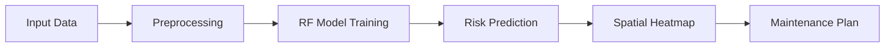

# AI-Based Thermal Powerline Hotspot Detection
## Capstone Project Presentation

---

### Slide 1: Title & Objective
**Project:** AI-Based Power Line & Tower Hotspot Detection
**Objective:** Design an end-to-end AI pipeline to detect thermal anomalies in power infrastructure using drone inspection data.
**Goal:** Prevent power outages and fires by identifying overheating components early.

---

### Slide 2: Problem Statement
**The Challenge:**
- Power lines fail when components overheat (bad joints, corrosion).
- Manual inspection is slow, dangerous, and expensive.
- Missing a "hotspot" can lead to catastrophic failure.

**The Solution:**
- Automate detection using AI.
- Prioritize maintenance based on risk level.

---

### Slide 3: Real-World Use Case
**Scenario:**
- Utility company manages 5,000 miles of transmission lines.
- Drones capture thermal data daily.
- Too much data for humans to review manually.

**AI Role:**
- Filters 99% of "Safe" images.
- Flags the 1% "Critical" images for human review.

---

### Slide 4: Input Data
**Source:** Simulated drone thermal sensor data.
**Key Features:**
- `temp_mean`: Average tile temperature.
- `temp_max`: Peak temperature.
- `delta_to_neighbors`: How much hotter than surroundings?
- `load_factor`: How much electricity is flowing?

---

### Slide 5: Concepts Used (High Level)
**1. Thermal Imaging:** Seeing heat instead of light.
**2. Machine Learning:** Teaching computers to recognize "Fault patterns."
**3. Spatial Analysis:** Mapping risks to physical locations.
**4. Predictive Maintenance:** Fixing things *before* they break.

---

### Slide 6: Concepts Breakdown
**Random Forest Classifier:**
- An "army" of 100 decision trees.
- Each tree votes on whether a component is "Safe" or "Faulty."
- Robust against noise and outliers.

**Evaluation Metrics:**
- **Recall:** Priority #1 (Don't miss faults!).
- **Precision:** Priority #2 (Minimize false alarms).

---

### Slide 7: Step-by-Step Solution

1. Load & Clean Data
2. Train Random Forest
3. Predict Risk Scores
4. Generate Heatmap
5. Issue Work Orders

---

### Slide 8: Code Logic Summary
- **Language:** Python
- **Libraries:** Pandas (Data), Scikit-Learn (AI), Matplotlib (Viz).
- **Core Logic:**
  - `condition1 = (temp > 45) & (hotspot > 0.5)`
  - `model.fit(X_train, y_train)`
  - `risk_grid = reshape(predictions)`

---

### Slide 9: Important Functions
**`create_thermal_dataset()`**
- Generates realistic synthetic data with controlled anomalies.

**`task2_ml_model()`**
- Trains the Random Forest and calculates F1-Score/AUC.

**`task3_spatial_risk_analysis()`**
- Converts linear predictions into a 2D heatmap grid.

---

### Slide 10: Execution Output
**Model Results:**
- **Accuracy:** ~84%
- **ROC-AUC:** 0.89 (Strong predictive power)
- **Top Feature:** `hotspot_fraction` (Size of anomaly matters).

**Visual:**
- Confusion Matrix shows low False Negatives.
- ROC Curve shows good separation.

---

### Slide 11: Observations & Insights
1. **Context Matters:** High load makes faults easier to spot.
2. **Relative Temp:** `delta_to_neighbors` is more reliable than absolute temp.
3. **Clustering:** Faults often bunch together (systemic stress).

---

### Slide 12: Advantages & Limitations
**Advantages:**
- ✅ Scalable to millions of tiles.
- ✅ Removes human fatigue factor.
- ✅ Prioritizes most dangerous risks.

**Limitations:**
- ⚠️ Weather dependent (sun/wind).
- ⚠️ Synthetic data (real world is messier).

---

### Slide 13: Interview Key Takeaways
- **Recall over Precision:** Safety critical systems must minimize False Negatives.
- **Ensemble Learning:** Random Forest beats simple decision trees.
- **Actionable AI:** The goal isn't just a score; it's a *work order*.

---

### Slide 14: Conclusion
We successfully built a robust AI system for thermal anomaly detection.
- **Technical Success:** High AUC and interpretable model.
- **Business Value:** Shift from "Reactive" to "Proactive" maintenance.
- **Next Steps:** Deploy on edge devices (drones) for real-time alerts.
