```mermaid
graph TD
    A[Actual: JAM] -->|Predicted: JAM| B(True Positive ✅)
    A -->|Predicted: CLEAR| C(False Negative ❌ - DANGEROUS)
    D[Actual: CLEAR] -->|Predicted: JAM| E(False Positive ⚠️ - False Alarm)
    D -->|Predicted: CLEAR| F(True Negative ✅)
```

# 🧠 Concepts Explained

## 1. Random Forest Classifier
### 1. Definition
A machine learning algorithm that creates a "forest" of many Decision Trees and takes the majority vote to make a prediction. It is an ensemble method.

### 2. Why it is used
To improve accuracy and reduce "overfitting" (memorizing the answer key). One tree might make a mistake, but 100 trees are less likely to be wrong together.

### 3. When to use it
- When you have tabular data (rows and columns).
- When accuracy is more important than speed.
- When you don't feature scaling (though it helps).

### 4. Real-World Application
- **Traffic Detection:** Deciding if a road is congested based on speed/density.
- **Banking:** Detecting fraud transactions.
- **Medicine:** Diagnosing diseases based on symptoms.

### 5. Comparison
| Feature | Decision Tree | Random Forest |
| :--- | :--- | :--- |
| **Simple?** | Yes | No (Complex) |
| **Accuracy** | Lower | Higher |
| **Overfitting** | High Risk | Low Risk |

### 6. Diagram


### 7. How to use (Syntax)
```python
model = RandomForestClassifier(n_estimators=100)
model.fit(X_train, y_train)
```

### 8. Internal Working
1.  Select random subset of data.
2.  Build a decision tree (ask questions like "Is speed < 20?").
3.  Repeat 100 times.
4.  For new data, ask all trees and count votes.

### 9. Visual Summary
- 🌳 Tree 1 says: Jam
- 🌳 Tree 2 says: Jam
- 🌳 Tree 3 says: Clear
- 🗳️ **Result:** Jam (2 vs 1)

### 10. Advantages
- Accurate.
- Handles missing data well.
- working well on large datasets.

### 11. Disadvantages
- Slow to train.
- Hard to interpret (Black Box).

### 12. Exam Point
**Q:** Why use Random Forest over Decision Tree?
**A:** It reduces variance (overfitting) by averaging multiple trees.

---

## 2. Traffic Density & Flow Analysis
### 1. Definition
The study of how many vehicles are on a road (`Density`) and how fast they move (`Speed`) to determine the Level of Service (LOS).

### 2. Why it is used
To mathematically define "Traffic Jam". Determining congestion isn't just "feeling", it's physics.

### 3. When to use it
In intelligent transportation systems (ITS) and city planning.

### 4. Real-World Usage
Google Maps traffic colors (Green, Orange, Red) are based on this.

### 5. Is there another way?
- **Manual counting:** Humans standing on corners (Slow, expensive).
- **Inductive Loops:** Wires in the road (Expensive to install).
- **Aerial Imagery (Ours):** Cheap, covers wide area.

### 6. Diagram


```mermaid
graph LR
    A[Low Density] -->|High Speed| B(Free Flow 🟢)
    C[High Density] -->|Low Speed| D(Congestion 🔴)
    E[High Density] -->|High Speed| F(Unstable Flow 🟠)
```

### 7. How to use
Calculate: `Density = Number of Vehicles / Road Length`.

### 8. Internal Working
Fundamental Diagram of Traffic Flow:
`Flow = Speed * Density`.
When Density gets too high, Speed drops strictly.

### 12. Exam Point
**Q:** What is the relationship between Speed and Density?
**A:** Inverse. As Density increases towards a jam, Speed decreases to zero.

---

## 3. Confusion Matrix
### 1. Definition
A table layout that allows visualization of the performance of an algorithm.

### 2. Why it is used
Accuracy is misleading. If 90% of traffic is normal, a model that *always* guesses "Normal" has 90% accuracy but is useless. We need to know errors.

### 6. Diagram


### 12. Exam Point
**Q:** What is a False Negative in this context?
**A:** The model says "Road Clear" when there is actually a "Traffic Jam". This is dangerous because no police will be sent.
