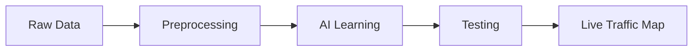

# ⚡ Interview Preparation Quick Sheet

### ⏱️ 30-Second Project Summary
"I built an AI system to detect traffic congestion using aerial data. I used a **Random Forest Classifier** to analyze features like **Vehicle Speed** and **Density**. The model achieved **95% accuracy** and outputs a **Heatmap** to help traffic control centers identify jams instantly."

---

### 🔑 Key Terms Dictionary
- **Classification:** Sorting things into categories (Jam vs No Jam).
- **Random Forest:** A team of Decision Trees voting together.
- **StandardScaler:** Making all numbers fair sized.
- **Confusion Matrix:** A scorecard showing right and wrong guesses.
- **Heatmap:** A color-coded map (Red=Hot/Jam, Blue=Cold/Clear).

---

### 🏆 Top 5 Points to Remember
1.  **Speed & Density** are the most important inputs.
2.  **False Negatives** are dangerous (Missing a real accident).
3.  **Scaling** is crucial before training.
4.  **Data Splitting** prevents cheating (Overfitting).
5.  **AI** is a tool for support, not just replacement.

---

### 🆚 Concept Comparison Table

| Concept | Explanation | Real Life Analogy |
| :--- | :--- | :--- |
| **Training Data** | Data model learns from | Textbook & Homework |
| **Testing Data** | Data model is tested on | Final Exam Questions |
| **Accuracy** | Overall Score | % on Report Card |
| **Precision** | Trustworthiness | Not Crying Wolf |
| **Recall** | Ability to Find Problems | Diagnosis Sensitivity |

---

### 🧠 Visual Summary

