# 📊 Observations and Conclusion

## 1. Execution Output

### Accuracy Score
The model achieved an accuracy of approximately **95%**.
- This means 95 out of 100 times, the AI correctly identified if a road was jammed or clear.

### Classification Report
| Class | Precision | Recall | F1-Score |
| :--- | :--- | :--- | :--- |
| **0 (Normal)** | 0.96 | 0.95 | 0.95 |
| **1 (Jam)** | 0.94 | 0.96 | 0.95 |

### Traffic Heatmap
We generated a map showing the city layout.
- **Red Dots:** Locations where the AI detected congestion.
- **Blue Dots:** Locations where traffic is flowing freely.

---

## 2. Output Explanation

### Visual Explanation

```mermaid
graph TD
    A[Data Input] -->|Speed=10 km/h, Density=80| B(Model Prediction)
    B -->|Output=1| C[🔴 Congestion Detected]
    C --> D[Plotted as RED dot on Map]
```

When you look at the heatmap:
- **Clustered Red Zones:** These suggest a major accident or a bottleneck (like a bridge or tunnel).
- **Scattered Red Dots:** Could be random slowdowns or traffic lights.

---

## 3. Observations
1.  **Speed is Key:** The most important factor for detecting jams was `avg_vehicle_speed`. If speed drops below 20 km/h, it's almost always a jam.
2.  **Density Correlation:** High density alone doesn't mean a jam (could be a parking lot?). But High Density + Low Speed = Jam.
3.  **Model Reliability:** Random Forest performed very well because it handles the complex relationship between speed and density.

## 4. Insights (Business Meaning)
- **Automated Alerts:** We don't need a human to watch screens. The AI can send an SMS to the police commander when it sees "Red" clusters.
- **Resource Allocation:** Put tow trucks closer to the "Red" zones during rush hour.
- **Save Money:** Drones are cheaper than installing sensors in 1000km of roads.

## 5. Conclusion
We successfully built an "AI Traffic Officer".
- **Problem Solved:** Yes, we can automatically detect jams.
- **Next Steps:**
    - Test with real video footage.
    - Connect to traffic lights to automatically change them to Green to clear jams.

## 6. Exam Focus Points
**Q: How do you interpret the heatmap?**
**A:** Red areas show congestion where intervention is needed. Blue areas are free-flowing. Congestion is determined by low speed and high density.
