# 🧩 Problem Statement

### 🚦 What is the problem?
Imagine looking at a city from a helicopter or a drone. You see hundreds of roads, cars, and intersections. Some roads are flowing smoothly, while others are jam-packed with cars not moving at all. This "jam-packed" state is called **Traffic Congestion**.

The problem is that traffic police and city managers cannot watch every single road 24/7. They need a way to automatically know **where** traffic is bad and **why** (is it just rush hour, or is there an accident?).

We need to build an **Artificial Intelligence (AI) System** that acts like a "Virtual Traffic Officer". It will look at data collected from aerial cameras (drones/satellites) and decide: *"Is this road clear, or is there a problem?"*

### 🌍 Real-Life Analogy
Think of this like a **School Hallway Monitor**:
- **Normal Flow:** Students walking to class calmly. (No congestion)
- **Congestion:** A huge group of students stuck at a doorway because someone dropped their books. (Incident/Congestion)

Our AI is the monitor that spots the crowd and tells the principal (Traffic Control Center) so they can fix it.

### 🪜 Steps to Solve the Problem

1.  **See the Road (Data Input):** We get data about the road, like how fast cars are moving (`average speed`), how many cars are there (`density`), and if lines are full (`lane occupancy`).
2.  **Learn the Patterns (Model Training):** We teach a computer (Machine Learning Model) to recognize the difference between "Good Traffic" and "Bad Traffic".
    - *Example:* High Speed + Low Density = Good.
    - *Example:* Low Speed + High Density = Bad.
3.  **Test the Monitor (Evaluation):** We give the computer new road data it hasn't seen before and check if it guesses correctly.
4.  **Make a Map (Visualization):** We draw a map showing red zones (congestion) and green zones (clear) so humans can understand it easily.
5.  **Take Action (Interpretation):** We suggest what to do, like "Send a police officer" or "Change the traffic light timing".

### 🎯 Expected Output

We want to produce:
1.  **A Smart Classifier:** A program that says "Congestion" or "Normal" for any road segment.
2.  **Accuracy Report:** A report card showing how often the AI is right.
3.  **Traffic Heatmap:** A visual map where red spots show traffic jams, helping city planners see problem areas instantly.

```mermaid
graph TD
    A[Aerial Camera Data] -->|Extract Features| B(Speed, Density, Queue Length)
    B --> C[AI Model Brain]
    C -->|Thinking...| D{Is it Congested?}
    D -->|Yes| E[🔴 Alert: Traffic Jam!]
    D -->|No| F[🟢 Status: All Clear]
    E --> G[Traffic Heatmap Visualization]
    F --> G
```

