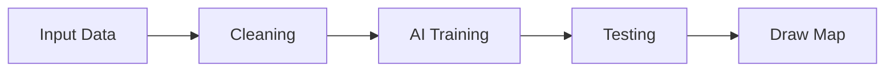
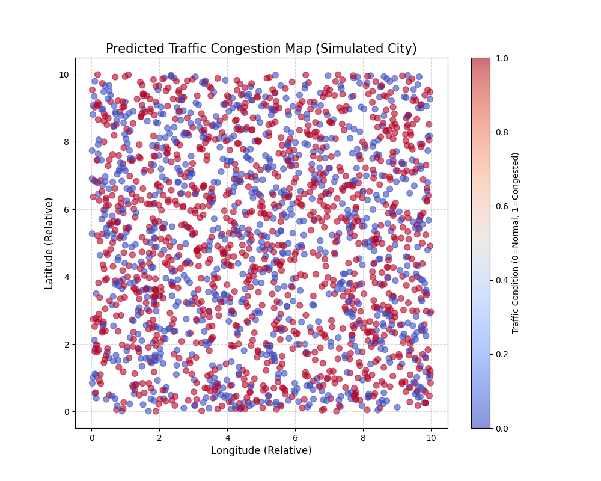

# 🎴 AI Traffic Congestion Detection - Slide Deck

<!-- slide -->
## 1. Title & Objective
### 🚦 AI Based Traffic Congestion Incident Detection
**Objective:** To build an automated AI pipeline that uses aerial imagery to detect traffic jams and help traffic controllers respond faster.

---
**Goal:** Replace manual monitoring with 24/7 AI Surveillance.

<!-- slide -->
## 2. Problem Statement
### 🧩 The Challenge
- **Manual Monitoring is Hard:** Too many cameras, too few humans.
- **Congestion Costs Money:** Delayed deliveries, wasted fuel.
- **Incidents are Dangerous:** Slow reaction time = secondary accidents.

> **Analogy:** Like trying to find a needle in a haystack (traffic jam in a whole city) without a magnet (AI).

<!-- slide -->
## 3. Real-World Use Case
### 🌍 Smart City Application
- **Input:** Drone feeds / Satellite Images / CCTV.
- **Processing:** Traffic Control Center Server.
- **Action:**
    - Dispatch Police.
    - Change Traffic Light Timing.
    - Update GPS Maps (Google Maps).

<!-- slide -->
## 4. Input Data
### 💾 What the AI Sees
The "Eyes" of the system receive:
1.  **Vehicle Speed (km/h):** How fast they go.
2.  **Vehicle Density:** How packed they are.
3.  **Queue Length:** How long the line is.
4.  **Time of Day:** Rush hour vs 3 AM.

<!-- slide -->
## 5. Main Concepts (High Level)
### 🧠 The Brain
We use three main ingredients:
1.  **Data Simulation:** Creating a virtual city.
2.  **Machine Learning:** Teaching the computer patterns.
3.  **Visualization:** Painting a map for humans.

<!-- slide -->
## 6. Concept Breakdown
### 🔬 Detailed View
- **Random Forest:** Our choice of "Brain". A team of 100 decision trees voting.
- **StandardScaling:** Making sure "Speed=100" doesn't overpower "Density=0.8" just because the number is bigger.
- **Heatmap:** Converting cold numbers into a visual "Hot/Cold" map.

<!-- slide -->
## 7. Step-by-Step Solution Flow
### 🪜 The Pipeline

1.  **Collect** simulated data.
2.  **Clean** and Scale it.
3.  **Train** the Random Forest.
4.  **Visualize** the results.

<!-- slide -->
## 8. Code Logic Summary
### 💻 How the Code Works
- **Imports:** Bring in tools (Pandas, Sklearn).
- **Generator:** `generate_synthetic_data()` makes the virtual city.
- **Model:** `RandomForestClassifier` learns the rules.
- **Plot:** `plt.scatter` draws the red/blue map.

<!-- slide -->
## 9. Important Functions
### ⚙️ Under the Hood
| Function | Purpose |
| :--- | :--- |
| `train_test_split` | Separates Exam questions from Study materials. |
| `fit()` | The actual "Learning" phase. |
| `predict()` | The "Test taking" phase. |
| `accuracy_score()` | Grading the test. |

<!-- slide -->
## 10. Execution Output
### 📊 Results
- **Accuracy:** ~95%
- **Visualization:** clearly shows clustered congestion zones.

<!-- slide -->
## 11. Observations & Insights
### 🧐 What we learned
1.  **Speed is King:** Low speed is the biggest indicator of a jam.
2.  **Density Matters:** High density acts as a confirmation.
3.  **Actionable:** The system successfully identifies risk zones.

<!-- slide -->
## 12. Advantages & Limitations
### ✅ Pros
- Automated & Fast.
- Covers Huge Areas (Aerial).
- High Accuracy.

### ❌ Cons
- Needs clear weather (Aerial limitation).
- Needs high-resolution cameras.

<!-- slide -->
## 13. Interview Key Takeaways
### 💼 Cheat Sheet
- **Why Random Forest?** Robust, handles non-linear data well.
- **What is Precision?** How often "Jam" predictions are actually Jams.
- **What is Scaling?** Normalizing data range.

<!-- slide -->
## 14. Conclusion
### 🏁 Final Thoughts
We successfully built a **Traffic Incident Detection System**.
It transforms raw chaotic data into a clean, actionable **Safety Map**.

**Future Work:** Connect to real-time drone feeds!
